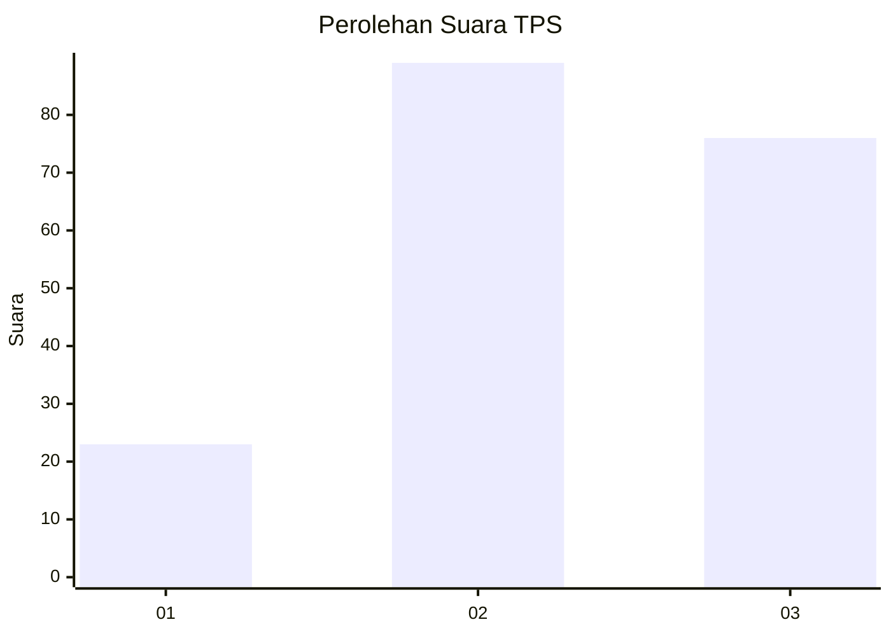
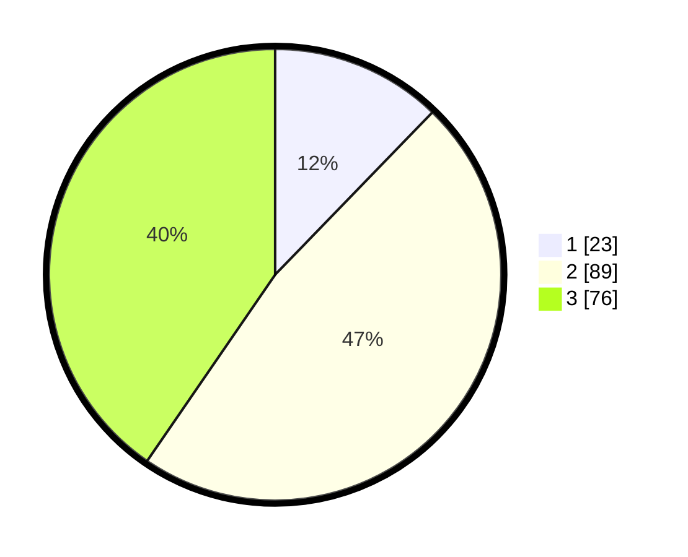

# Hasil

## Grafik

## Tabel

| No. | Nama Paslon    | Suara | Suara (raw) | Persentase |
|:--- |:-------------- | -----:| -----------:| ----------:|
| 1   | ANIES MUHAIMIN | 23    | [23][p-1]   | 12,23      |
| 2   | PRABOWO GIBRAN | 89    | [89][p-2]   | 47,34      |
| 3   | GANJAR MAHFUD  | 76    | [76][p-3]   | 40,43      |

[p-1]: https://github.com/gigit-pemilu/pemilu-2024/blob/main/pilpres/hitung-suara/sub/33-jawa-tengah/sub/12-wonogiri/sub/25-puhpelem/sub/1002-giriharjo/sub/006-tps/sub/paslon-1.txt
[p-2]: https://github.com/gigit-pemilu/pemilu-2024/blob/main/pilpres/hitung-suara/sub/33-jawa-tengah/sub/12-wonogiri/sub/25-puhpelem/sub/1002-giriharjo/sub/006-tps/sub/paslon-2.txt
[p-3]: https://github.com/gigit-pemilu/pemilu-2024/blob/main/pilpres/hitung-suara/sub/33-jawa-tengah/sub/12-wonogiri/sub/25-puhpelem/sub/1002-giriharjo/sub/006-tps/sub/paslon-3.txt

## Foto C Plano

https://sirekap-obj-formc.kpu.go.id/bcac/pemilu/ppwp/33/12/25/10/02/3312251002006-20240214-234308--61278dab-970b-4a7d-acee-e11633cb1e78.jpg

https://sirekap-obj-formc.kpu.go.id/bcac/pemilu/ppwp/33/12/25/10/02/3312251002006-20240214-234742--2730259e-5e58-4dca-b7e4-307e58f30251.jpg

https://sirekap-obj-formc.kpu.go.id/bcac/pemilu/ppwp/33/12/25/10/02/3312251002006-20240216-162134--b6fa604d-e7f7-4bb5-8d19-fd6d33eca96f.jpg

## Metadata

| Key        | Value               |
| ---------- | ------------------- |
| Time Stamp | 2024-02-24 22:31:28 |

