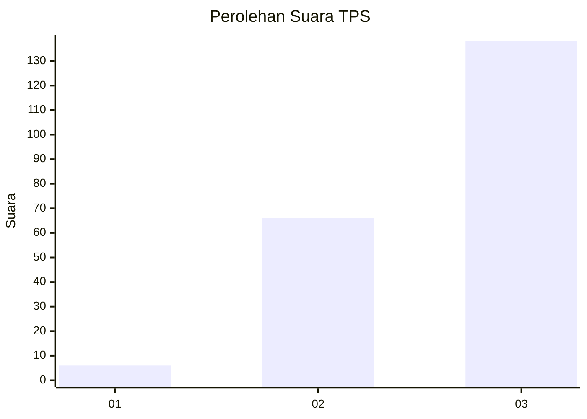
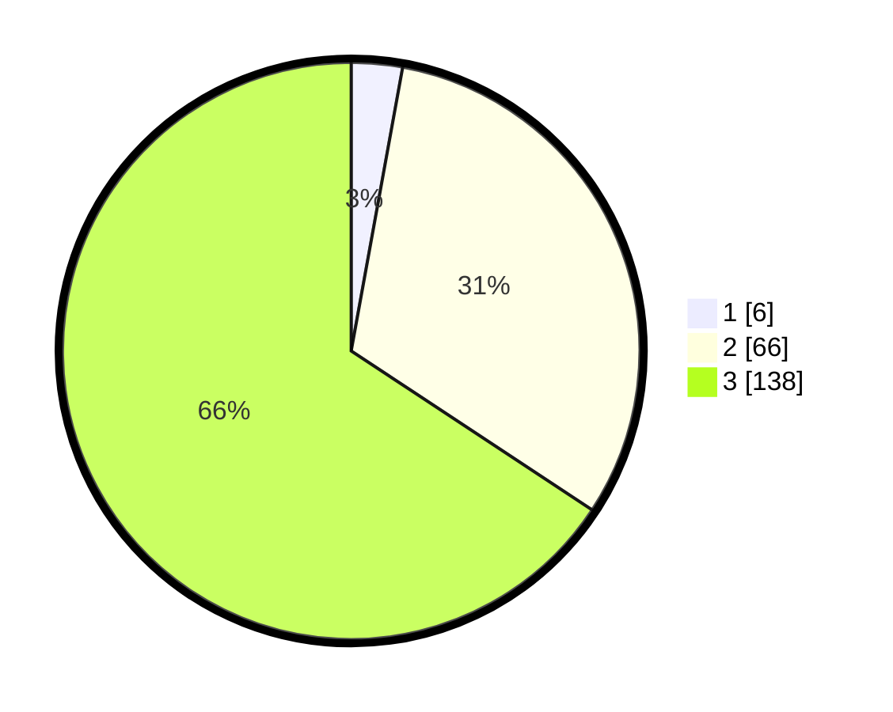

# Hasil

## Grafik

## Tabel

| No. | Nama Paslon    | Suara | Suara (raw) | Persentase |
|:--- |:-------------- | -----:| -----------:| ----------:|
| 1   | ANIES MUHAIMIN | 6     | [6][p-1]    | 2,86       |
| 2   | PRABOWO GIBRAN | 66    | [66][p-2]   | 31,43      |
| 3   | GANJAR MAHFUD  | 138   | [138][p-3]  | 65,71      |

[p-1]: https://github.com/gigit-pemilu/pemilu-2024-33-jawa-tengah/blob/main/pilpres/hitung-suara/sub/33-jawa-tengah/sub/12-wonogiri/sub/25-puhpelem/sub/1002-giriharjo/sub/007-tps/sub/paslon-1.txt
[p-2]: https://github.com/gigit-pemilu/pemilu-2024-33-jawa-tengah/blob/main/pilpres/hitung-suara/sub/33-jawa-tengah/sub/12-wonogiri/sub/25-puhpelem/sub/1002-giriharjo/sub/007-tps/sub/paslon-2.txt
[p-3]: https://github.com/gigit-pemilu/pemilu-2024-33-jawa-tengah/blob/main/pilpres/hitung-suara/sub/33-jawa-tengah/sub/12-wonogiri/sub/25-puhpelem/sub/1002-giriharjo/sub/007-tps/sub/paslon-3.txt

## Foto C Plano

https://sirekap-obj-formc.kpu.go.id/a2a7/pemilu/ppwp/33/12/25/10/02/3312251002007-20240216-145749--00e54a12-a472-43ec-b58e-08fda9d37d2f.jpg

https://sirekap-obj-formc.kpu.go.id/a2a7/pemilu/ppwp/33/12/25/10/02/3312251002007-20240216-161508--d3808381-3ac6-4882-acb1-9355c8cf5f35.jpg

## Metadata

| Key        | Value               |
| ---------- | ------------------- |
| Time Stamp | 2024-02-24 22:31:28 |

