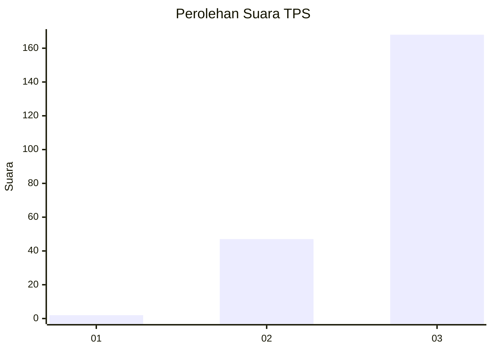
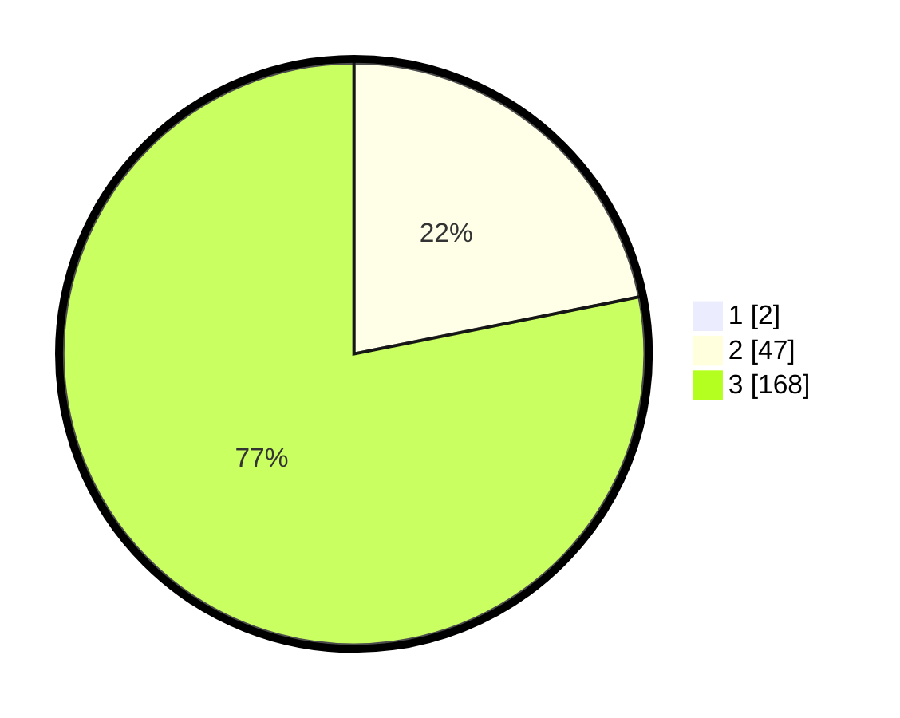

# Hasil

## Grafik

## Tabel

| No. | Nama Paslon    | Suara | Suara (raw) | Persentase |
|:--- |:-------------- | -----:| -----------:| ----------:|
| 1   | ANIES MUHAIMIN | 2     | [2][p-1]    | 0,92       |
| 2   | PRABOWO GIBRAN | 47    | [47][p-2]   | 21,66      |
| 3   | GANJAR MAHFUD  | 168   | [168][p-3]  | 77,42      |

[p-1]: https://github.com/gigit-pemilu/pemilu-2024/blob/main/pilpres/hitung-suara/sub/33-jawa-tengah/sub/12-wonogiri/sub/25-puhpelem/sub/2003-nguneng/sub/011-tps/sub/paslon-1.txt
[p-2]: https://github.com/gigit-pemilu/pemilu-2024/blob/main/pilpres/hitung-suara/sub/33-jawa-tengah/sub/12-wonogiri/sub/25-puhpelem/sub/2003-nguneng/sub/011-tps/sub/paslon-2.txt
[p-3]: https://github.com/gigit-pemilu/pemilu-2024/blob/main/pilpres/hitung-suara/sub/33-jawa-tengah/sub/12-wonogiri/sub/25-puhpelem/sub/2003-nguneng/sub/011-tps/sub/paslon-3.txt

## Foto C Plano

https://sirekap-obj-formc.kpu.go.id/e007/pemilu/ppwp/33/12/25/20/03/3312252003011-20240215-001134--bbf27000-24b0-4542-a30c-a51e9a461cd6.jpg

https://sirekap-obj-formc.kpu.go.id/e007/pemilu/ppwp/33/12/25/20/03/3312252003011-20240215-001221--6f0d4d0c-0bce-45a1-a303-4f129117032d.jpg

https://sirekap-obj-formc.kpu.go.id/e007/pemilu/ppwp/33/12/25/20/03/3312252003011-20240215-001300--814c6db5-6554-4461-9558-83d172fce0ac.jpg

## Metadata

| Key        | Value               |
| ---------- | ------------------- |
| Time Stamp | 2024-02-15 21:01:18 |

