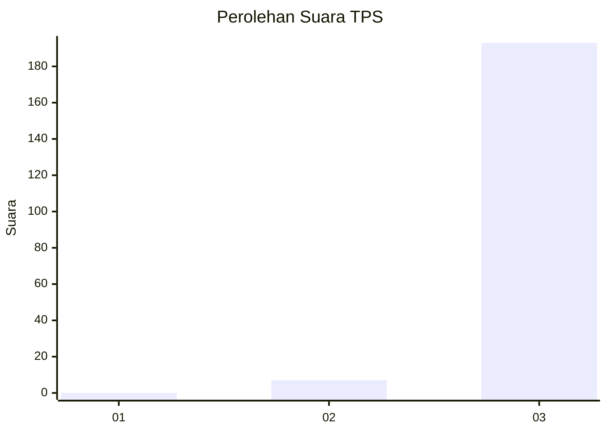
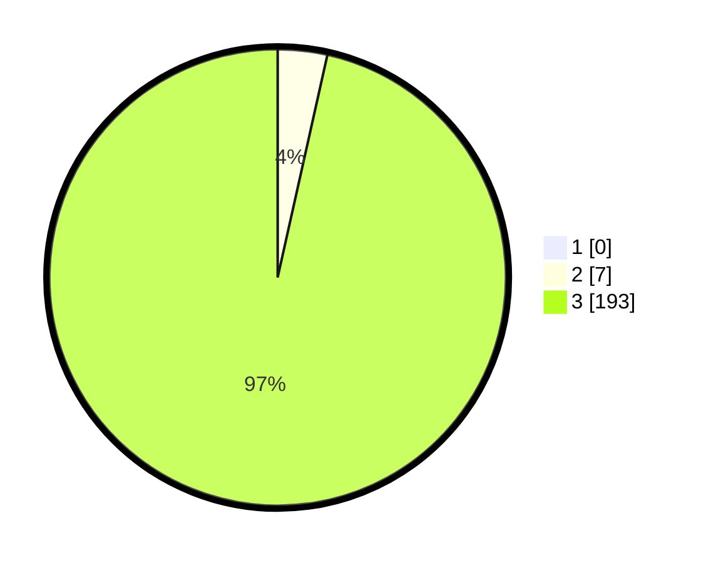

# Hasil

## Grafik

## Tabel

| No. | Nama Paslon    | Suara | Suara (raw) | Persentase |
|:--- |:-------------- | -----:| -----------:| ----------:|
| 1   | ANIES MUHAIMIN | 0     | [0][p-1]    | 0,00       |
| 2   | PRABOWO GIBRAN | 7     | [7][p-2]    | 3,50       |
| 3   | GANJAR MAHFUD  | 193   | [193][p-3]  | 96,50      |

[p-1]: https://github.com/gigit-pemilu/pemilu-2024/blob/main/pilpres/hitung-suara/sub/33-jawa-tengah/sub/12-wonogiri/sub/25-puhpelem/sub/2005-tengger/sub/001-tps/sub/paslon-1.txt
[p-2]: https://github.com/gigit-pemilu/pemilu-2024/blob/main/pilpres/hitung-suara/sub/33-jawa-tengah/sub/12-wonogiri/sub/25-puhpelem/sub/2005-tengger/sub/001-tps/sub/paslon-2.txt
[p-3]: https://github.com/gigit-pemilu/pemilu-2024/blob/main/pilpres/hitung-suara/sub/33-jawa-tengah/sub/12-wonogiri/sub/25-puhpelem/sub/2005-tengger/sub/001-tps/sub/paslon-3.txt

## Foto C Plano

https://sirekap-obj-formc.kpu.go.id/f8c6/pemilu/ppwp/33/12/25/20/05/3312252005001-20240214-223207--a7337a3a-8f20-48c3-8d3c-481e6febce4a.jpg

https://sirekap-obj-formc.kpu.go.id/f8c6/pemilu/ppwp/33/12/25/20/05/3312252005001-20240214-223251--593ddd12-8648-439b-bf74-d3e7992298cb.jpg

https://sirekap-obj-formc.kpu.go.id/f8c6/pemilu/ppwp/33/12/25/20/05/3312252005001-20240214-223328--6bf43ff4-5edb-4f51-8a34-cf8f4e992af3.jpg

## Metadata

| Key        | Value               |
| ---------- | ------------------- |
| Time Stamp | 2024-02-15 20:00:44 |

