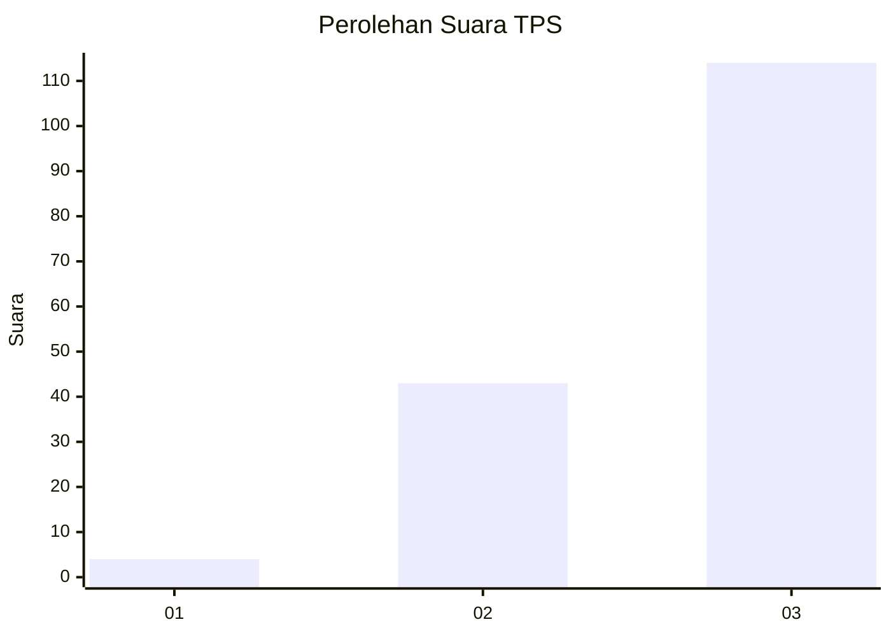
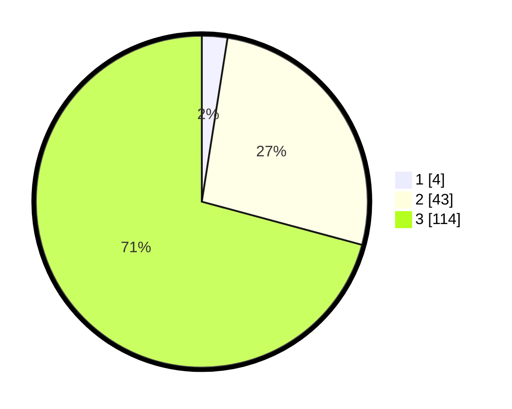

# Hasil

## Grafik

## Tabel

| No. | Nama Paslon    | Suara | Suara (raw) | Persentase |
|:--- |:-------------- | -----:| -----------:| ----------:|
| 1   | ANIES MUHAIMIN | 4     | [4][p-1]    | 2,48       |
| 2   | PRABOWO GIBRAN | 43    | [43][p-2]   | 26,71      |
| 3   | GANJAR MAHFUD  | 114   | [114][p-3]  | 70,81      |

[p-1]: https://github.com/gigit-pemilu/pemilu-2024/blob/main/pilpres/hitung-suara/sub/33-jawa-tengah/sub/12-wonogiri/sub/25-puhpelem/sub/2005-tengger/sub/012-tps/sub/paslon-1.txt
[p-2]: https://github.com/gigit-pemilu/pemilu-2024/blob/main/pilpres/hitung-suara/sub/33-jawa-tengah/sub/12-wonogiri/sub/25-puhpelem/sub/2005-tengger/sub/012-tps/sub/paslon-2.txt
[p-3]: https://github.com/gigit-pemilu/pemilu-2024/blob/main/pilpres/hitung-suara/sub/33-jawa-tengah/sub/12-wonogiri/sub/25-puhpelem/sub/2005-tengger/sub/012-tps/sub/paslon-3.txt

## Foto C Plano

https://sirekap-obj-formc.kpu.go.id/fa6d/pemilu/ppwp/33/12/25/20/05/3312252005012-20240217-134303--f4b15660-2218-4fb4-9933-99528c14b093.jpg

https://sirekap-obj-formc.kpu.go.id/fa6d/pemilu/ppwp/33/12/25/20/05/3312252005012-20240215-065012--35c63698-ff0f-4420-abe9-cdb9a713731f.jpg

https://sirekap-obj-formc.kpu.go.id/fa6d/pemilu/ppwp/33/12/25/20/05/3312252005012-20240217-133926--26ebea13-8670-4e4e-b170-d265d36175f6.jpg

## Metadata

| Key        | Value               |
| ---------- | ------------------- |
| Time Stamp | 2024-02-19 06:16:00 |

