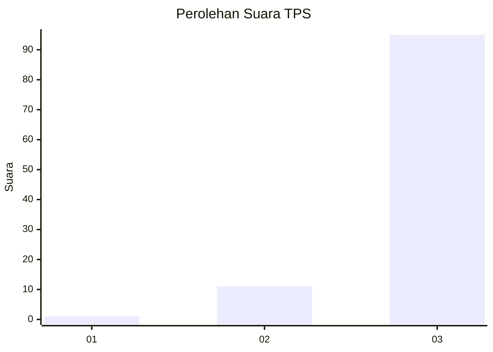
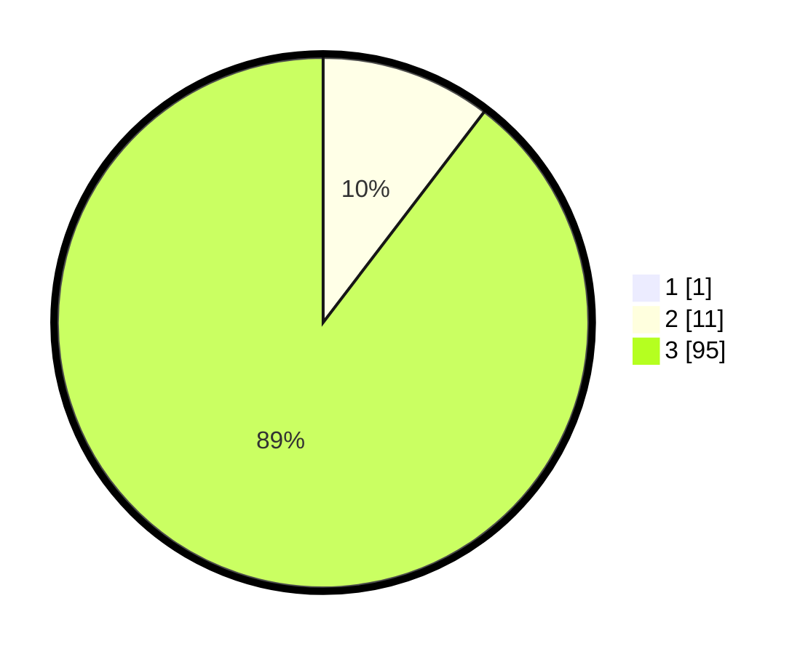

# Hasil

## Grafik

## Tabel

| No. | Nama Paslon    | Suara | Suara (raw) | Persentase |
|:--- |:-------------- | -----:| -----------:| ----------:|
| 1   | ANIES MUHAIMIN | 1     | [1][p-1]    | 0,93       |
| 2   | PRABOWO GIBRAN | 11    | [11][p-2]   | 10,28      |
| 3   | GANJAR MAHFUD  | 95    | [95][p-3]   | 88,79      |

[p-1]: https://github.com/gigit-pemilu/pemilu-2024-33-jawa-tengah/blob/main/pilpres/hitung-suara/sub/33-jawa-tengah/sub/12-wonogiri/sub/25-puhpelem/sub/2005-tengger/sub/015-tps/sub/paslon-1.txt
[p-2]: https://github.com/gigit-pemilu/pemilu-2024-33-jawa-tengah/blob/main/pilpres/hitung-suara/sub/33-jawa-tengah/sub/12-wonogiri/sub/25-puhpelem/sub/2005-tengger/sub/015-tps/sub/paslon-2.txt
[p-3]: https://github.com/gigit-pemilu/pemilu-2024-33-jawa-tengah/blob/main/pilpres/hitung-suara/sub/33-jawa-tengah/sub/12-wonogiri/sub/25-puhpelem/sub/2005-tengger/sub/015-tps/sub/paslon-3.txt

## Foto C Plano

https://sirekap-obj-formc.kpu.go.id/0dee/pemilu/ppwp/33/12/25/20/05/3312252005015-20240215-105552--da7ed370-0e5b-4d17-9241-af6cb45a8116.jpg

https://sirekap-obj-formc.kpu.go.id/0dee/pemilu/ppwp/33/12/25/20/05/3312252005015-20240214-214755--8fa484f1-815e-4f72-bc64-b5b35f052b98.jpg

https://sirekap-obj-formc.kpu.go.id/0dee/pemilu/ppwp/33/12/25/20/05/3312252005015-20240214-214843--03f10c20-1cd3-42f9-afdd-3c9dd97c6058.jpg

## Metadata

| Key        | Value               |
| ---------- | ------------------- |
| Time Stamp | 2024-02-16 12:51:22 |

