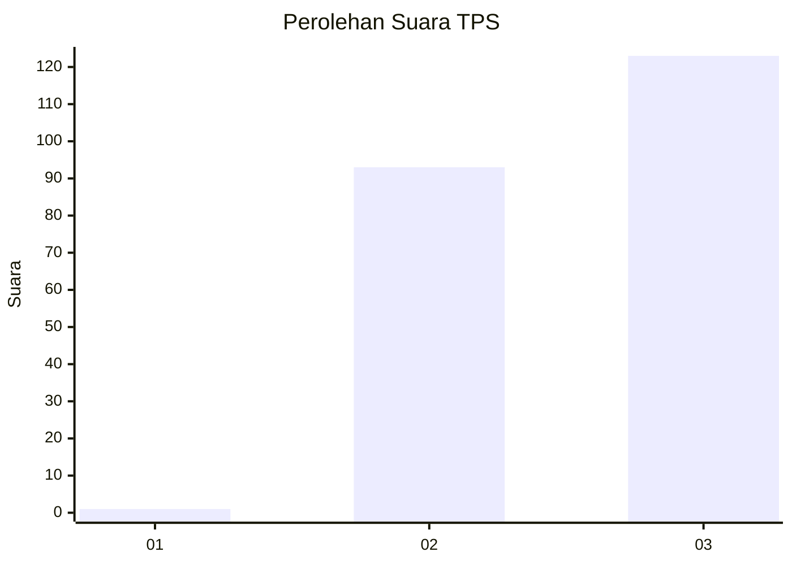
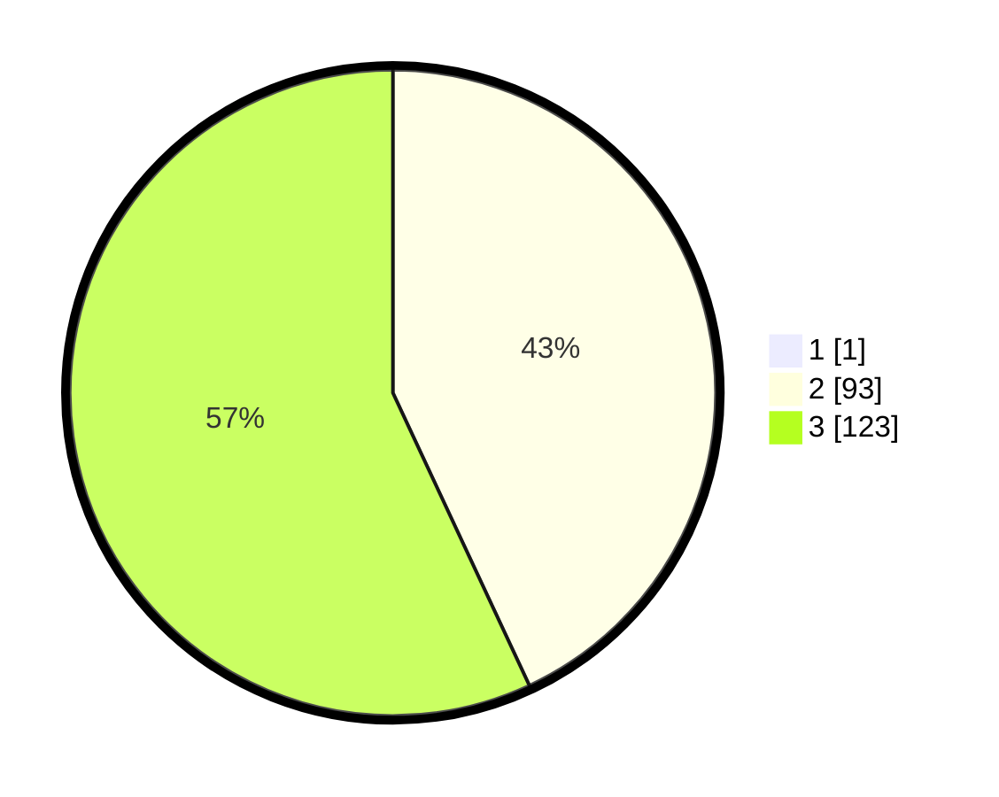

# Hasil

## Grafik

## Tabel

| No. | Nama Paslon    | Suara | Suara (raw) | Persentase |
|:--- |:-------------- | -----:| -----------:| ----------:|
| 1   | ANIES MUHAIMIN | 1     | [1][p-1]    | 0,46       |
| 2   | PRABOWO GIBRAN | 93    | [93][p-2]   | 42,86      |
| 3   | GANJAR MAHFUD  | 123   | [123][p-3]  | 56,68      |

[p-1]: https://github.com/gigit-pemilu/pemilu-2024/blob/main/pilpres/hitung-suara/sub/33-jawa-tengah/sub/12-wonogiri/sub/25-puhpelem/sub/2006-golo/sub/003-tps/sub/paslon-1.txt
[p-2]: https://github.com/gigit-pemilu/pemilu-2024/blob/main/pilpres/hitung-suara/sub/33-jawa-tengah/sub/12-wonogiri/sub/25-puhpelem/sub/2006-golo/sub/003-tps/sub/paslon-2.txt
[p-3]: https://github.com/gigit-pemilu/pemilu-2024/blob/main/pilpres/hitung-suara/sub/33-jawa-tengah/sub/12-wonogiri/sub/25-puhpelem/sub/2006-golo/sub/003-tps/sub/paslon-3.txt

## Foto C Plano

https://sirekap-obj-formc.kpu.go.id/7a17/pemilu/ppwp/33/12/25/20/06/3312252006003-20240218-204355--ff89af23-d1e3-4207-94d4-06222139b12a.jpg

https://sirekap-obj-formc.kpu.go.id/7a17/pemilu/ppwp/33/12/25/20/06/3312252006003-20240216-141732--1ea339bc-744a-4d9c-9c7b-f096c7d1c596.jpg

https://sirekap-obj-formc.kpu.go.id/7a17/pemilu/ppwp/33/12/25/20/06/3312252006003-20240216-141743--091b4dd1-3713-4bf6-9b99-ab7c1da744e2.jpg

## Metadata

| Key        | Value               |
| ---------- | ------------------- |
| Time Stamp | 2024-02-19 06:16:00 |

