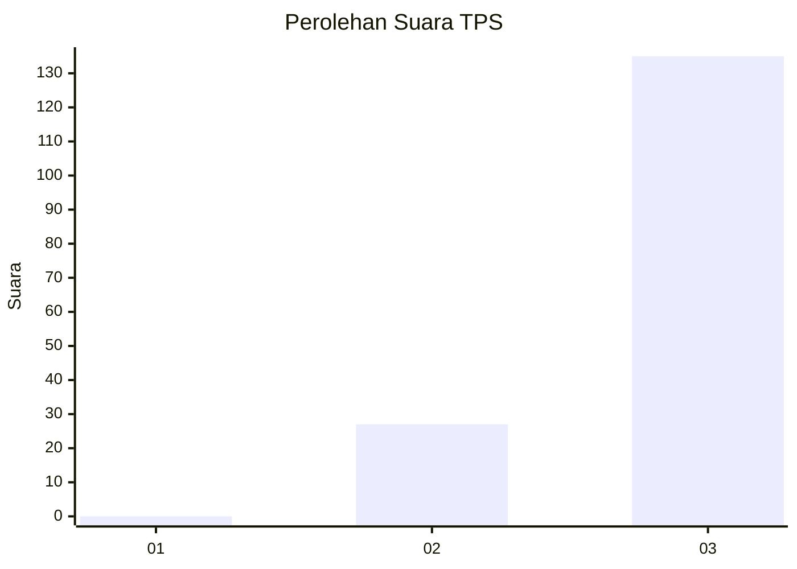
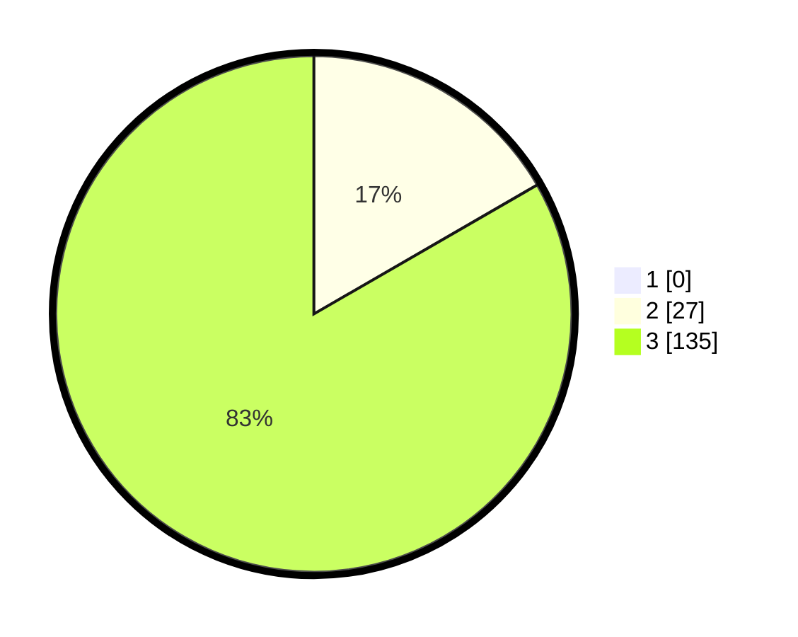

# Hasil

## Grafik

## Tabel

| No. | Nama Paslon    | Suara | Suara (raw) | Persentase |
|:--- |:-------------- | -----:| -----------:| ----------:|
| 1   | ANIES MUHAIMIN | 0     | [0][p-1]    | 0,00       |
| 2   | PRABOWO GIBRAN | 27    | [27][p-2]   | 16,67      |
| 3   | GANJAR MAHFUD  | 135   | [135][p-3]  | 83,33      |

[p-1]: https://github.com/gigit-pemilu/pemilu-2024/blob/main/pilpres/hitung-suara/sub/33-jawa-tengah/sub/12-wonogiri/sub/25-puhpelem/sub/2006-golo/sub/012-tps/sub/paslon-1.txt
[p-2]: https://github.com/gigit-pemilu/pemilu-2024/blob/main/pilpres/hitung-suara/sub/33-jawa-tengah/sub/12-wonogiri/sub/25-puhpelem/sub/2006-golo/sub/012-tps/sub/paslon-2.txt
[p-3]: https://github.com/gigit-pemilu/pemilu-2024/blob/main/pilpres/hitung-suara/sub/33-jawa-tengah/sub/12-wonogiri/sub/25-puhpelem/sub/2006-golo/sub/012-tps/sub/paslon-3.txt

## Foto C Plano

https://sirekap-obj-formc.kpu.go.id/7fb9/pemilu/ppwp/33/12/25/20/06/3312252006012-20240217-093416--67812269-04a8-4427-bde3-df90aa9682ad.jpg

https://sirekap-obj-formc.kpu.go.id/7fb9/pemilu/ppwp/33/12/25/20/06/3312252006012-20240215-082152--0f2286ce-6fe8-43e7-b7ee-0a628dffaac6.jpg

https://sirekap-obj-formc.kpu.go.id/7fb9/pemilu/ppwp/33/12/25/20/06/3312252006012-20240215-082204--9701c710-7a94-42d3-928b-9b4bb621d3af.jpg

## Metadata

| Key        | Value               |
| ---------- | ------------------- |
| Time Stamp | 2024-02-17 10:00:02 |

