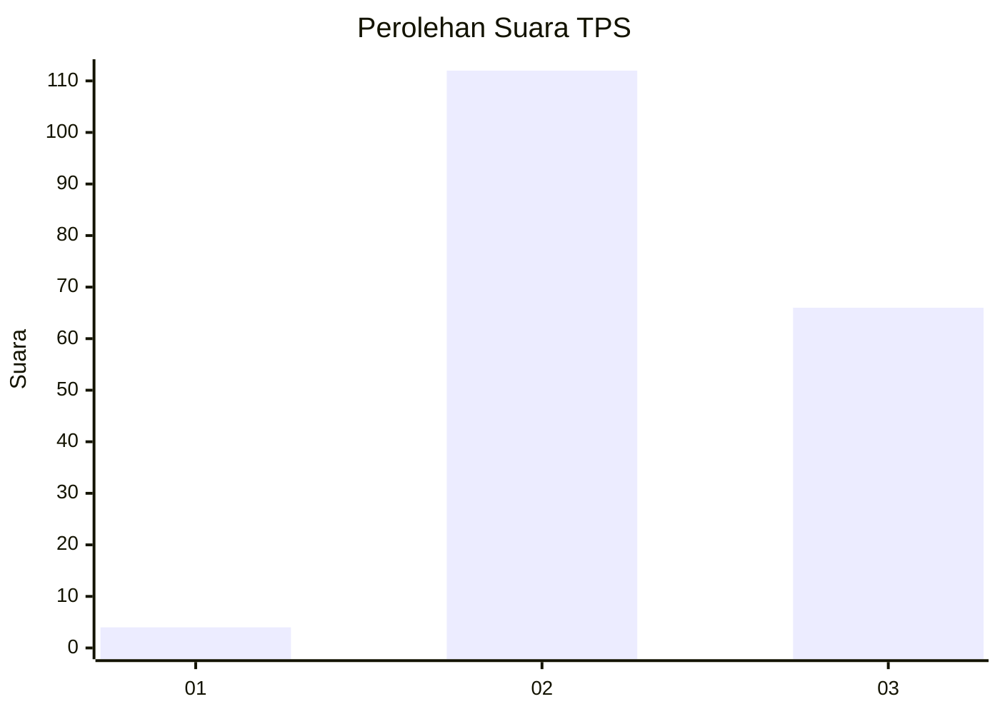
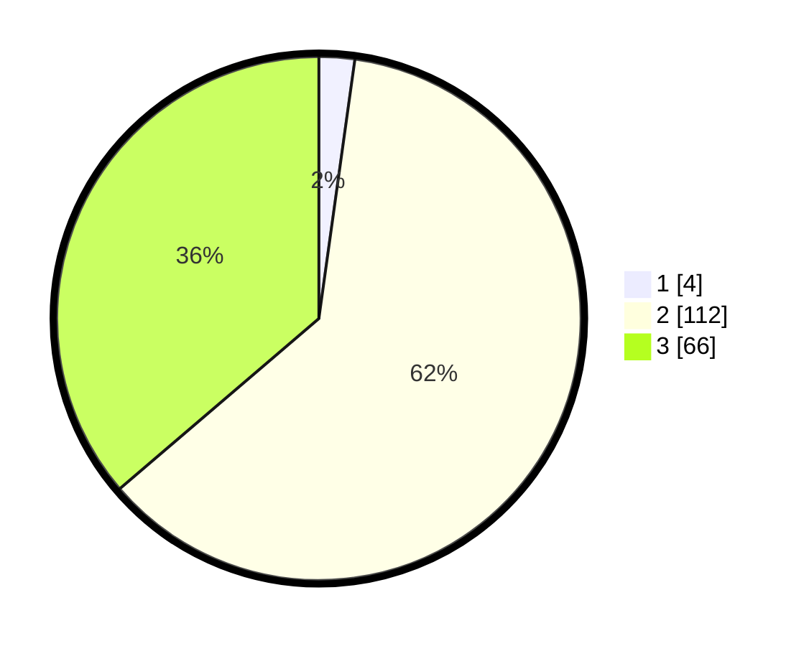

# Hasil

## Grafik

## Tabel

| No. | Nama Paslon    | Suara | Suara (raw) | Persentase |
|:--- |:-------------- | -----:| -----------:| ----------:|
| 1   | ANIES MUHAIMIN | 4     | [4][p-1]    | 2,20       |
| 2   | PRABOWO GIBRAN | 112   | [112][p-2]  | 61,54      |
| 3   | GANJAR MAHFUD  | 66    | [66][p-3]   | 36,26      |

[p-1]: https://github.com/gigit-pemilu/pemilu-2024/blob/main/pilpres/hitung-suara/sub/33-jawa-tengah/sub/13-karanganyar/sub/03-jumapolo/sub/2001-paseban/sub/002-tps/sub/paslon-1.txt
[p-2]: https://github.com/gigit-pemilu/pemilu-2024/blob/main/pilpres/hitung-suara/sub/33-jawa-tengah/sub/13-karanganyar/sub/03-jumapolo/sub/2001-paseban/sub/002-tps/sub/paslon-2.txt
[p-3]: https://github.com/gigit-pemilu/pemilu-2024/blob/main/pilpres/hitung-suara/sub/33-jawa-tengah/sub/13-karanganyar/sub/03-jumapolo/sub/2001-paseban/sub/002-tps/sub/paslon-3.txt

## Foto C Plano

https://sirekap-obj-formc.kpu.go.id/5078/pemilu/ppwp/33/13/03/20/01/3313032001002-20240217-100556--4d098414-23c3-467d-b02b-61148b282173.jpg

https://sirekap-obj-formc.kpu.go.id/5078/pemilu/ppwp/33/13/03/20/01/3313032001002-20240217-100547--f17bb4e7-d015-4302-8a0d-051c515bcc5a.jpg

https://sirekap-obj-formc.kpu.go.id/5078/pemilu/ppwp/33/13/03/20/01/3313032001002-20240217-100823--48d1cfb3-3169-464a-97d8-06859bf253f5.jpg

## Metadata

| Key        | Value               |
| ---------- | ------------------- |
| Time Stamp | 2024-02-25 21:00:00 |

