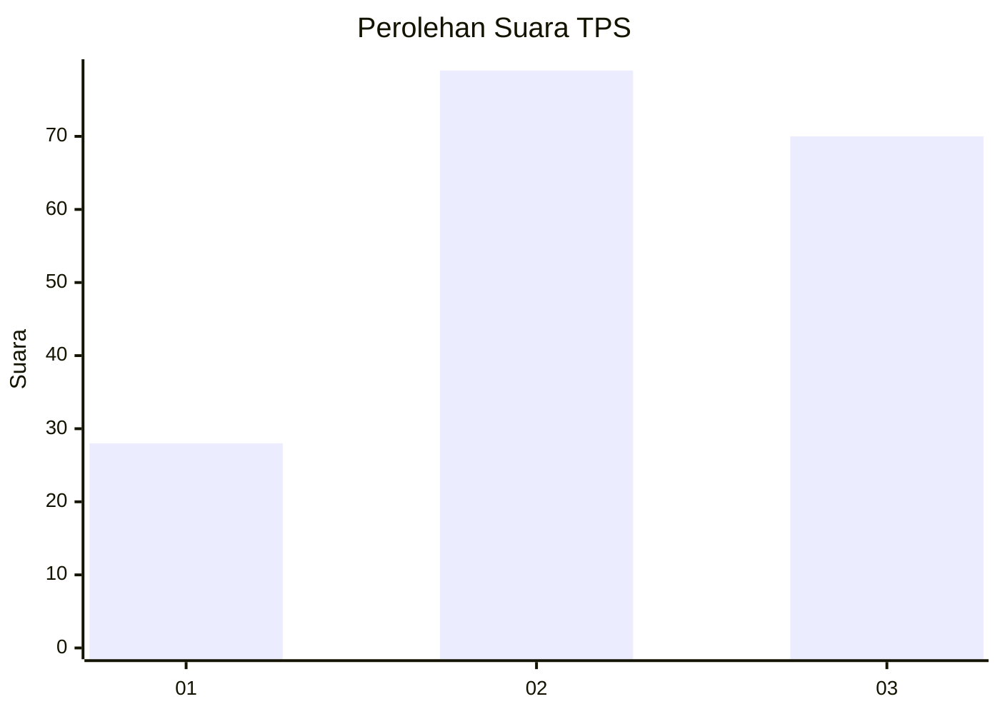
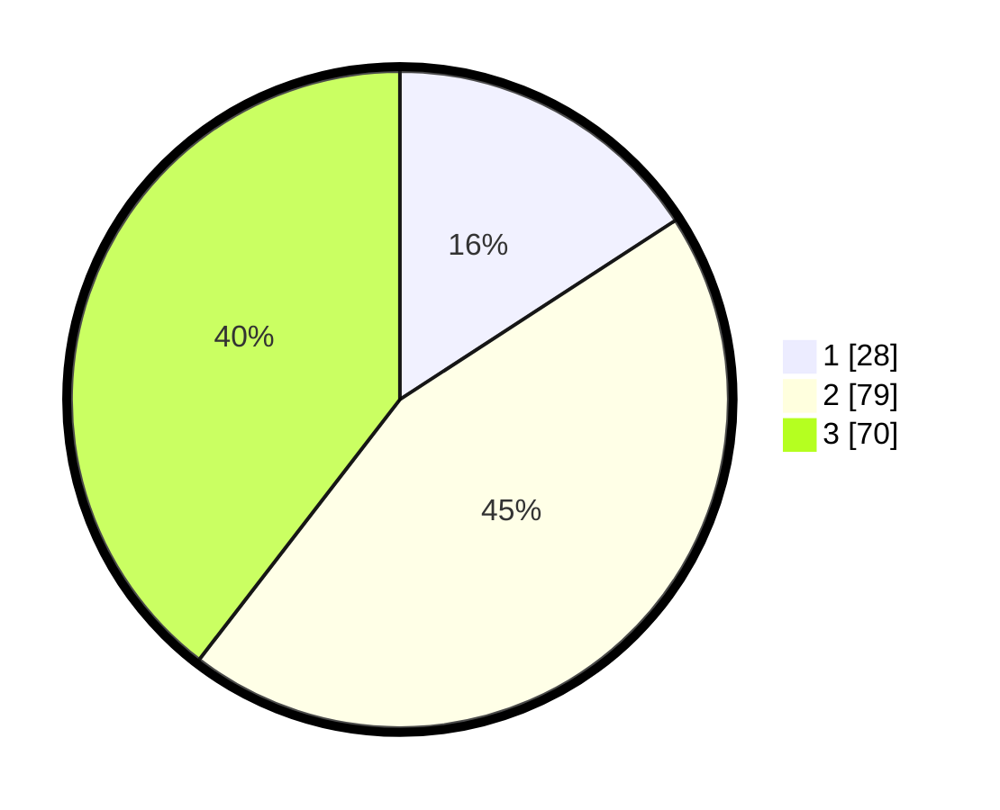

# Hasil

## Grafik

## Tabel

| No. | Nama Paslon    | Suara | Suara (raw) | Persentase |
|:--- |:-------------- | -----:| -----------:| ----------:|
| 1   | ANIES MUHAIMIN | 28    | [28][p-1]   | 15,82      |
| 2   | PRABOWO GIBRAN | 79    | [79][p-2]   | 44,63      |
| 3   | GANJAR MAHFUD  | 70    | [70][p-3]   | 39,55      |

[p-1]: https://github.com/gigit-pemilu/pemilu-2024/blob/main/pilpres/hitung-suara/sub/33-jawa-tengah/sub/13-karanganyar/sub/03-jumapolo/sub/2007-giriwondo/sub/010-tps/sub/paslon-1.txt
[p-2]: https://github.com/gigit-pemilu/pemilu-2024/blob/main/pilpres/hitung-suara/sub/33-jawa-tengah/sub/13-karanganyar/sub/03-jumapolo/sub/2007-giriwondo/sub/010-tps/sub/paslon-2.txt
[p-3]: https://github.com/gigit-pemilu/pemilu-2024/blob/main/pilpres/hitung-suara/sub/33-jawa-tengah/sub/13-karanganyar/sub/03-jumapolo/sub/2007-giriwondo/sub/010-tps/sub/paslon-3.txt

## Foto C Plano

https://sirekap-obj-formc.kpu.go.id/7068/pemilu/ppwp/33/13/03/20/07/3313032007010-20240218-075815--708adb5e-8347-489d-9b05-500de0e9465d.jpg

https://sirekap-obj-formc.kpu.go.id/7068/pemilu/ppwp/33/13/03/20/07/3313032007010-20240218-071045--76944706-dc38-45a8-8d7b-6c07b71a4e30.jpg

https://sirekap-obj-formc.kpu.go.id/7068/pemilu/ppwp/33/13/03/20/07/3313032007010-20240218-071225--e50a11a3-2707-465c-8388-ad1840e77298.jpg

## Metadata

| Key        | Value               |
| ---------- | ------------------- |
| Time Stamp | 2024-02-19 06:16:00 |

## DATA PEMILIH TETAP

Jumlah pemilih dalam DPT: **575**.
 * L: **200**.
 * P: **172**.

## DATA PENGGUNA HAK PILIH

Jumlah pengguna hak pilih dalam DPT: **430**.
 * L: **557**.
 * P: **723**.

Jumlah pengguna hak pilih dalam DPTb: **3**.
 * L: **31**.
 * P: **2**.

Jumlah pengguna hak pilih dalam DPK: **2**.
 * L: **8**.
 * P: **1**.

Jumlah pengguna hak pilih: **171**.
 * L: **899**.
 * P: **93**.

## JUMLAH SUARA SAH DAN TIDAK SAH

JUMLAH SELURUH SUARA SAH: **177**.

JUMLAH SUARA TIDAK SAH: **4**.

JUMLAH SELURUH SUARA SAH DAN SUARA TIDAK SAH: **181**.

