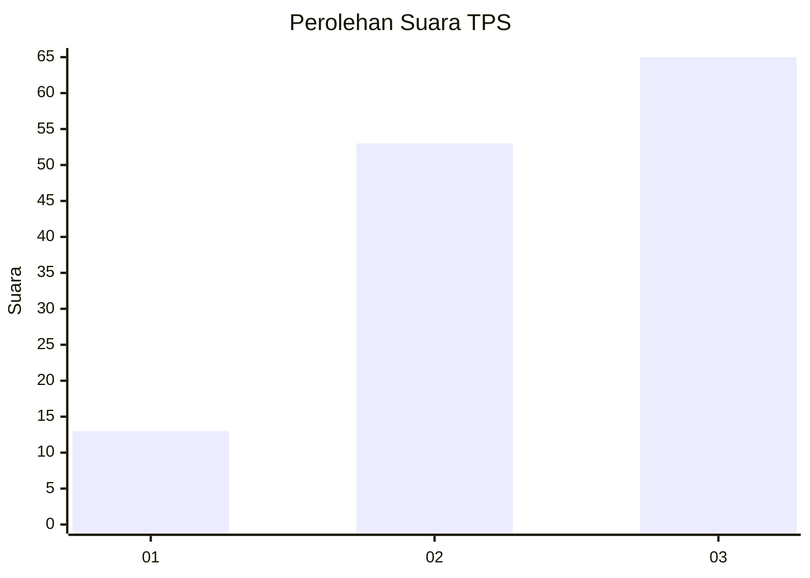
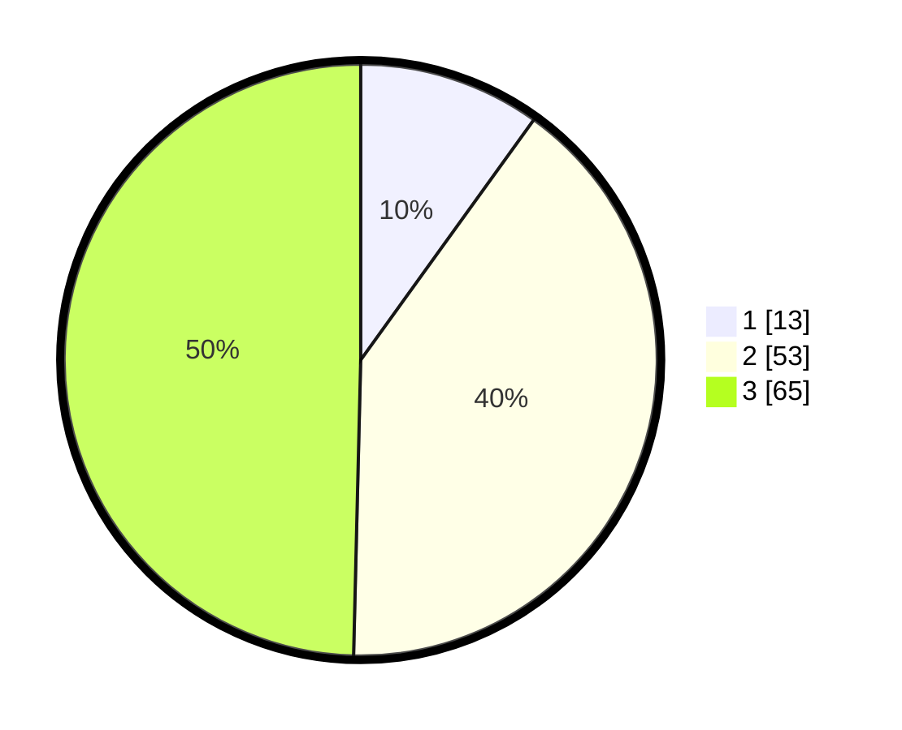

# Hasil

## Grafik

## Tabel

| No. | Nama Paslon    | Suara | Suara (raw) | Persentase |
|:--- |:-------------- | -----:| -----------:| ----------:|
| 1   | ANIES MUHAIMIN | 13    | [13][p-1]   | 9,92       |
| 2   | PRABOWO GIBRAN | 53    | [53][p-2]   | 40,46      |
| 3   | GANJAR MAHFUD  | 65    | [65][p-3]   | 49,62      |

[p-1]: https://github.com/gigit-pemilu/pemilu-2024-33-jawa-tengah/blob/main/pilpres/hitung-suara/sub/33-jawa-tengah/sub/13-karanganyar/sub/03-jumapolo/sub/2011-jumapolo/sub/021-tps/sub/paslon-1.txt
[p-2]: https://github.com/gigit-pemilu/pemilu-2024-33-jawa-tengah/blob/main/pilpres/hitung-suara/sub/33-jawa-tengah/sub/13-karanganyar/sub/03-jumapolo/sub/2011-jumapolo/sub/021-tps/sub/paslon-2.txt
[p-3]: https://github.com/gigit-pemilu/pemilu-2024-33-jawa-tengah/blob/main/pilpres/hitung-suara/sub/33-jawa-tengah/sub/13-karanganyar/sub/03-jumapolo/sub/2011-jumapolo/sub/021-tps/sub/paslon-3.txt

## Foto C Plano

https://sirekap-obj-formc.kpu.go.id/11da/pemilu/ppwp/33/13/03/20/11/3313032011021-20240214-204346--abb8ea11-a27c-402f-9c94-980296eeb8c5.jpg

https://sirekap-obj-formc.kpu.go.id/11da/pemilu/ppwp/33/13/03/20/11/3313032011021-20240214-203954--2fd83d35-ea2e-4d5b-987f-45c5379988e9.jpg

https://sirekap-obj-formc.kpu.go.id/11da/pemilu/ppwp/33/13/03/20/11/3313032011021-20240214-204115--3c73705a-87fb-4266-a824-1e58741ed502.jpg

## Metadata

| Key        | Value               |
| ---------- | ------------------- |
| Time Stamp | 2024-02-19 23:00:00 |

