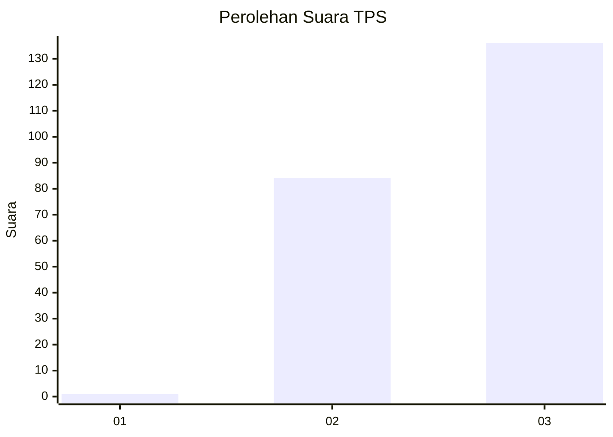
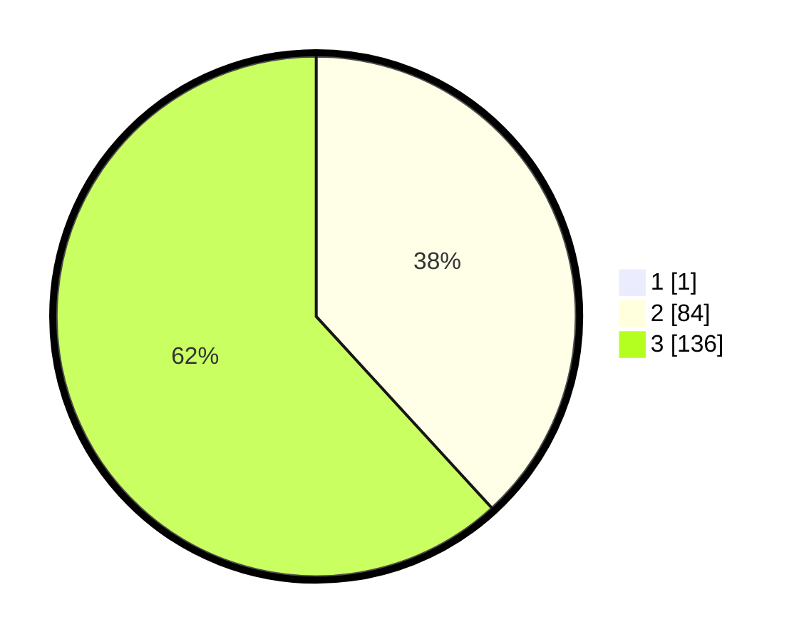

# Hasil

## Grafik

## Tabel

| No. | Nama Paslon    | Suara | Suara (raw) | Persentase |
|:--- |:-------------- | -----:| -----------:| ----------:|
| 1   | ANIES MUHAIMIN | 1     | [1][p-1]    | 0,45       |
| 2   | PRABOWO GIBRAN | 84    | [84][p-2]   | 38,01      |
| 3   | GANJAR MAHFUD  | 136   | [136][p-3]  | 61,54      |

[p-1]: https://github.com/gigit-pemilu/pemilu-2024-33-jawa-tengah/blob/main/pilpres/hitung-suara/sub/33-jawa-tengah/sub/13-karanganyar/sub/04-jumantono/sub/2007-tugu/sub/019-tps/sub/paslon-1.txt
[p-2]: https://github.com/gigit-pemilu/pemilu-2024-33-jawa-tengah/blob/main/pilpres/hitung-suara/sub/33-jawa-tengah/sub/13-karanganyar/sub/04-jumantono/sub/2007-tugu/sub/019-tps/sub/paslon-2.txt
[p-3]: https://github.com/gigit-pemilu/pemilu-2024-33-jawa-tengah/blob/main/pilpres/hitung-suara/sub/33-jawa-tengah/sub/13-karanganyar/sub/04-jumantono/sub/2007-tugu/sub/019-tps/sub/paslon-3.txt

## Foto C Plano

https://sirekap-obj-formc.kpu.go.id/742a/pemilu/ppwp/33/13/04/20/07/3313042007019-20240217-223118--b51fc92c-bac7-45c7-a768-95705d5eb542.jpg

https://sirekap-obj-formc.kpu.go.id/742a/pemilu/ppwp/33/13/04/20/07/3313042007019-20240217-221911--60d47659-04d6-4b19-abe2-462d7e8db6b0.jpg

https://sirekap-obj-formc.kpu.go.id/742a/pemilu/ppwp/33/13/04/20/07/3313042007019-20240218-185450--e412061b-e7ba-490e-87d7-735c5be14c15.jpg

## Metadata

| Key        | Value               |
| ---------- | ------------------- |
| Time Stamp | 2024-02-20 00:00:00 |

