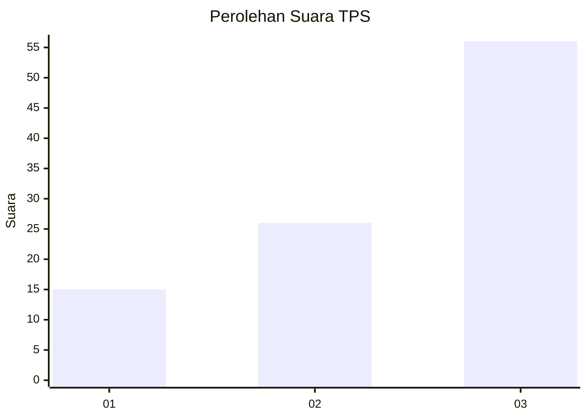
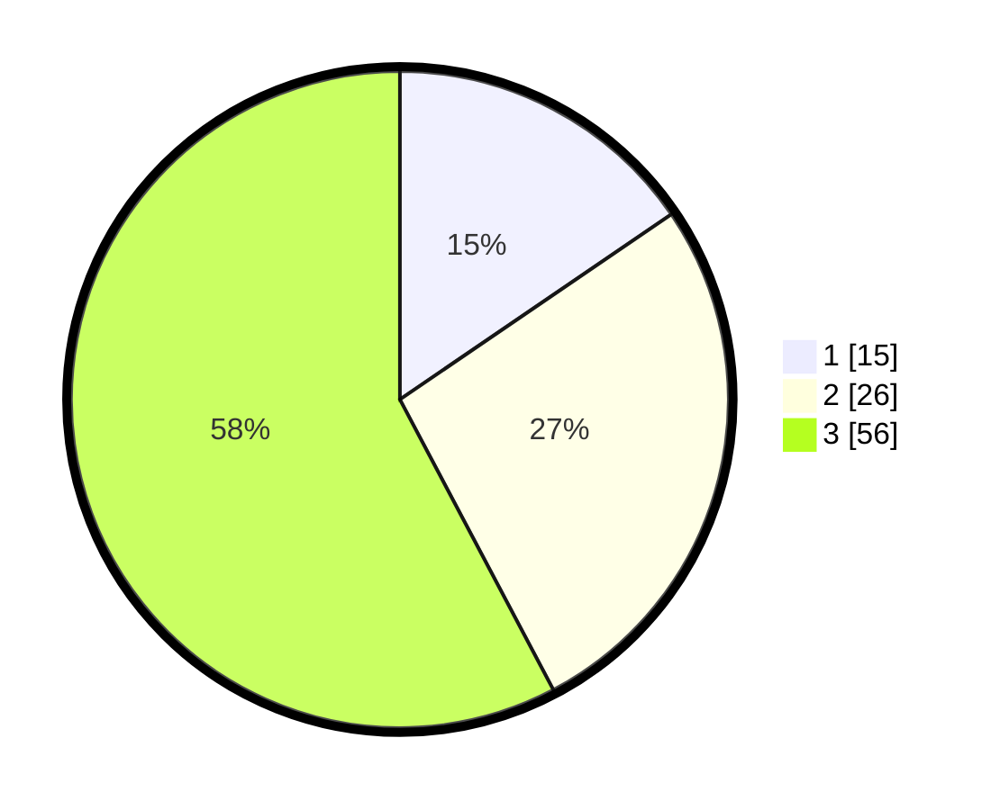

# Hasil

## Grafik

## Tabel

| No. | Nama Paslon    | Suara | Suara (raw) | Persentase |
|:--- |:-------------- | -----:| -----------:| ----------:|
| 1   | ANIES MUHAIMIN | 15    | [15][p-1]   | 15,46      |
| 2   | PRABOWO GIBRAN | 26    | [26][p-2]   | 26,80      |
| 3   | GANJAR MAHFUD  | 56    | [56][p-3]   | 57,73      |

[p-1]: https://github.com/gigit-pemilu/pemilu-2024-33-jawa-tengah/blob/main/pilpres/hitung-suara/sub/33-jawa-tengah/sub/13-karanganyar/sub/06-tawangmangu/sub/1004-tawangmangu/sub/007-tps/sub/paslon-1.txt
[p-2]: https://github.com/gigit-pemilu/pemilu-2024-33-jawa-tengah/blob/main/pilpres/hitung-suara/sub/33-jawa-tengah/sub/13-karanganyar/sub/06-tawangmangu/sub/1004-tawangmangu/sub/007-tps/sub/paslon-2.txt
[p-3]: https://github.com/gigit-pemilu/pemilu-2024-33-jawa-tengah/blob/main/pilpres/hitung-suara/sub/33-jawa-tengah/sub/13-karanganyar/sub/06-tawangmangu/sub/1004-tawangmangu/sub/007-tps/sub/paslon-3.txt

## Foto C Plano

https://sirekap-obj-formc.kpu.go.id/8fdb/pemilu/ppwp/33/13/06/10/04/3313061004007-20240217-210255--54eedf47-19e0-4b12-9ba2-c824da975e24.jpg

https://sirekap-obj-formc.kpu.go.id/8fdb/pemilu/ppwp/33/13/06/10/04/3313061004007-20240217-140817--3f4b1da8-9af5-488e-8bd6-8e8d5d2695fc.jpg

https://sirekap-obj-formc.kpu.go.id/8fdb/pemilu/ppwp/33/13/06/10/04/3313061004007-20240217-141123--79649fb6-5aef-42e8-886e-7079f8a18580.jpg

## Metadata

| Key        | Value               |
| ---------- | ------------------- |
| Time Stamp | 2024-02-19 06:16:00 |

