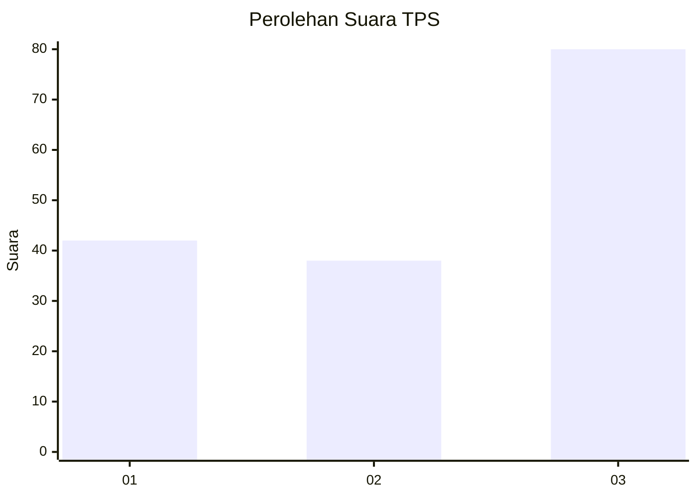
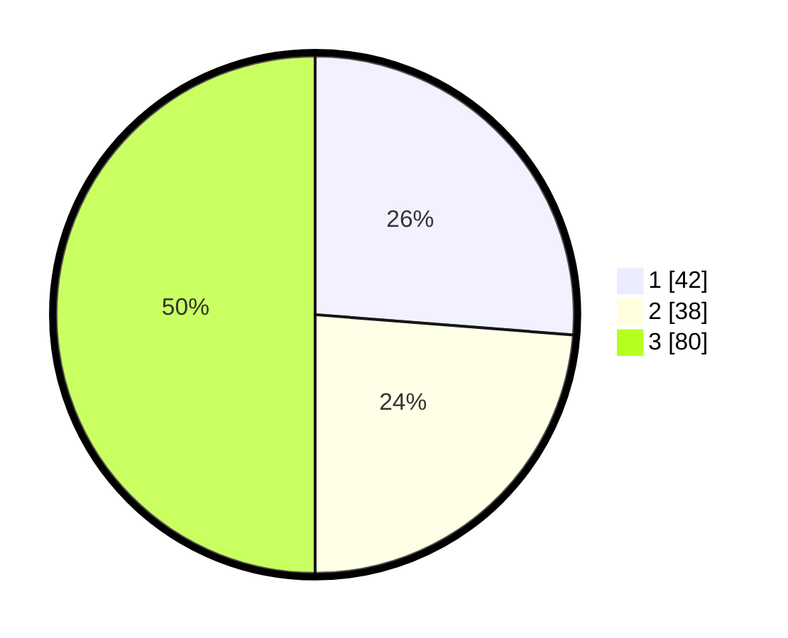

# Hasil

## Grafik

## Tabel

| No. | Nama Paslon    | Suara | Suara (raw) | Persentase |
|:--- |:-------------- | -----:| -----------:| ----------:|
| 1   | ANIES MUHAIMIN | 42    | [42][p-1]   | 26,25      |
| 2   | PRABOWO GIBRAN | 38    | [38][p-2]   | 23,75      |
| 3   | GANJAR MAHFUD  | 80    | [80][p-3]   | 50,00      |

[p-1]: https://github.com/gigit-pemilu/pemilu-2024/blob/main/pilpres/hitung-suara/sub/33-jawa-tengah/sub/13-karanganyar/sub/06-tawangmangu/sub/1004-tawangmangu/sub/029-tps/sub/paslon-1.txt
[p-2]: https://github.com/gigit-pemilu/pemilu-2024/blob/main/pilpres/hitung-suara/sub/33-jawa-tengah/sub/13-karanganyar/sub/06-tawangmangu/sub/1004-tawangmangu/sub/029-tps/sub/paslon-2.txt
[p-3]: https://github.com/gigit-pemilu/pemilu-2024/blob/main/pilpres/hitung-suara/sub/33-jawa-tengah/sub/13-karanganyar/sub/06-tawangmangu/sub/1004-tawangmangu/sub/029-tps/sub/paslon-3.txt

## Foto C Plano

https://sirekap-obj-formc.kpu.go.id/248f/pemilu/ppwp/33/13/06/10/04/3313061004029-20240214-231825--0301936f-1c81-4780-8df4-a64f58f916cd.jpg

https://sirekap-obj-formc.kpu.go.id/248f/pemilu/ppwp/33/13/06/10/04/3313061004029-20240214-231047--e268901e-cfc9-4a65-a295-d200c16af37c.jpg

https://sirekap-obj-formc.kpu.go.id/248f/pemilu/ppwp/33/13/06/10/04/3313061004029-20240214-231104--40be0553-ed31-4e3d-83b4-835622b0ac8a.jpg

## Metadata

| Key        | Value               |
| ---------- | ------------------- |
| Time Stamp | 2024-02-17 10:00:02 |

