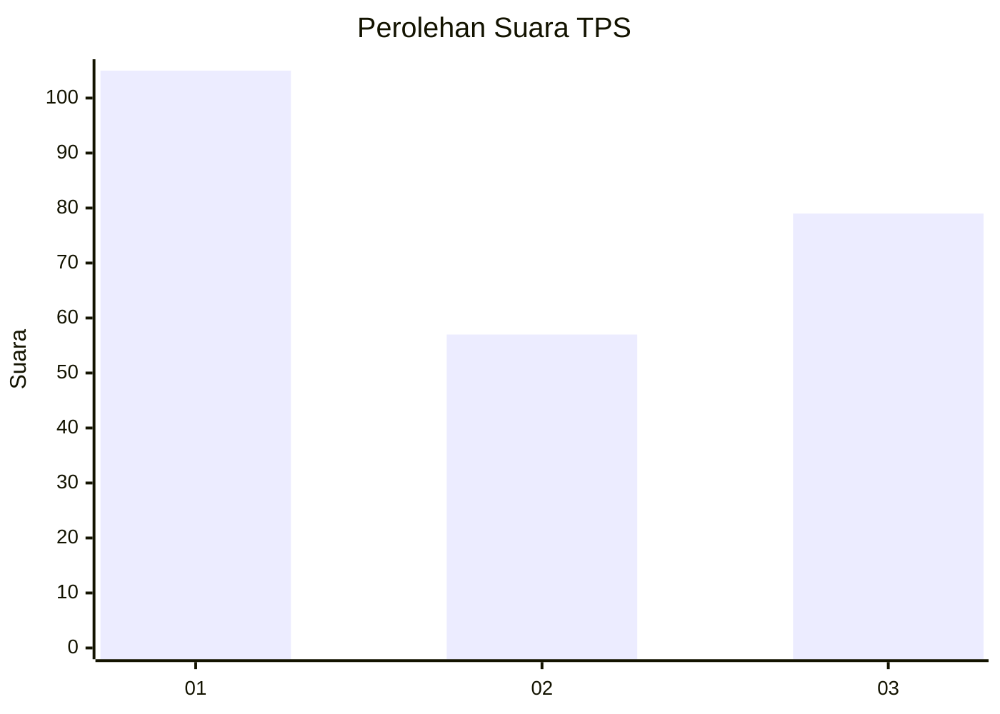
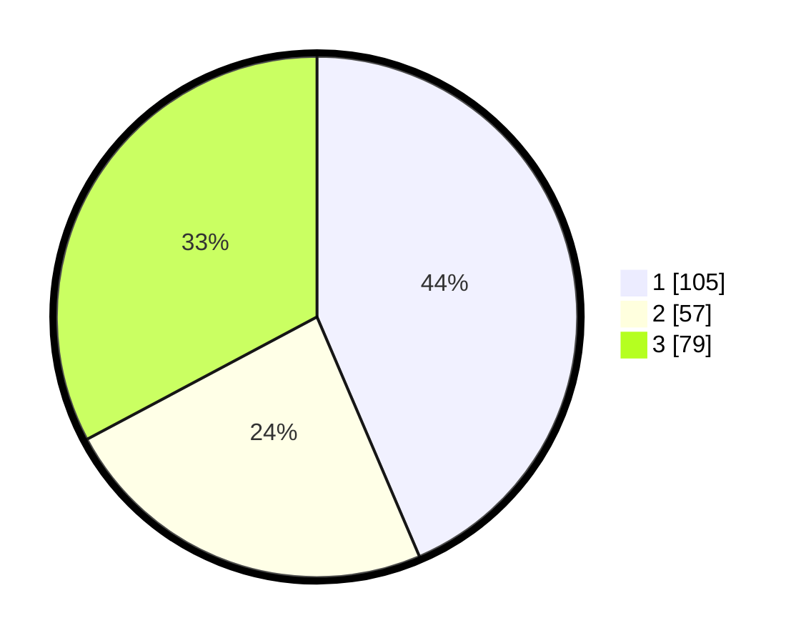

# Hasil

## Grafik

## Tabel

| No. | Nama Paslon    | Suara | Suara (raw) | Persentase |
|:--- |:-------------- | -----:| -----------:| ----------:|
| 1   | ANIES MUHAIMIN | 105   | [105][p-1]  | 43,57      |
| 2   | PRABOWO GIBRAN | 57    | [57][p-2]   | 23,65      |
| 3   | GANJAR MAHFUD  | 79    | [79][p-3]   | 32,78      |

[p-1]: https://github.com/gigit-pemilu/pemilu-2024-33-jawa-tengah/blob/main/pilpres/hitung-suara/sub/33-jawa-tengah/sub/13-karanganyar/sub/06-tawangmangu/sub/1004-tawangmangu/sub/032-tps/sub/paslon-1.txt
[p-2]: https://github.com/gigit-pemilu/pemilu-2024-33-jawa-tengah/blob/main/pilpres/hitung-suara/sub/33-jawa-tengah/sub/13-karanganyar/sub/06-tawangmangu/sub/1004-tawangmangu/sub/032-tps/sub/paslon-2.txt
[p-3]: https://github.com/gigit-pemilu/pemilu-2024-33-jawa-tengah/blob/main/pilpres/hitung-suara/sub/33-jawa-tengah/sub/13-karanganyar/sub/06-tawangmangu/sub/1004-tawangmangu/sub/032-tps/sub/paslon-3.txt

## Foto C Plano

https://sirekap-obj-formc.kpu.go.id/6713/pemilu/ppwp/33/13/06/10/04/3313061004032-20240215-010516--55d4eea2-dd6f-4e16-a313-441a837ea86a.jpg

https://sirekap-obj-formc.kpu.go.id/6713/pemilu/ppwp/33/13/06/10/04/3313061004032-20240215-010754--b76be482-e72d-4cb7-8d84-3facb6bfeb13.jpg

https://sirekap-obj-formc.kpu.go.id/6713/pemilu/ppwp/33/13/06/10/04/3313061004032-20240215-011027--9d50c11f-8339-43b3-9d1b-101f131115de.jpg

## Metadata

| Key        | Value               |
| ---------- | ------------------- |
| Time Stamp | 2024-02-15 15:00:29 |

