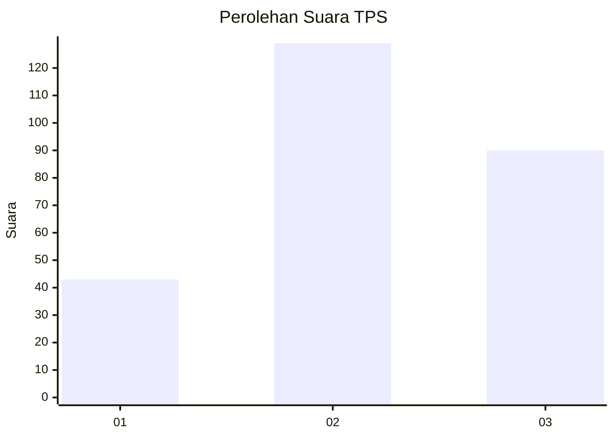
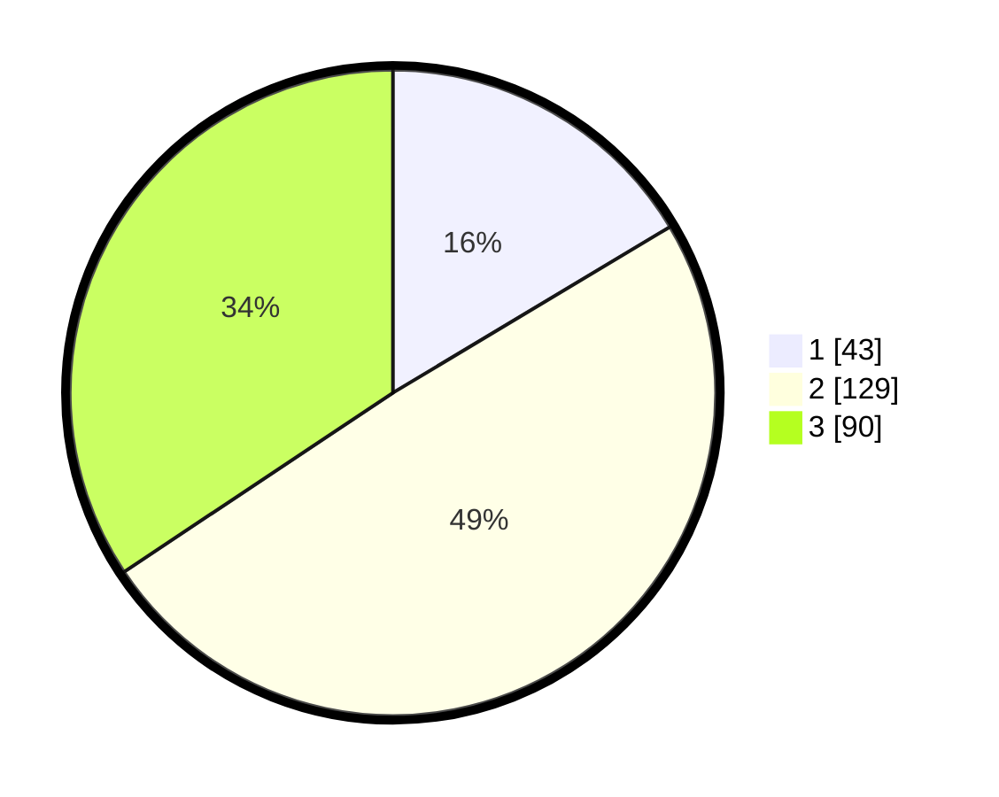

# Hasil

## Grafik

## Tabel

| No. | Nama Paslon    | Suara | Suara (raw) | Persentase |
|:--- |:-------------- | -----:| -----------:| ----------:|
| 1   | ANIES MUHAIMIN | 43    | [43][p-1]   | 16,41      |
| 2   | PRABOWO GIBRAN | 129   | [129][p-2]  | 49,24      |
| 3   | GANJAR MAHFUD  | 90    | [90][p-3]   | 34,35      |

[p-1]: https://github.com/gigit-pemilu/pemilu-2024-33-jawa-tengah/blob/main/pilpres/hitung-suara/sub/33-jawa-tengah/sub/13-karanganyar/sub/06-tawangmangu/sub/2009-plumbon/sub/013-tps/sub/paslon-1.txt
[p-2]: https://github.com/gigit-pemilu/pemilu-2024-33-jawa-tengah/blob/main/pilpres/hitung-suara/sub/33-jawa-tengah/sub/13-karanganyar/sub/06-tawangmangu/sub/2009-plumbon/sub/013-tps/sub/paslon-2.txt
[p-3]: https://github.com/gigit-pemilu/pemilu-2024-33-jawa-tengah/blob/main/pilpres/hitung-suara/sub/33-jawa-tengah/sub/13-karanganyar/sub/06-tawangmangu/sub/2009-plumbon/sub/013-tps/sub/paslon-3.txt

## Foto C Plano

https://sirekap-obj-formc.kpu.go.id/c651/pemilu/ppwp/33/13/06/20/09/3313062009013-20240217-215026--1bf1c7b1-ac18-4728-9c11-22395f80bcc5.jpg

https://sirekap-obj-formc.kpu.go.id/c651/pemilu/ppwp/33/13/06/20/09/3313062009013-20240215-091200--9a1e3f24-57a7-45d3-856b-613122a1faee.jpg

https://sirekap-obj-formc.kpu.go.id/c651/pemilu/ppwp/33/13/06/20/09/3313062009013-20240215-091842--98e8cb00-5063-4340-80a5-cd00bf0157ce.jpg

## Metadata

| Key        | Value               |
| ---------- | ------------------- |
| Time Stamp | 2024-02-19 06:16:00 |

