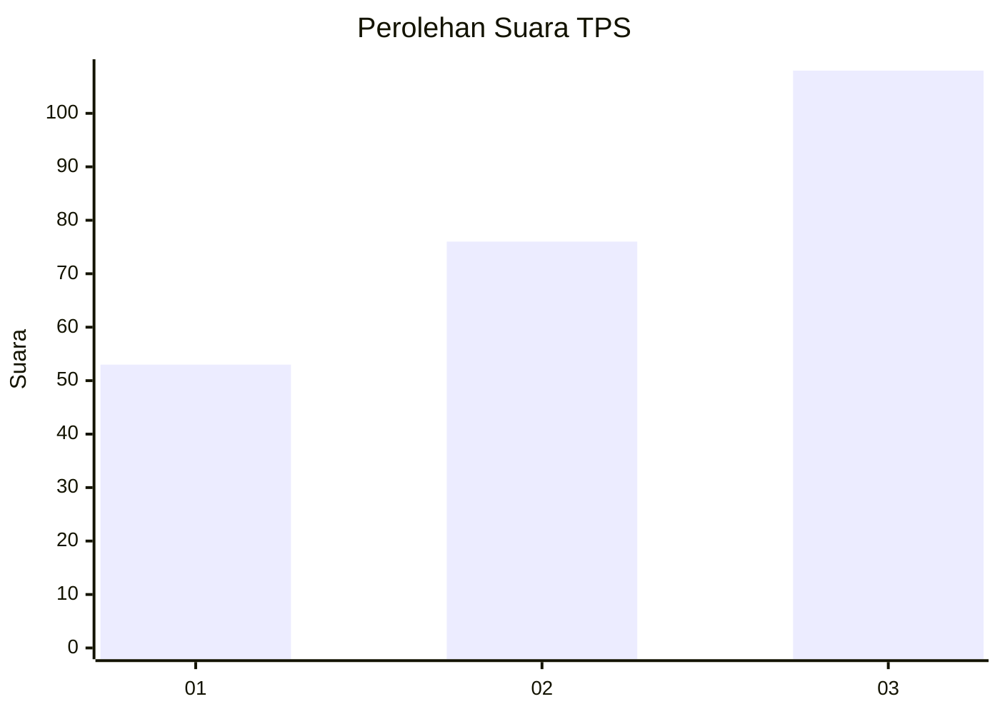
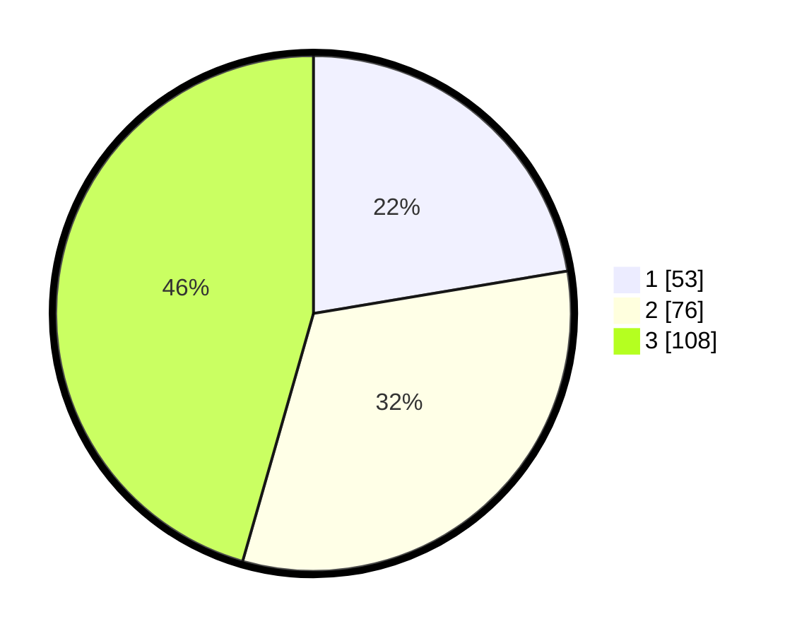

# Hasil

## Grafik

## Tabel

| No. | Nama Paslon    | Suara | Suara (raw) | Persentase |
|:--- |:-------------- | -----:| -----------:| ----------:|
| 1   | ANIES MUHAIMIN | 53    | [53][p-1]   | 22,36      |
| 2   | PRABOWO GIBRAN | 76    | [76][p-2]   | 32,07      |
| 3   | GANJAR MAHFUD  | 108   | [108][p-3]  | 45,57      |

[p-1]: https://github.com/gigit-pemilu/pemilu-2024-33-jawa-tengah/blob/main/pilpres/hitung-suara/sub/33-jawa-tengah/sub/13-karanganyar/sub/07-ngargoyoso/sub/2002-berjo/sub/013-tps/sub/paslon-1.txt
[p-2]: https://github.com/gigit-pemilu/pemilu-2024-33-jawa-tengah/blob/main/pilpres/hitung-suara/sub/33-jawa-tengah/sub/13-karanganyar/sub/07-ngargoyoso/sub/2002-berjo/sub/013-tps/sub/paslon-2.txt
[p-3]: https://github.com/gigit-pemilu/pemilu-2024-33-jawa-tengah/blob/main/pilpres/hitung-suara/sub/33-jawa-tengah/sub/13-karanganyar/sub/07-ngargoyoso/sub/2002-berjo/sub/013-tps/sub/paslon-3.txt

## Foto C Plano

https://sirekap-obj-formc.kpu.go.id/0166/pemilu/ppwp/33/13/07/20/02/3313072002013-20240214-141406--2ba0f5c2-ad42-40b8-9698-41e70b4b2e11.jpg

https://sirekap-obj-formc.kpu.go.id/0166/pemilu/ppwp/33/13/07/20/02/3313072002013-20240214-141610--45977352-a10a-4b8e-8edc-70916b290206.jpg

https://sirekap-obj-formc.kpu.go.id/0166/pemilu/ppwp/33/13/07/20/02/3313072002013-20240214-141731--45593a35-8945-43c2-98c7-9bedc3df0a32.jpg

## Metadata

| Key        | Value               |
| ---------- | ------------------- |
| Time Stamp | 2024-02-15 12:00:28 |

