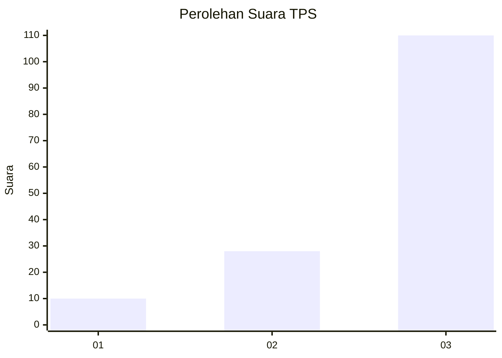
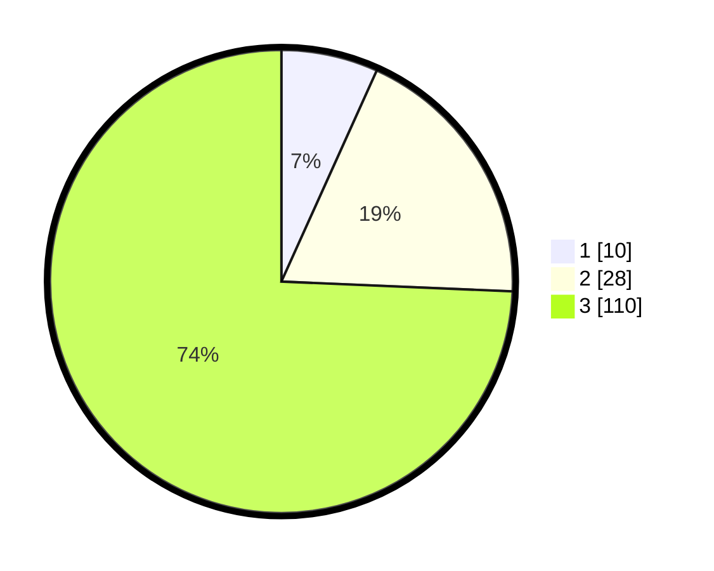

# Hasil

## Grafik

## Tabel

| No. | Nama Paslon    | Suara | Suara (raw) | Persentase |
|:--- |:-------------- | -----:| -----------:| ----------:|
| 1   | ANIES MUHAIMIN | 10    | [10][p-1]   | 6,76       |
| 2   | PRABOWO GIBRAN | 28    | [28][p-2]   | 18,92      |
| 3   | GANJAR MAHFUD  | 110   | [110][p-3]  | 74,32      |

[p-1]: https://github.com/gigit-pemilu/pemilu-2024-33-jawa-tengah/blob/main/pilpres/hitung-suara/sub/33-jawa-tengah/sub/13-karanganyar/sub/07-ngargoyoso/sub/2002-berjo/sub/020-tps/sub/paslon-1.txt
[p-2]: https://github.com/gigit-pemilu/pemilu-2024-33-jawa-tengah/blob/main/pilpres/hitung-suara/sub/33-jawa-tengah/sub/13-karanganyar/sub/07-ngargoyoso/sub/2002-berjo/sub/020-tps/sub/paslon-2.txt
[p-3]: https://github.com/gigit-pemilu/pemilu-2024-33-jawa-tengah/blob/main/pilpres/hitung-suara/sub/33-jawa-tengah/sub/13-karanganyar/sub/07-ngargoyoso/sub/2002-berjo/sub/020-tps/sub/paslon-3.txt

## Foto C Plano

https://sirekap-obj-formc.kpu.go.id/16a3/pemilu/ppwp/33/13/07/20/02/3313072002020-20240215-103446--564189e3-d0fd-40a2-919d-71da42c6ea07.jpg

https://sirekap-obj-formc.kpu.go.id/16a3/pemilu/ppwp/33/13/07/20/02/3313072002020-20240215-103737--0bba6240-b450-4d26-800b-da74e9083e6d.jpg

https://sirekap-obj-formc.kpu.go.id/16a3/pemilu/ppwp/33/13/07/20/02/3313072002020-20240215-103930--034dd148-1e57-4827-84ac-b38a4ca8e521.jpg

## Metadata

| Key        | Value               |
| ---------- | ------------------- |
| Time Stamp | 2024-02-15 15:00:29 |

