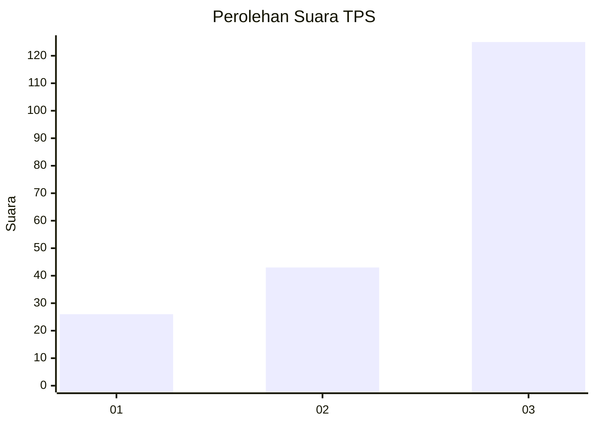
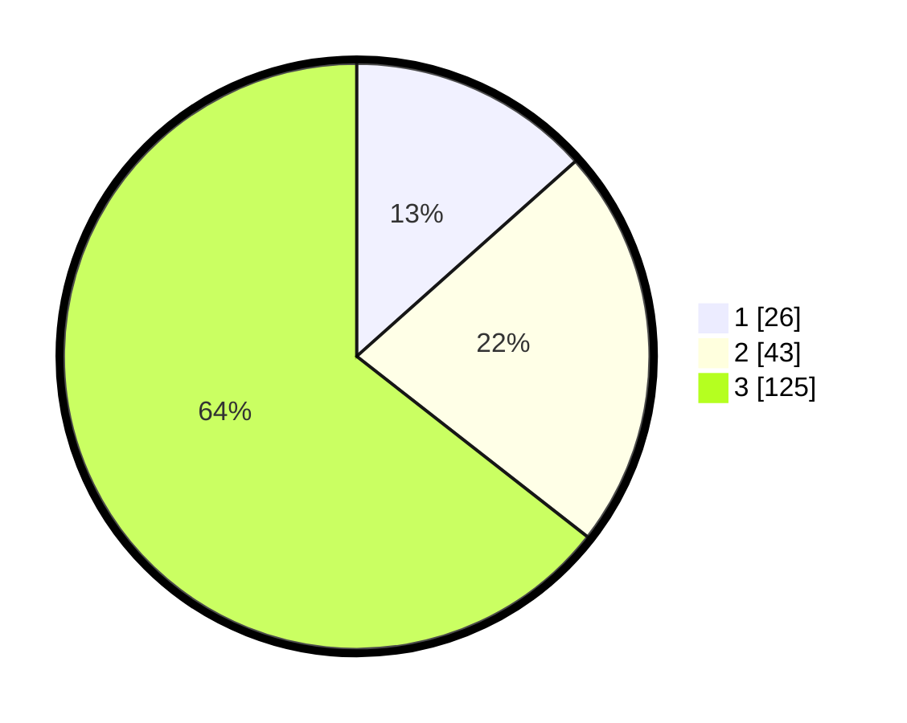

# Hasil

## Grafik

## Tabel

| No. | Nama Paslon    | Suara | Suara (raw) | Persentase |
|:--- |:-------------- | -----:| -----------:| ----------:|
| 1   | ANIES MUHAIMIN | 26    | [26][p-1]   | 13,40      |
| 2   | PRABOWO GIBRAN | 43    | [43][p-2]   | 22,16      |
| 3   | GANJAR MAHFUD  | 125   | [125][p-3]  | 64,43      |

[p-1]: https://github.com/gigit-pemilu/pemilu-2024/blob/main/pilpres/hitung-suara/sub/33-jawa-tengah/sub/13-karanganyar/sub/07-ngargoyoso/sub/2005-kemuning/sub/018-tps/sub/paslon-1.txt
[p-2]: https://github.com/gigit-pemilu/pemilu-2024/blob/main/pilpres/hitung-suara/sub/33-jawa-tengah/sub/13-karanganyar/sub/07-ngargoyoso/sub/2005-kemuning/sub/018-tps/sub/paslon-2.txt
[p-3]: https://github.com/gigit-pemilu/pemilu-2024/blob/main/pilpres/hitung-suara/sub/33-jawa-tengah/sub/13-karanganyar/sub/07-ngargoyoso/sub/2005-kemuning/sub/018-tps/sub/paslon-3.txt

## Foto C Plano

https://sirekap-obj-formc.kpu.go.id/f4f8/pemilu/ppwp/33/13/07/20/05/3313072005018-20240214-141144--5e3905b9-1a2f-4536-942c-633f2cc3c3d9.jpg

https://sirekap-obj-formc.kpu.go.id/f4f8/pemilu/ppwp/33/13/07/20/05/3313072005018-20240214-141312--2d6d8c66-9c4f-4fa4-832e-cba8ff5530b4.jpg

https://sirekap-obj-formc.kpu.go.id/f4f8/pemilu/ppwp/33/13/07/20/05/3313072005018-20240214-141718--05e79beb-7df8-4fc1-861c-1778f218977b.jpg

## Metadata

| Key        | Value               |
| ---------- | ------------------- |
| Time Stamp | 2024-02-15 15:00:29 |

