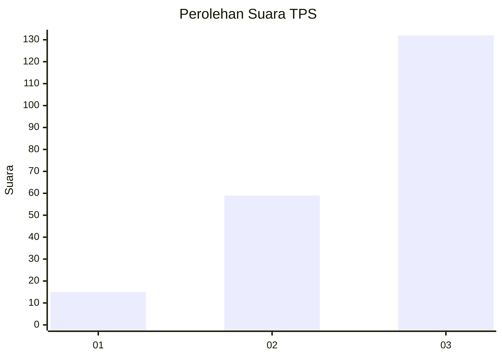
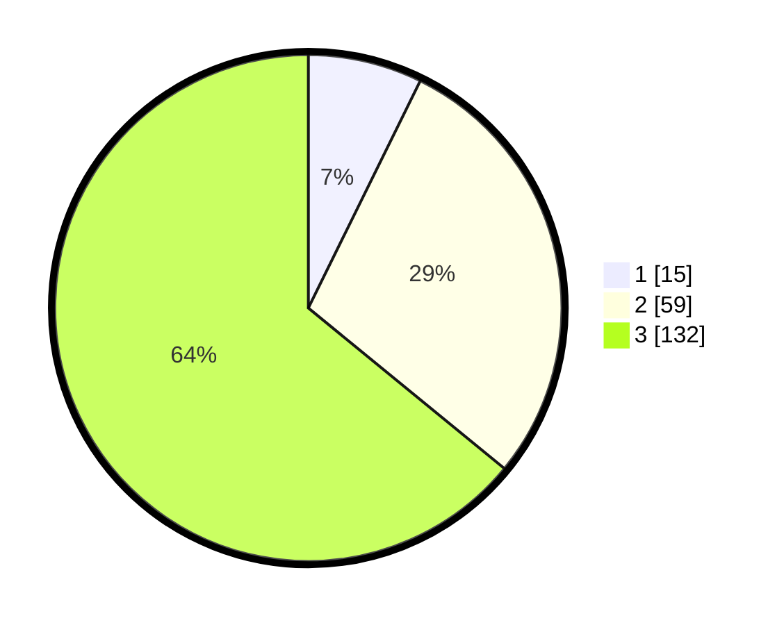

# Hasil

## Grafik

## Tabel

| No. | Nama Paslon    | Suara | Suara (raw) | Persentase |
|:--- |:-------------- | -----:| -----------:| ----------:|
| 1   | ANIES MUHAIMIN | 15    | [15][p-1]   | 7,28       |
| 2   | PRABOWO GIBRAN | 59    | [59][p-2]   | 28,64      |
| 3   | GANJAR MAHFUD  | 132   | [132][p-3]  | 64,08      |

[p-1]: https://github.com/gigit-pemilu/pemilu-2024/blob/main/pilpres/hitung-suara/sub/33-jawa-tengah/sub/13-karanganyar/sub/07-ngargoyoso/sub/2009-ngargoyoso/sub/010-tps/sub/paslon-1.txt
[p-2]: https://github.com/gigit-pemilu/pemilu-2024/blob/main/pilpres/hitung-suara/sub/33-jawa-tengah/sub/13-karanganyar/sub/07-ngargoyoso/sub/2009-ngargoyoso/sub/010-tps/sub/paslon-2.txt
[p-3]: https://github.com/gigit-pemilu/pemilu-2024/blob/main/pilpres/hitung-suara/sub/33-jawa-tengah/sub/13-karanganyar/sub/07-ngargoyoso/sub/2009-ngargoyoso/sub/010-tps/sub/paslon-3.txt

## Foto C Plano

https://sirekap-obj-formc.kpu.go.id/6018/pemilu/ppwp/33/13/07/20/09/3313072009010-20240215-194756--9e479278-ffdc-40df-aa3b-14e6d9d97534.jpg

https://sirekap-obj-formc.kpu.go.id/6018/pemilu/ppwp/33/13/07/20/09/3313072009010-20240217-163914--daf4b95e-e031-45dc-add2-316e0d5cbe86.jpg

https://sirekap-obj-formc.kpu.go.id/6018/pemilu/ppwp/33/13/07/20/09/3313072009010-20240217-164317--d554cc6f-3ee4-4480-9cc1-4fbf35582b3c.jpg

## Metadata

| Key        | Value               |
| ---------- | ------------------- |
| Time Stamp | 2024-02-20 10:00:00 |

