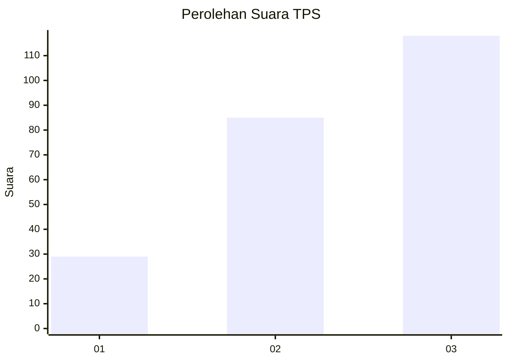
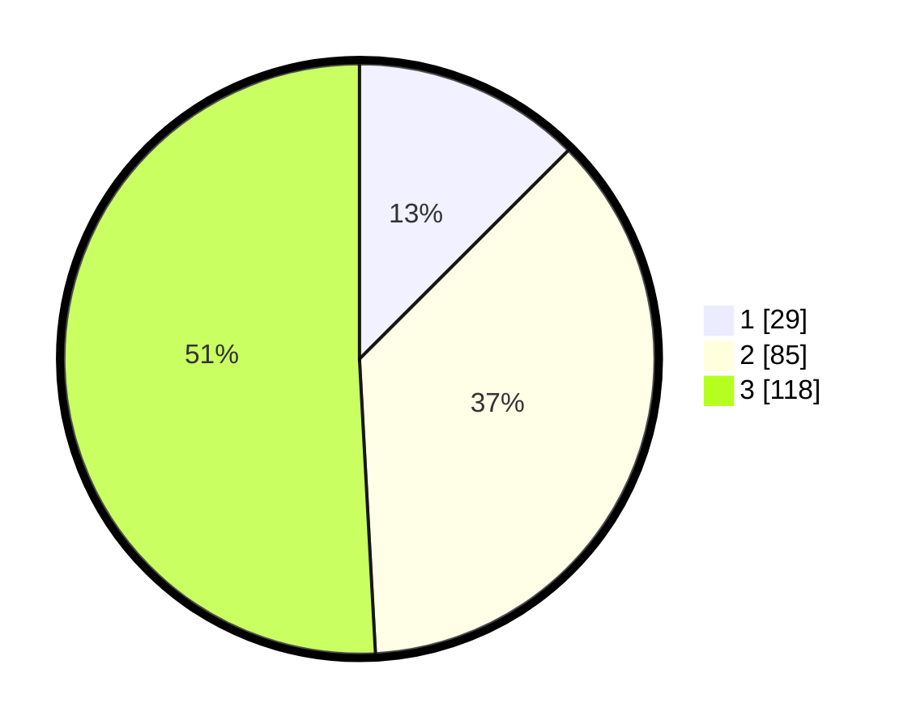

# Hasil

## Grafik

## Tabel

| No. | Nama Paslon    | Suara | Suara (raw) | Persentase |
|:--- |:-------------- | -----:| -----------:| ----------:|
| 1   | ANIES MUHAIMIN | 29    | [29][p-1]   | 12,50      |
| 2   | PRABOWO GIBRAN | 85    | [85][p-2]   | 36,64      |
| 3   | GANJAR MAHFUD  | 118   | [118][p-3]  | 50,86      |

[p-1]: https://github.com/gigit-pemilu/pemilu-2024/blob/main/pilpres/hitung-suara/sub/33-jawa-tengah/sub/13-karanganyar/sub/08-karangpandan/sub/2001-bangsri/sub/005-tps/sub/paslon-1.txt
[p-2]: https://github.com/gigit-pemilu/pemilu-2024/blob/main/pilpres/hitung-suara/sub/33-jawa-tengah/sub/13-karanganyar/sub/08-karangpandan/sub/2001-bangsri/sub/005-tps/sub/paslon-2.txt
[p-3]: https://github.com/gigit-pemilu/pemilu-2024/blob/main/pilpres/hitung-suara/sub/33-jawa-tengah/sub/13-karanganyar/sub/08-karangpandan/sub/2001-bangsri/sub/005-tps/sub/paslon-3.txt

## Foto C Plano

https://sirekap-obj-formc.kpu.go.id/3ed4/pemilu/ppwp/33/13/08/20/01/3313082001005-20240215-013104--2c4527fa-b3b6-4c47-a4d3-8b68462dd70f.jpg

https://sirekap-obj-formc.kpu.go.id/3ed4/pemilu/ppwp/33/13/08/20/01/3313082001005-20240214-212632--321610be-9d59-4860-be7a-3fcbeb5cfefd.jpg

https://sirekap-obj-formc.kpu.go.id/3ed4/pemilu/ppwp/33/13/08/20/01/3313082001005-20240214-212634--49412d63-4538-4632-8334-7add14f4e73b.jpg

## Metadata

| Key        | Value               |
| ---------- | ------------------- |
| Time Stamp | 2024-02-15 20:30:46 |

