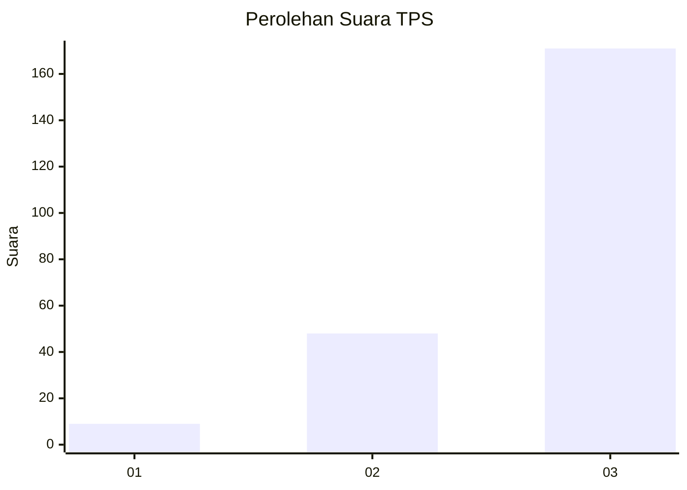
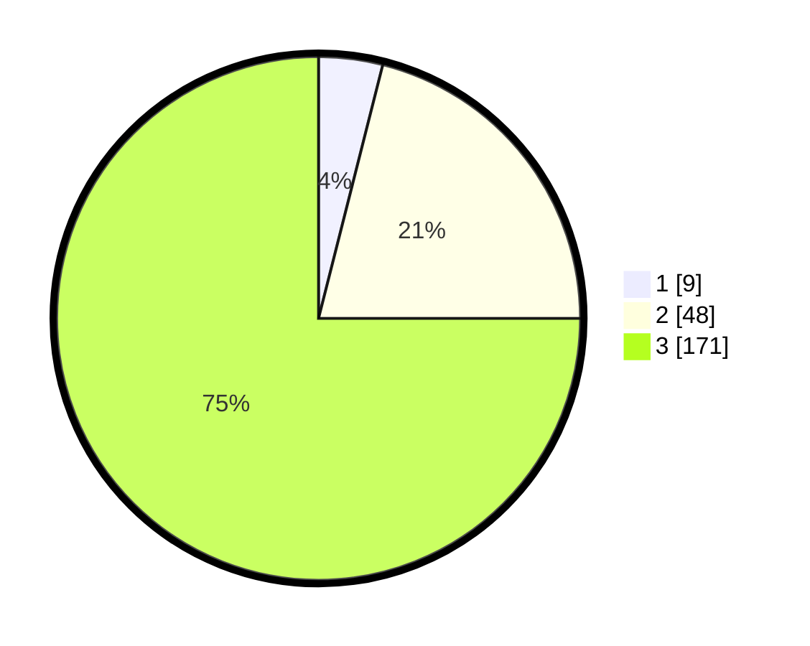

# Hasil

## Grafik

## Tabel

| No. | Nama Paslon    | Suara | Suara (raw) | Persentase |
|:--- |:-------------- | -----:| -----------:| ----------:|
| 1   | ANIES MUHAIMIN | 9     | [9][p-1]    | 3,95       |
| 2   | PRABOWO GIBRAN | 48    | [48][p-2]   | 21,05      |
| 3   | GANJAR MAHFUD  | 171   | [171][p-3]  | 75,00      |

[p-1]: https://github.com/gigit-pemilu/pemilu-2024-33-jawa-tengah/blob/main/pilpres/hitung-suara/sub/33-jawa-tengah/sub/13-karanganyar/sub/08-karangpandan/sub/2001-bangsri/sub/007-tps/sub/paslon-1.txt
[p-2]: https://github.com/gigit-pemilu/pemilu-2024-33-jawa-tengah/blob/main/pilpres/hitung-suara/sub/33-jawa-tengah/sub/13-karanganyar/sub/08-karangpandan/sub/2001-bangsri/sub/007-tps/sub/paslon-2.txt
[p-3]: https://github.com/gigit-pemilu/pemilu-2024-33-jawa-tengah/blob/main/pilpres/hitung-suara/sub/33-jawa-tengah/sub/13-karanganyar/sub/08-karangpandan/sub/2001-bangsri/sub/007-tps/sub/paslon-3.txt

## Foto C Plano

https://sirekap-obj-formc.kpu.go.id/0839/pemilu/ppwp/33/13/08/20/01/3313082001007-20240214-232010--3b29b2cb-93c4-4dfb-b232-628cbf188d5b.jpg

https://sirekap-obj-formc.kpu.go.id/0839/pemilu/ppwp/33/13/08/20/01/3313082001007-20240214-230956--1ad9e086-833e-4fcc-9290-271881122004.jpg

https://sirekap-obj-formc.kpu.go.id/0839/pemilu/ppwp/33/13/08/20/01/3313082001007-20240214-232257--68c5db0d-c37e-4d0a-bb91-1f8a17aeb500.jpg

## Metadata

| Key        | Value               |
| ---------- | ------------------- |
| Time Stamp | 2024-02-15 20:30:46 |

