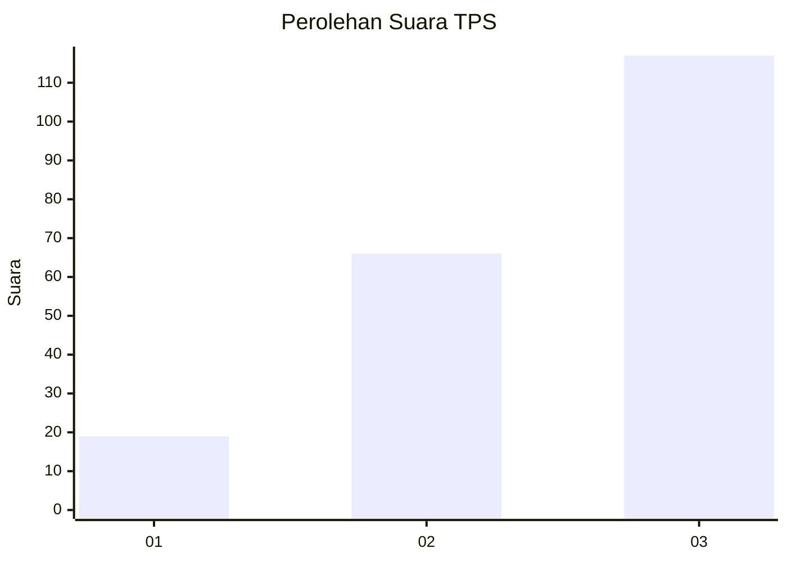
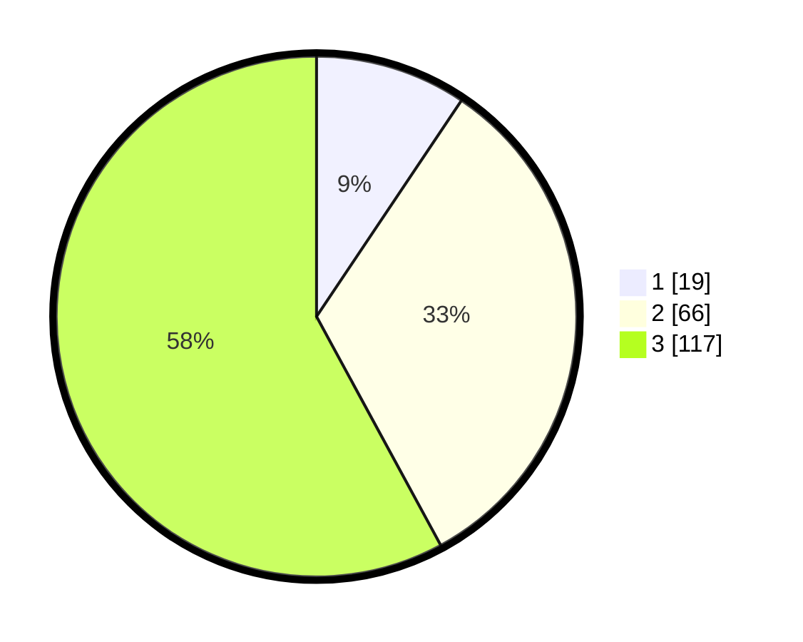

# Hasil

## Grafik

## Tabel

| No. | Nama Paslon    | Suara | Suara (raw) | Persentase |
|:--- |:-------------- | -----:| -----------:| ----------:|
| 1   | ANIES MUHAIMIN | 19    | [19][p-1]   | 9,41       |
| 2   | PRABOWO GIBRAN | 66    | [66][p-2]   | 32,67      |
| 3   | GANJAR MAHFUD  | 117   | [117][p-3]  | 57,92      |

[p-1]: https://github.com/gigit-pemilu/pemilu-2024/blob/main/pilpres/hitung-suara/sub/33-jawa-tengah/sub/13-karanganyar/sub/08-karangpandan/sub/2011-harjosari/sub/006-tps/sub/paslon-1.txt
[p-2]: https://github.com/gigit-pemilu/pemilu-2024/blob/main/pilpres/hitung-suara/sub/33-jawa-tengah/sub/13-karanganyar/sub/08-karangpandan/sub/2011-harjosari/sub/006-tps/sub/paslon-2.txt
[p-3]: https://github.com/gigit-pemilu/pemilu-2024/blob/main/pilpres/hitung-suara/sub/33-jawa-tengah/sub/13-karanganyar/sub/08-karangpandan/sub/2011-harjosari/sub/006-tps/sub/paslon-3.txt

## Foto C Plano

https://sirekap-obj-formc.kpu.go.id/de45/pemilu/ppwp/33/13/08/20/11/3313082011006-20240216-153418--7ae00f7c-e644-48fb-8011-2e3df800f7d0.jpg

https://sirekap-obj-formc.kpu.go.id/de45/pemilu/ppwp/33/13/08/20/11/3313082011006-20240217-171649--36fa6d5b-9a8c-4818-bf39-ee91d01ee833.jpg

https://sirekap-obj-formc.kpu.go.id/de45/pemilu/ppwp/33/13/08/20/11/3313082011006-20240216-153824--3b6fcd3e-f44c-4f95-81a5-cbb146d62dc8.jpg

## Metadata

| Key        | Value               |
| ---------- | ------------------- |
| Time Stamp | 2024-02-22 12:00:00 |

