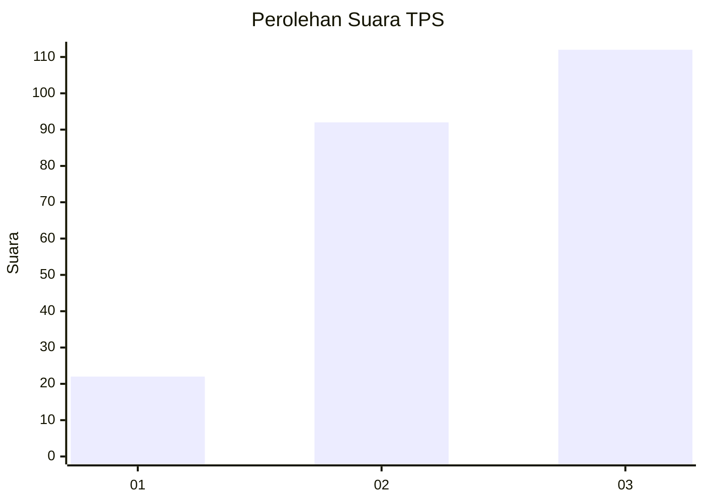
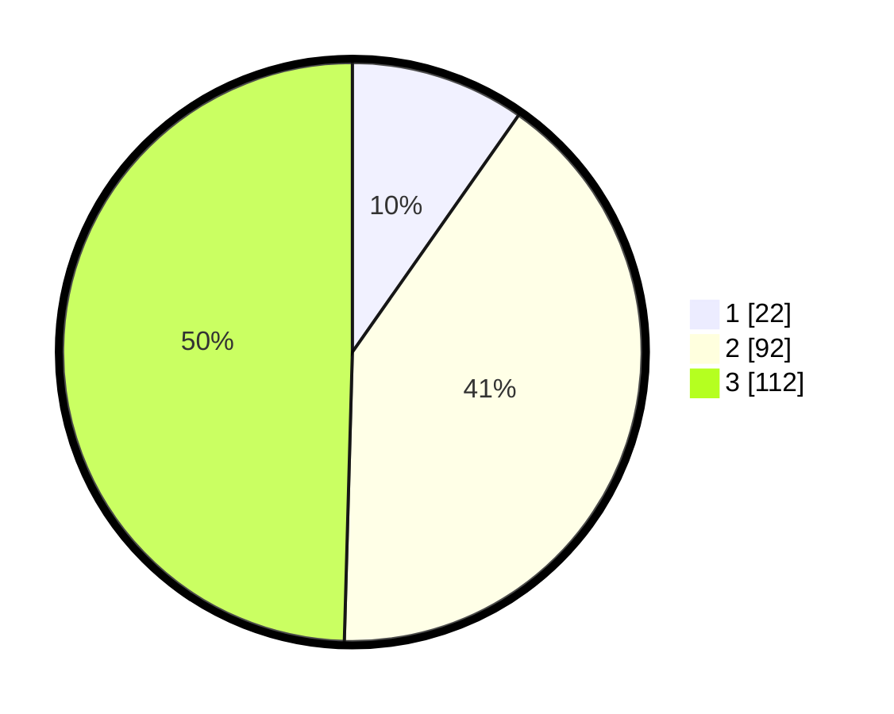

# Hasil

## Grafik

## Tabel

| No. | Nama Paslon    | Suara | Suara (raw) | Persentase |
|:--- |:-------------- | -----:| -----------:| ----------:|
| 1   | ANIES MUHAIMIN | 22    | [22][p-1]   | 9,73       |
| 2   | PRABOWO GIBRAN | 92    | [92][p-2]   | 40,71      |
| 3   | GANJAR MAHFUD  | 112   | [112][p-3]  | 49,56      |

[p-1]: https://github.com/gigit-pemilu/pemilu-2024/blob/main/pilpres/hitung-suara/sub/33-jawa-tengah/sub/13-karanganyar/sub/09-karanganyar/sub/1002-bolong/sub/002-tps/sub/paslon-1.txt
[p-2]: https://github.com/gigit-pemilu/pemilu-2024/blob/main/pilpres/hitung-suara/sub/33-jawa-tengah/sub/13-karanganyar/sub/09-karanganyar/sub/1002-bolong/sub/002-tps/sub/paslon-2.txt
[p-3]: https://github.com/gigit-pemilu/pemilu-2024/blob/main/pilpres/hitung-suara/sub/33-jawa-tengah/sub/13-karanganyar/sub/09-karanganyar/sub/1002-bolong/sub/002-tps/sub/paslon-3.txt

## Foto C Plano

https://sirekap-obj-formc.kpu.go.id/ed59/pemilu/ppwp/33/13/09/10/02/3313091002002-20240216-122448--bb777ba9-ebeb-47c8-9d5b-b9b87870a53f.jpg

https://sirekap-obj-formc.kpu.go.id/ed59/pemilu/ppwp/33/13/09/10/02/3313091002002-20240214-214352--3bbbcee8-5db7-42e2-80ec-53001b987f6a.jpg

https://sirekap-obj-formc.kpu.go.id/ed59/pemilu/ppwp/33/13/09/10/02/3313091002002-20240215-212505--b9c33c3e-6510-4e9d-8e56-fc1a205a9b42.jpg

## Metadata

| Key        | Value               |
| ---------- | ------------------- |
| Time Stamp | 2024-02-16 12:51:22 |

