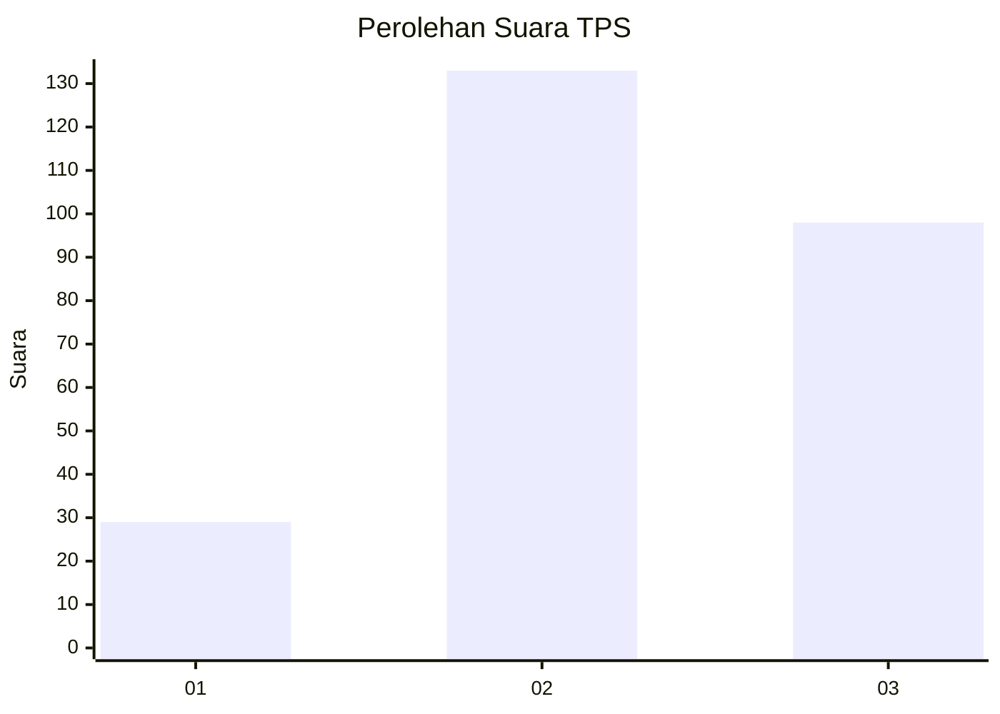
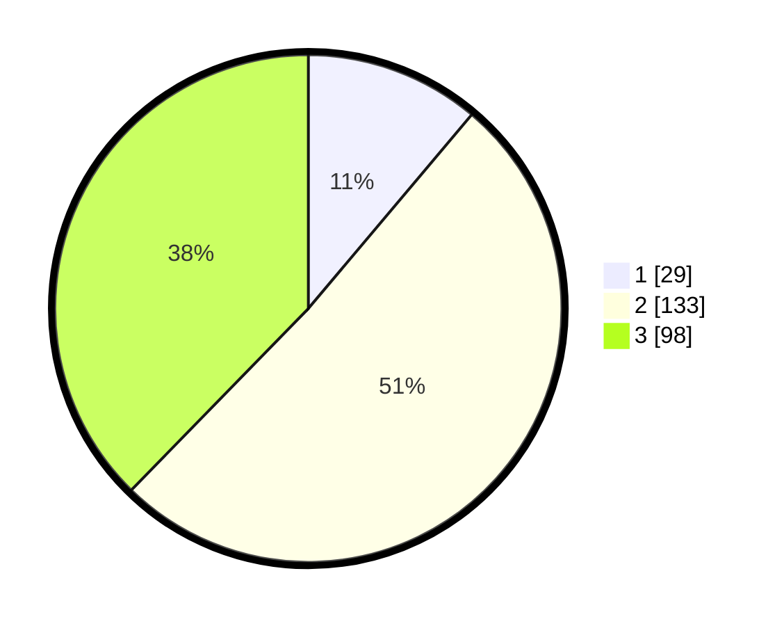

# Hasil

## Grafik

## Tabel

| No. | Nama Paslon    | Suara | Suara (raw) | Persentase |
|:--- |:-------------- | -----:| -----------:| ----------:|
| 1   | ANIES MUHAIMIN | 29    | [29][p-1]   | 11,15      |
| 2   | PRABOWO GIBRAN | 133   | [133][p-2]  | 51,15      |
| 3   | GANJAR MAHFUD  | 98    | [98][p-3]   | 37,69      |

[p-1]: https://github.com/gigit-pemilu/pemilu-2024/blob/main/pilpres/hitung-suara/sub/33-jawa-tengah/sub/13-karanganyar/sub/09-karanganyar/sub/1005-jungke/sub/005-tps/sub/paslon-1.txt
[p-2]: https://github.com/gigit-pemilu/pemilu-2024/blob/main/pilpres/hitung-suara/sub/33-jawa-tengah/sub/13-karanganyar/sub/09-karanganyar/sub/1005-jungke/sub/005-tps/sub/paslon-2.txt
[p-3]: https://github.com/gigit-pemilu/pemilu-2024/blob/main/pilpres/hitung-suara/sub/33-jawa-tengah/sub/13-karanganyar/sub/09-karanganyar/sub/1005-jungke/sub/005-tps/sub/paslon-3.txt

## Foto C Plano

https://sirekap-obj-formc.kpu.go.id/3525/pemilu/ppwp/33/13/09/10/05/3313091005005-20240214-221109--eba5215e-b4dd-48de-8524-d69909b792bd.jpg

https://sirekap-obj-formc.kpu.go.id/3525/pemilu/ppwp/33/13/09/10/05/3313091005005-20240216-000219--4e89ab81-7968-4b23-8b73-2147b4c2e915.jpg

https://sirekap-obj-formc.kpu.go.id/3525/pemilu/ppwp/33/13/09/10/05/3313091005005-20240215-170236--fc8ec94c-34b1-49e2-a7f6-6d7f6e13c2fe.jpg

## Metadata

| Key        | Value               |
| ---------- | ------------------- |
| Time Stamp | 2024-02-24 22:31:28 |

