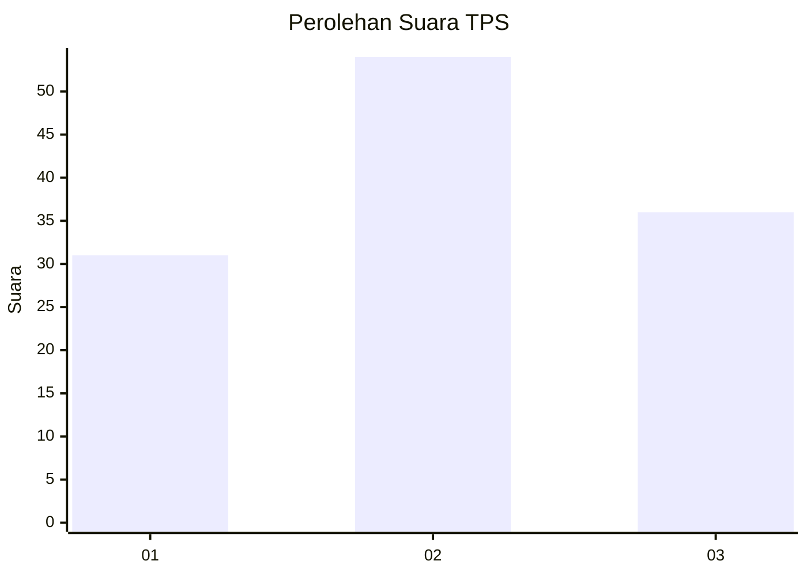
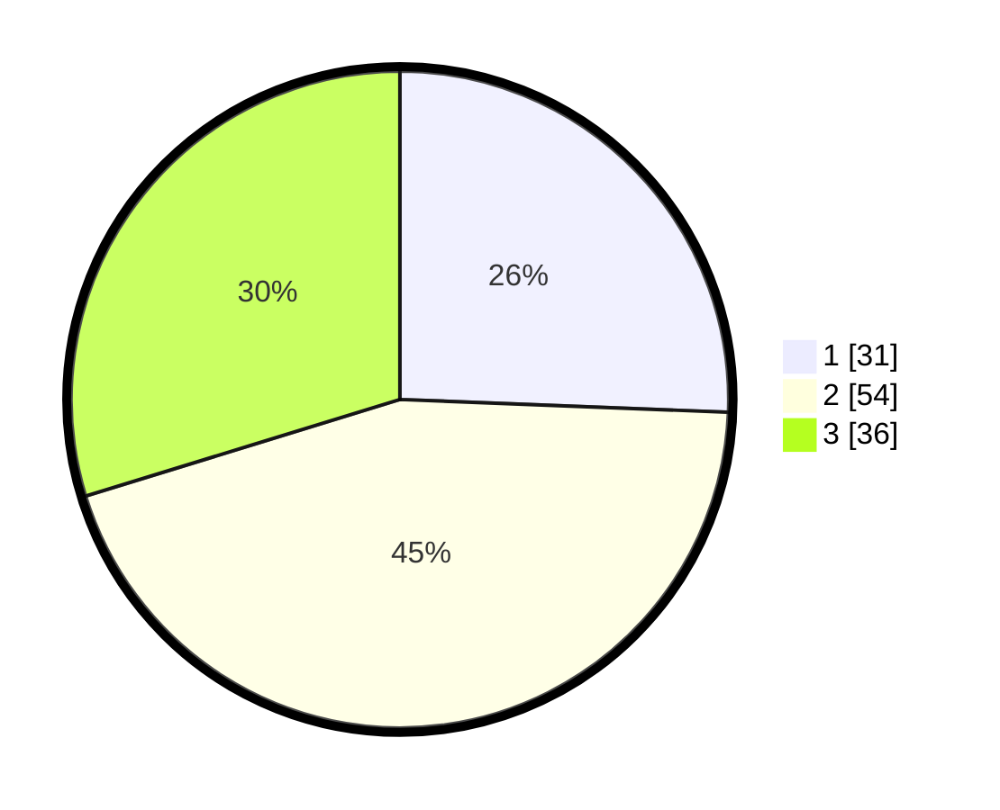

# Hasil

## Grafik

## Tabel

| No. | Nama Paslon    | Suara | Suara (raw) | Persentase |
|:--- |:-------------- | -----:| -----------:| ----------:|
| 1   | ANIES MUHAIMIN | 31    | [31][p-1]   | 25,62      |
| 2   | PRABOWO GIBRAN | 54    | [54][p-2]   | 44,63      |
| 3   | GANJAR MAHFUD  | 36    | [36][p-3]   | 29,75      |

[p-1]: https://github.com/gigit-pemilu/pemilu-2024-33-jawa-tengah/blob/main/pilpres/hitung-suara/sub/33-jawa-tengah/sub/13-karanganyar/sub/11-jaten/sub/2003-jaten/sub/050-tps/sub/paslon-1.txt
[p-2]: https://github.com/gigit-pemilu/pemilu-2024-33-jawa-tengah/blob/main/pilpres/hitung-suara/sub/33-jawa-tengah/sub/13-karanganyar/sub/11-jaten/sub/2003-jaten/sub/050-tps/sub/paslon-2.txt
[p-3]: https://github.com/gigit-pemilu/pemilu-2024-33-jawa-tengah/blob/main/pilpres/hitung-suara/sub/33-jawa-tengah/sub/13-karanganyar/sub/11-jaten/sub/2003-jaten/sub/050-tps/sub/paslon-3.txt

## Foto C Plano

https://sirekap-obj-formc.kpu.go.id/52e3/pemilu/ppwp/33/13/11/20/03/3313112003050-20240215-200342--aa654c56-acf1-4896-aeef-46c41364d7f0.jpg

https://sirekap-obj-formc.kpu.go.id/52e3/pemilu/ppwp/33/13/11/20/03/3313112003050-20240215-200607--024aa2ba-34e2-4783-9e53-a3092570c85d.jpg

https://sirekap-obj-formc.kpu.go.id/52e3/pemilu/ppwp/33/13/11/20/03/3313112003050-20240215-200821--b3c6b597-bd18-4d6b-a36f-8119c767c620.jpg

## Metadata

| Key        | Value               |
| ---------- | ------------------- |
| Time Stamp | 2024-02-15 20:30:46 |

