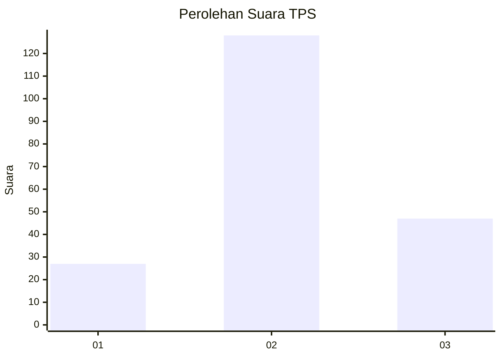
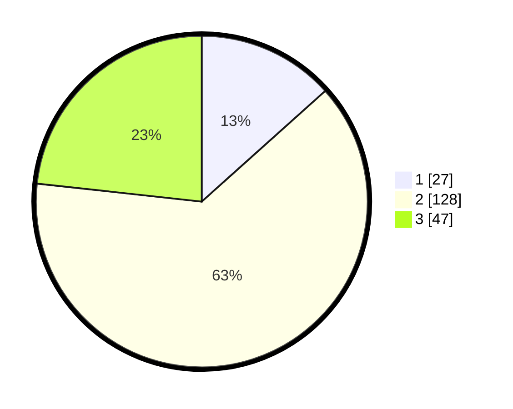

# Hasil

## Grafik

## Tabel

| No. | Nama Paslon    | Suara | Suara (raw) | Persentase |
|:--- |:-------------- | -----:| -----------:| ----------:|
| 1   | ANIES MUHAIMIN | 27    | [27][p-1]   | 13,37      |
| 2   | PRABOWO GIBRAN | 128   | [128][p-2]  | 63,37      |
| 3   | GANJAR MAHFUD  | 47    | [47][p-3]   | 23,27      |

[p-1]: https://github.com/gigit-pemilu/pemilu-2024/blob/main/pilpres/hitung-suara/sub/33-jawa-tengah/sub/13-karanganyar/sub/11-jaten/sub/2008-brujul/sub/004-tps/sub/paslon-1.txt
[p-2]: https://github.com/gigit-pemilu/pemilu-2024/blob/main/pilpres/hitung-suara/sub/33-jawa-tengah/sub/13-karanganyar/sub/11-jaten/sub/2008-brujul/sub/004-tps/sub/paslon-2.txt
[p-3]: https://github.com/gigit-pemilu/pemilu-2024/blob/main/pilpres/hitung-suara/sub/33-jawa-tengah/sub/13-karanganyar/sub/11-jaten/sub/2008-brujul/sub/004-tps/sub/paslon-3.txt

## Foto C Plano

https://sirekap-obj-formc.kpu.go.id/1fbb/pemilu/ppwp/33/13/11/20/08/3313112008004-20240220-224053--cb9f4930-d136-4160-a79d-971fb7569e3d.jpg

https://sirekap-obj-formc.kpu.go.id/1fbb/pemilu/ppwp/33/13/11/20/08/3313112008004-20240220-224140--51372a0b-9d23-4858-ac9f-adf54ba18a38.jpg

https://sirekap-obj-formc.kpu.go.id/1fbb/pemilu/ppwp/33/13/11/20/08/3313112008004-20240220-224226--d5dd26b7-b996-48a1-a5b2-dee7f9ed11d6.jpg

## Metadata

| Key        | Value               |
| ---------- | ------------------- |
| Time Stamp | 2024-02-20 23:00:00 |

## DATA PEMILIH TETAP

Jumlah pemilih dalam DPT: **224**.
 * L: **203**.
 * P: **115**.

## DATA PENGGUNA HAK PILIH

Jumlah pengguna hak pilih dalam DPT: **327**.
 * L: **604**.
 * P: **876**.

Jumlah pengguna hak pilih dalam DPTb: **88**.
 * L: **1**.
 * P: **880**.

Jumlah pengguna hak pilih dalam DPK: **54**.
 * L: **3**.
 * P: **9**.

Jumlah pengguna hak pilih: **212**.
 * L: **108**.
 * P: **107**.

## JUMLAH SUARA SAH DAN TIDAK SAH

JUMLAH SELURUH SUARA SAH: **212**.

JUMLAH SUARA TIDAK SAH: **83**.

JUMLAH SELURUH SUARA SAH DAN SUARA TIDAK SAH: **221**.

