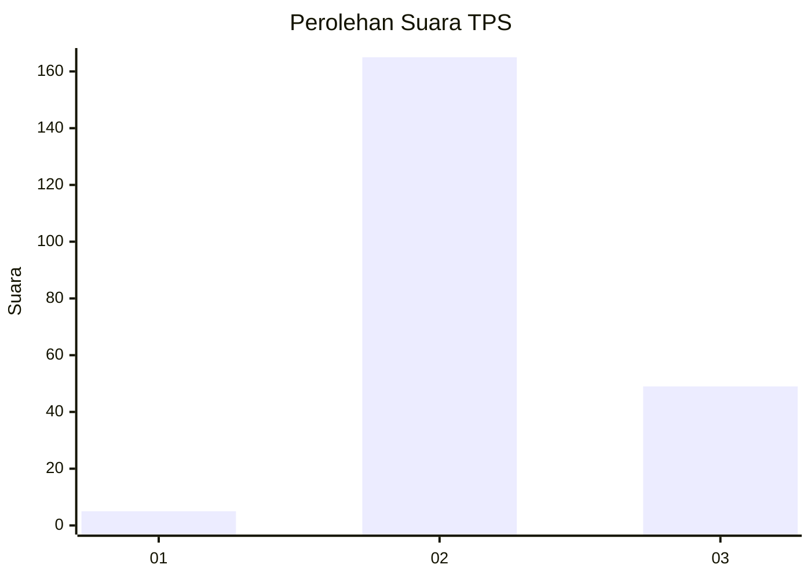
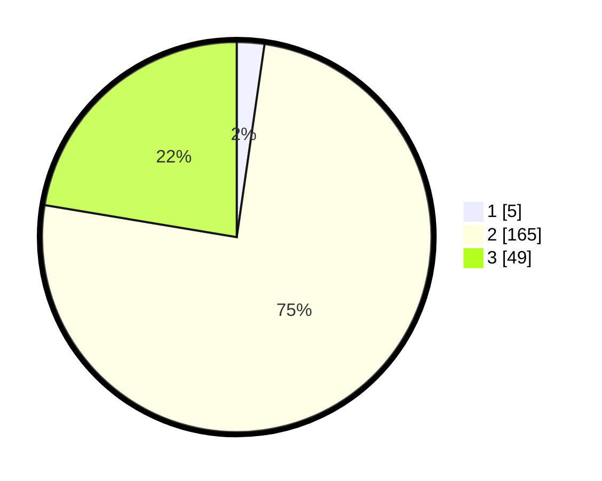

# Hasil

## Grafik

## Tabel

| No. | Nama Paslon    | Suara | Suara (raw) | Persentase |
|:--- |:-------------- | -----:| -----------:| ----------:|
| 1   | ANIES MUHAIMIN | 5     | [5][p-1]    | 2,28       |
| 2   | PRABOWO GIBRAN | 165   | [165][p-2]  | 75,34      |
| 3   | GANJAR MAHFUD  | 49    | [49][p-3]   | 22,37      |

[p-1]: https://github.com/gigit-pemilu/pemilu-2024-33-jawa-tengah/blob/main/pilpres/hitung-suara/sub/33-jawa-tengah/sub/13-karanganyar/sub/12-colomadu/sub/2001-ngasem/sub/004-tps/sub/paslon-1.txt
[p-2]: https://github.com/gigit-pemilu/pemilu-2024-33-jawa-tengah/blob/main/pilpres/hitung-suara/sub/33-jawa-tengah/sub/13-karanganyar/sub/12-colomadu/sub/2001-ngasem/sub/004-tps/sub/paslon-2.txt
[p-3]: https://github.com/gigit-pemilu/pemilu-2024-33-jawa-tengah/blob/main/pilpres/hitung-suara/sub/33-jawa-tengah/sub/13-karanganyar/sub/12-colomadu/sub/2001-ngasem/sub/004-tps/sub/paslon-3.txt

## Foto C Plano

https://sirekap-obj-formc.kpu.go.id/6304/pemilu/ppwp/33/13/12/20/01/3313122001004-20240215-161449--9305e882-0f8f-4ea3-a756-f2cef129dbf5.jpg

https://sirekap-obj-formc.kpu.go.id/6304/pemilu/ppwp/33/13/12/20/01/3313122001004-20240215-161257--38c9b45d-f97f-4e18-86cc-5ef7285a766d.jpg

https://sirekap-obj-formc.kpu.go.id/6304/pemilu/ppwp/33/13/12/20/01/3313122001004-20240215-161348--f0cb38a3-6244-425e-be8c-41e43fc7c735.jpg

## Metadata

| Key        | Value               |
| ---------- | ------------------- |
| Time Stamp | 2024-02-17 10:30:03 |

