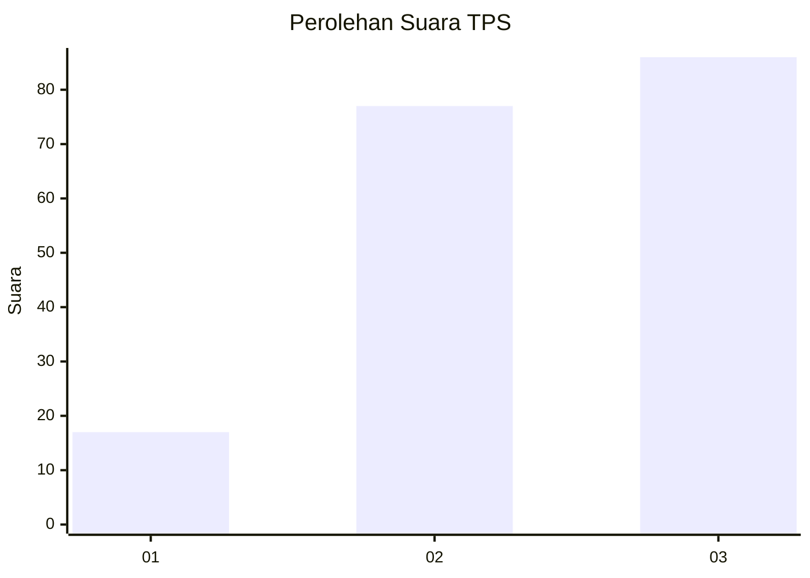
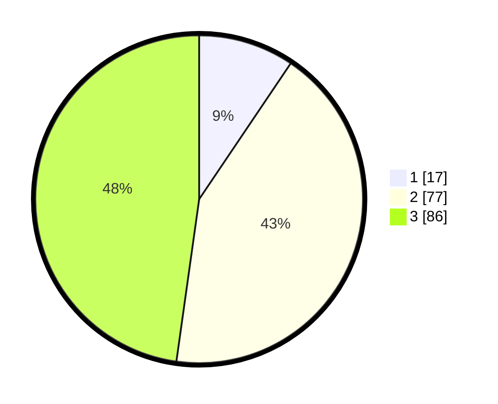

# Hasil

## Grafik

## Tabel

| No. | Nama Paslon    | Suara | Suara (raw) | Persentase |
|:--- |:-------------- | -----:| -----------:| ----------:|
| 1   | ANIES MUHAIMIN | 17    | [17][p-1]   | 9,44       |
| 2   | PRABOWO GIBRAN | 77    | [77][p-2]   | 42,78      |
| 3   | GANJAR MAHFUD  | 86    | [86][p-3]   | 47,78      |

[p-1]: https://github.com/gigit-pemilu/pemilu-2024/blob/main/pilpres/hitung-suara/sub/33-jawa-tengah/sub/13-karanganyar/sub/12-colomadu/sub/2007-gawanan/sub/007-tps/sub/paslon-1.txt
[p-2]: https://github.com/gigit-pemilu/pemilu-2024/blob/main/pilpres/hitung-suara/sub/33-jawa-tengah/sub/13-karanganyar/sub/12-colomadu/sub/2007-gawanan/sub/007-tps/sub/paslon-2.txt
[p-3]: https://github.com/gigit-pemilu/pemilu-2024/blob/main/pilpres/hitung-suara/sub/33-jawa-tengah/sub/13-karanganyar/sub/12-colomadu/sub/2007-gawanan/sub/007-tps/sub/paslon-3.txt

## Foto C Plano

https://sirekap-obj-formc.kpu.go.id/a869/pemilu/ppwp/33/13/12/20/07/3313122007007-20240217-095230--f674cb2d-abb4-46ff-98ed-09cab213855b.jpg

https://sirekap-obj-formc.kpu.go.id/a869/pemilu/ppwp/33/13/12/20/07/3313122007007-20240217-095257--e20eaddb-22c1-416e-b781-e451a7ea5548.jpg

https://sirekap-obj-formc.kpu.go.id/a869/pemilu/ppwp/33/13/12/20/07/3313122007007-20240217-095313--00eb3438-365b-45d8-bfb9-6644c6a7e8ea.jpg

## Metadata

| Key        | Value               |
| ---------- | ------------------- |
| Time Stamp | 2024-02-17 12:00:00 |

## DATA PEMILIH TETAP

Jumlah pemilih dalam DPT: **231**.
 * L: **806**.
 * P: **105**.

## DATA PENGGUNA HAK PILIH

Jumlah pengguna hak pilih dalam DPT: **898**.
 * L: **99**.
 * P: **94**.

Jumlah pengguna hak pilih dalam DPTb: **100**.
 * L: **50**.
 * P: **102**.

Jumlah pengguna hak pilih dalam DPK: **301**.
 * L: **51**.
 * P: **555**.

Jumlah pengguna hak pilih: **491**.
 * L: **595**.
 * P: **96**.

## JUMLAH SUARA SAH DAN TIDAK SAH

JUMLAH SELURUH SUARA SAH: **180**.

JUMLAH SUARA TIDAK SAH: **11**.

JUMLAH SELURUH SUARA SAH DAN SUARA TIDAK SAH: **191**.

