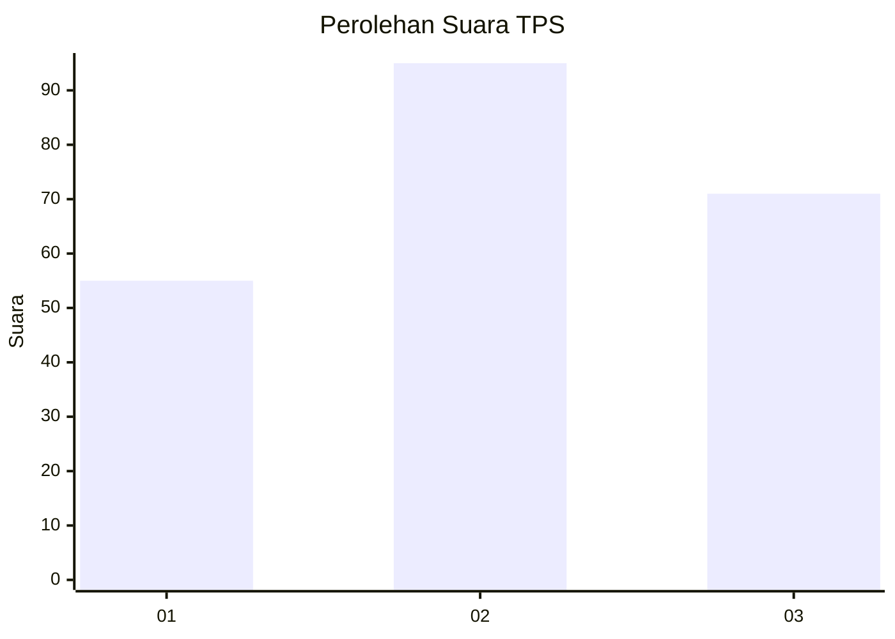
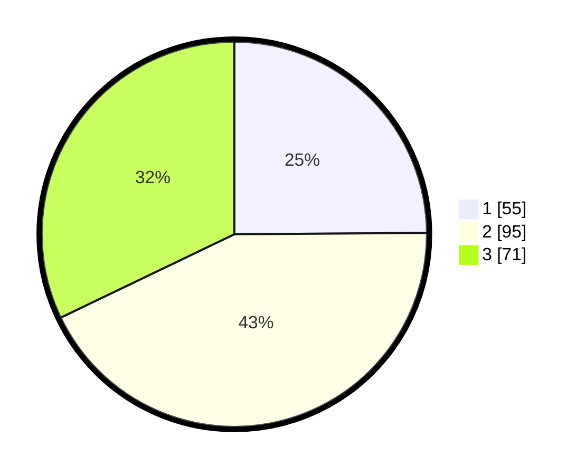

# Hasil

## Grafik

## Tabel

| No. | Nama Paslon    | Suara | Suara (raw) | Persentase |
|:--- |:-------------- | -----:| -----------:| ----------:|
| 1   | ANIES MUHAIMIN | 55    | [55][p-1]   | 24,89      |
| 2   | PRABOWO GIBRAN | 95    | [95][p-2]   | 42,99      |
| 3   | GANJAR MAHFUD  | 71    | [71][p-3]   | 32,13      |

[p-1]: https://github.com/gigit-pemilu/pemilu-2024/blob/main/pilpres/hitung-suara/sub/33-jawa-tengah/sub/13-karanganyar/sub/12-colomadu/sub/2008-gedongan/sub/008-tps/sub/paslon-1.txt
[p-2]: https://github.com/gigit-pemilu/pemilu-2024/blob/main/pilpres/hitung-suara/sub/33-jawa-tengah/sub/13-karanganyar/sub/12-colomadu/sub/2008-gedongan/sub/008-tps/sub/paslon-2.txt
[p-3]: https://github.com/gigit-pemilu/pemilu-2024/blob/main/pilpres/hitung-suara/sub/33-jawa-tengah/sub/13-karanganyar/sub/12-colomadu/sub/2008-gedongan/sub/008-tps/sub/paslon-3.txt

## Foto C Plano

https://sirekap-obj-formc.kpu.go.id/7ced/pemilu/ppwp/33/13/12/20/08/3313122008008-20240216-191748--84b3af73-2ad6-428f-bce2-c4b76c4b623c.jpg

https://sirekap-obj-formc.kpu.go.id/7ced/pemilu/ppwp/33/13/12/20/08/3313122008008-20240216-192057--5d234fe2-c53d-46a6-9fd1-8af3f5baacd7.jpg

https://sirekap-obj-formc.kpu.go.id/7ced/pemilu/ppwp/33/13/12/20/08/3313122008008-20240216-192158--62737f1d-a2f1-4988-8e84-c2a5331e946c.jpg

## Metadata

| Key        | Value               |
| ---------- | ------------------- |
| Time Stamp | 2024-02-17 12:00:00 |

## DATA PEMILIH TETAP

Jumlah pemilih dalam DPT: **74**.
 * L: **805**.
 * P: **625**.

## DATA PENGGUNA HAK PILIH

Jumlah pengguna hak pilih dalam DPT: **228**.
 * L: **757**.
 * P: **722**.

Jumlah pengguna hak pilih dalam DPTb: **227**.
 * L: **7**.
 * P: **88**.

Jumlah pengguna hak pilih dalam DPK: **248**.
 * L: **800**.
 * P: **808**.

Jumlah pengguna hak pilih: **223**.
 * L: **508**.
 * P: **528**.

## JUMLAH SUARA SAH DAN TIDAK SAH

JUMLAH SELURUH SUARA SAH: **221**.

JUMLAH SUARA TIDAK SAH: **8**.

JUMLAH SELURUH SUARA SAH DAN SUARA TIDAK SAH: **229**.

