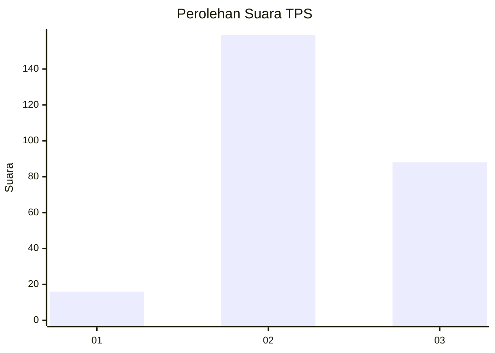
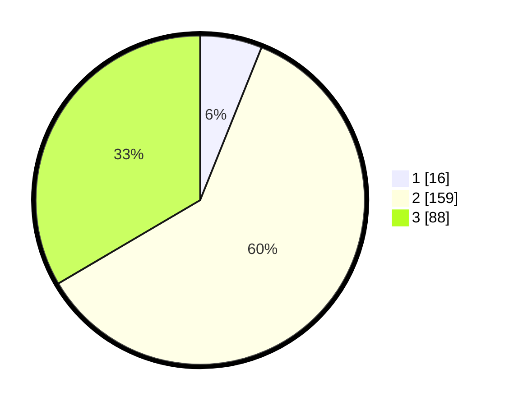

# Hasil

## Grafik

## Tabel

| No. | Nama Paslon    | Suara | Suara (raw) | Persentase |
|:--- |:-------------- | -----:| -----------:| ----------:|
| 1   | ANIES MUHAIMIN | 16    | [16][p-1]   | 6,08       |
| 2   | PRABOWO GIBRAN | 159   | [159][p-2]  | 60,46      |
| 3   | GANJAR MAHFUD  | 88    | [88][p-3]   | 33,46      |

[p-1]: https://github.com/gigit-pemilu/pemilu-2024/blob/main/pilpres/hitung-suara/sub/33-jawa-tengah/sub/13-karanganyar/sub/13-gondangrejo/sub/2002-plesungan/sub/020-tps/sub/paslon-1.txt
[p-2]: https://github.com/gigit-pemilu/pemilu-2024/blob/main/pilpres/hitung-suara/sub/33-jawa-tengah/sub/13-karanganyar/sub/13-gondangrejo/sub/2002-plesungan/sub/020-tps/sub/paslon-2.txt
[p-3]: https://github.com/gigit-pemilu/pemilu-2024/blob/main/pilpres/hitung-suara/sub/33-jawa-tengah/sub/13-karanganyar/sub/13-gondangrejo/sub/2002-plesungan/sub/020-tps/sub/paslon-3.txt

## Foto C Plano

https://sirekap-obj-formc.kpu.go.id/2c18/pemilu/ppwp/33/13/13/20/02/3313132002020-20240218-205138--3592464f-18f0-4a05-96d4-d7061f2ff28f.jpg

https://sirekap-obj-formc.kpu.go.id/2c18/pemilu/ppwp/33/13/13/20/02/3313132002020-20240218-210929--3c6cc3d5-b756-4e45-b5e0-4836595042eb.jpg

https://sirekap-obj-formc.kpu.go.id/2c18/pemilu/ppwp/33/13/13/20/02/3313132002020-20240218-211418--8ef0165a-3189-466a-a91c-e91f6bb58aaa.jpg

## Metadata

| Key        | Value               |
| ---------- | ------------------- |
| Time Stamp | 2024-02-26 11:00:00 |

## DATA PEMILIH TETAP

Jumlah pemilih dalam DPT: **268**.
 * L: **135**.
 * P: **133**.

## DATA PENGGUNA HAK PILIH

Jumlah pengguna hak pilih dalam DPT: **268**.
 * L: **135**.
 * P: **133**.

Jumlah pengguna hak pilih dalam DPTb: **255**.
 * L: **129**.
 * P: **126**.

Jumlah pengguna hak pilih dalam DPK: **11**.
 * L: **0**.
 * P: **11**.

Jumlah pengguna hak pilih: **269**.
 * L: **130**.
 * P: **139**.

## JUMLAH SUARA SAH DAN TIDAK SAH

JUMLAH SELURUH SUARA SAH: **263**.

JUMLAH SUARA TIDAK SAH: **6**.

JUMLAH SELURUH SUARA SAH DAN SUARA TIDAK SAH: **269**.

