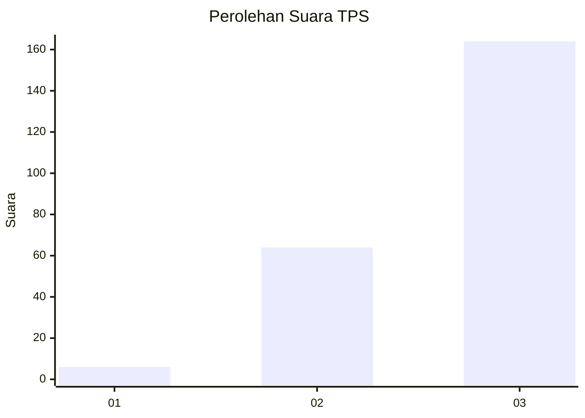
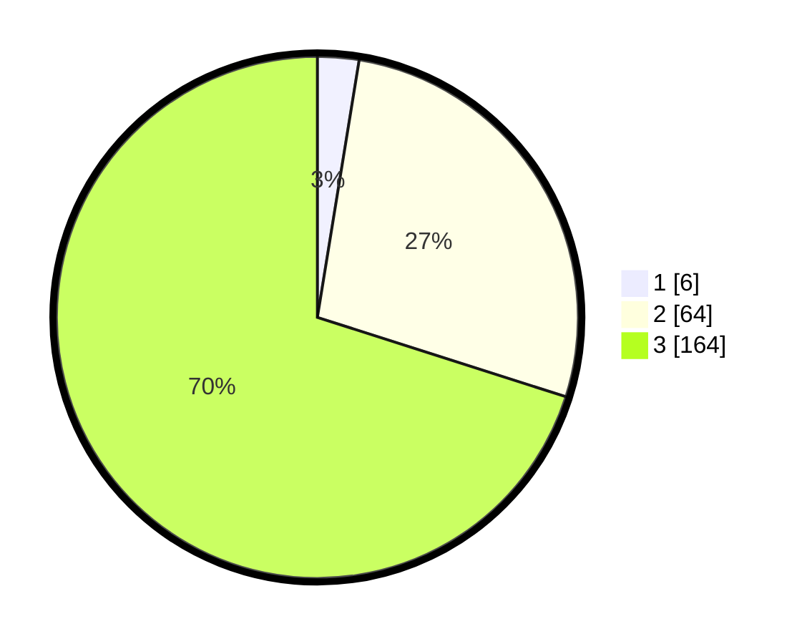

# Hasil

## Grafik

## Tabel

| No. | Nama Paslon    | Suara | Suara (raw) | Persentase |
|:--- |:-------------- | -----:| -----------:| ----------:|
| 1   | ANIES MUHAIMIN | 6     | [6][p-1]    | 2,56       |
| 2   | PRABOWO GIBRAN | 64    | [64][p-2]   | 27,35      |
| 3   | GANJAR MAHFUD  | 164   | [164][p-3]  | 70,09      |

[p-1]: https://github.com/gigit-pemilu/pemilu-2024-33-jawa-tengah/blob/main/pilpres/hitung-suara/sub/33-jawa-tengah/sub/13-karanganyar/sub/13-gondangrejo/sub/2006-rejosari/sub/001-tps/sub/paslon-1.txt
[p-2]: https://github.com/gigit-pemilu/pemilu-2024-33-jawa-tengah/blob/main/pilpres/hitung-suara/sub/33-jawa-tengah/sub/13-karanganyar/sub/13-gondangrejo/sub/2006-rejosari/sub/001-tps/sub/paslon-2.txt
[p-3]: https://github.com/gigit-pemilu/pemilu-2024-33-jawa-tengah/blob/main/pilpres/hitung-suara/sub/33-jawa-tengah/sub/13-karanganyar/sub/13-gondangrejo/sub/2006-rejosari/sub/001-tps/sub/paslon-3.txt

## Foto C Plano

https://sirekap-obj-formc.kpu.go.id/5140/pemilu/ppwp/33/13/13/20/06/3313132006001-20240214-213248--ea56c1a0-ab32-44f1-acf5-76b3dcf90f4f.jpg

https://sirekap-obj-formc.kpu.go.id/5140/pemilu/ppwp/33/13/13/20/06/3313132006001-20240214-225739--621af016-11b6-4494-bfd2-e88dd5c2042c.jpg

https://sirekap-obj-formc.kpu.go.id/5140/pemilu/ppwp/33/13/13/20/06/3313132006001-20240214-225605--1e914741-41b8-4799-b216-6f461286db31.jpg

## Metadata

| Key        | Value               |
| ---------- | ------------------- |
| Time Stamp | 2024-02-15 09:00:24 |

