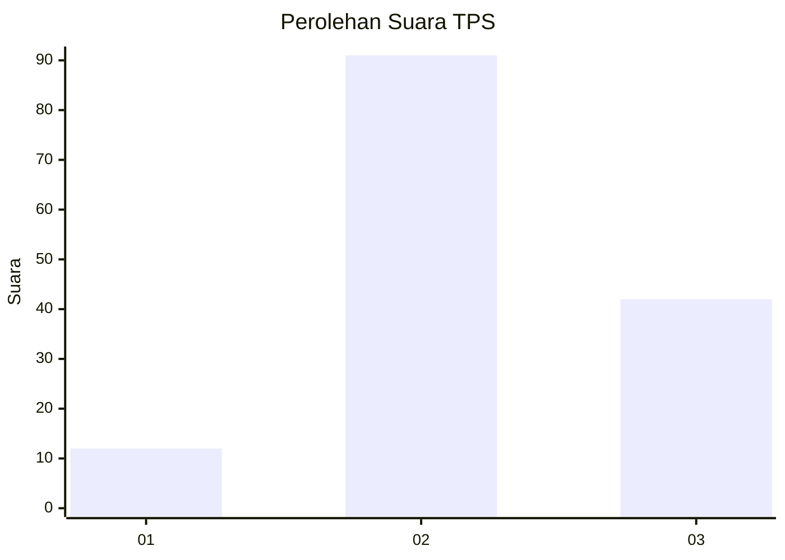
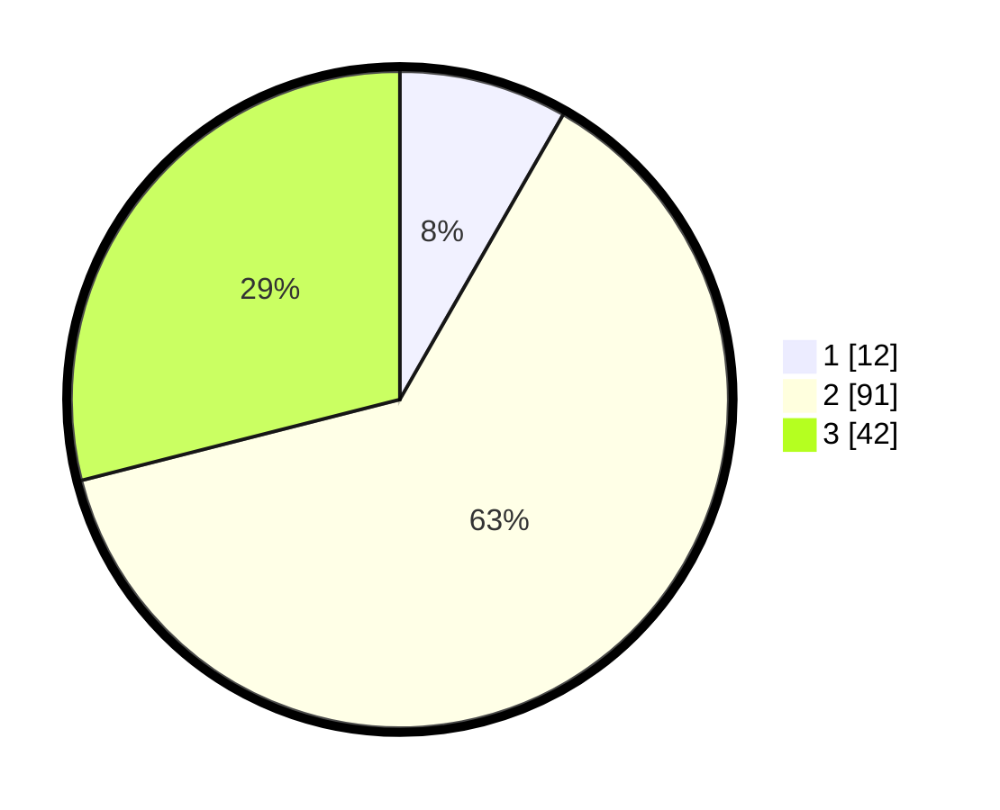

# Hasil

## Grafik

## Tabel

| No. | Nama Paslon    | Suara | Suara (raw) | Persentase |
|:--- |:-------------- | -----:| -----------:| ----------:|
| 1   | ANIES MUHAIMIN | 12    | [12][p-1]   | 8,28       |
| 2   | PRABOWO GIBRAN | 91    | [91][p-2]   | 62,76      |
| 3   | GANJAR MAHFUD  | 42    | [42][p-3]   | 28,97      |

[p-1]: https://github.com/gigit-pemilu/pemilu-2024-33-jawa-tengah/blob/main/pilpres/hitung-suara/sub/33-jawa-tengah/sub/13-karanganyar/sub/14-kebakkramat/sub/2001-banjarharjo/sub/005-tps/sub/paslon-1.txt
[p-2]: https://github.com/gigit-pemilu/pemilu-2024-33-jawa-tengah/blob/main/pilpres/hitung-suara/sub/33-jawa-tengah/sub/13-karanganyar/sub/14-kebakkramat/sub/2001-banjarharjo/sub/005-tps/sub/paslon-2.txt
[p-3]: https://github.com/gigit-pemilu/pemilu-2024-33-jawa-tengah/blob/main/pilpres/hitung-suara/sub/33-jawa-tengah/sub/13-karanganyar/sub/14-kebakkramat/sub/2001-banjarharjo/sub/005-tps/sub/paslon-3.txt

## Foto C Plano

https://sirekap-obj-formc.kpu.go.id/d717/pemilu/ppwp/33/13/14/20/01/3313142001005-20240215-110937--edf3f5c1-6769-45b5-b321-fa8128bce589.jpg

https://sirekap-obj-formc.kpu.go.id/d717/pemilu/ppwp/33/13/14/20/01/3313142001005-20240215-111121--68045f74-5926-418d-bded-5b860b894e9f.jpg

https://sirekap-obj-formc.kpu.go.id/d717/pemilu/ppwp/33/13/14/20/01/3313142001005-20240215-133609--b5c6bb1c-5ff6-40c4-bc6a-3d6ee488441f.jpg

## Metadata

| Key        | Value               |
| ---------- | ------------------- |
| Time Stamp | 2024-02-15 15:30:25 |

