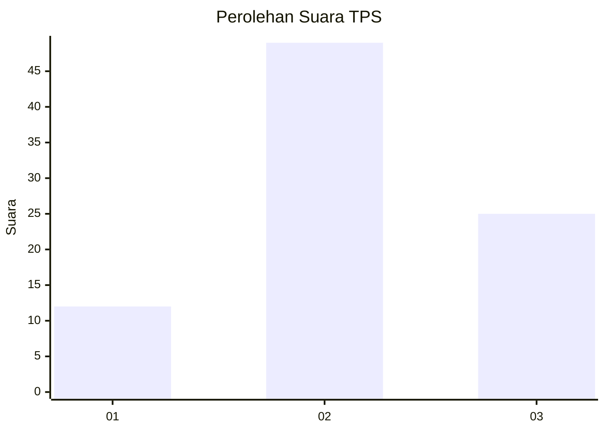
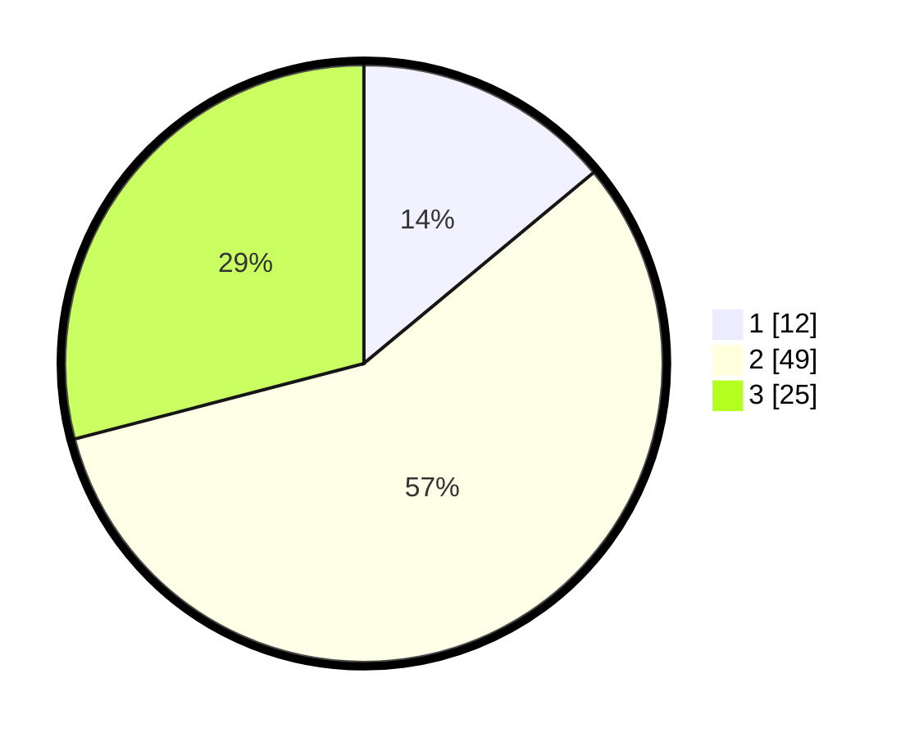

# Hasil

## Grafik

## Tabel

| No. | Nama Paslon    | Suara | Suara (raw) | Persentase |
|:--- |:-------------- | -----:| -----------:| ----------:|
| 1   | ANIES MUHAIMIN | 12    | [12][p-1]   | 13,95      |
| 2   | PRABOWO GIBRAN | 49    | [49][p-2]   | 56,98      |
| 3   | GANJAR MAHFUD  | 25    | [25][p-3]   | 29,07      |

[p-1]: https://github.com/gigit-pemilu/pemilu-2024-33-jawa-tengah/blob/main/pilpres/hitung-suara/sub/33-jawa-tengah/sub/13-karanganyar/sub/16-kerjo/sub/2003-ganten/sub/011-tps/sub/paslon-1.txt
[p-2]: https://github.com/gigit-pemilu/pemilu-2024-33-jawa-tengah/blob/main/pilpres/hitung-suara/sub/33-jawa-tengah/sub/13-karanganyar/sub/16-kerjo/sub/2003-ganten/sub/011-tps/sub/paslon-2.txt
[p-3]: https://github.com/gigit-pemilu/pemilu-2024-33-jawa-tengah/blob/main/pilpres/hitung-suara/sub/33-jawa-tengah/sub/13-karanganyar/sub/16-kerjo/sub/2003-ganten/sub/011-tps/sub/paslon-3.txt

## Foto C Plano

https://sirekap-obj-formc.kpu.go.id/dce3/pemilu/ppwp/33/13/16/20/03/3313162003011-20240214-190933--c91dd5d8-3d30-4282-bbee-56e2746f9238.jpg

https://sirekap-obj-formc.kpu.go.id/dce3/pemilu/ppwp/33/13/16/20/03/3313162003011-20240214-190937--185e8484-7e07-49c8-a272-72d3aed77d49.jpg

https://sirekap-obj-formc.kpu.go.id/dce3/pemilu/ppwp/33/13/16/20/03/3313162003011-20240214-190942--793bca63-ebd6-4660-bd65-93c73877b914.jpg

## Metadata

| Key        | Value               |
| ---------- | ------------------- |
| Time Stamp | 2024-02-15 15:00:29 |

