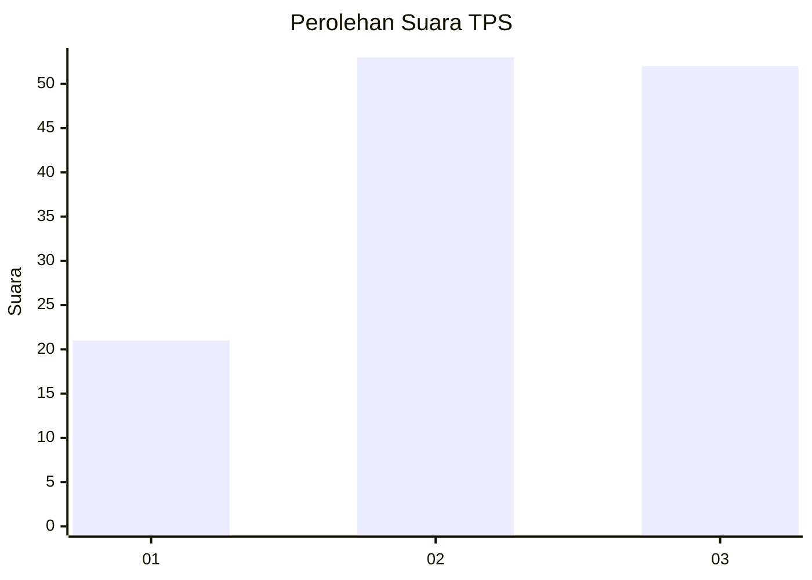
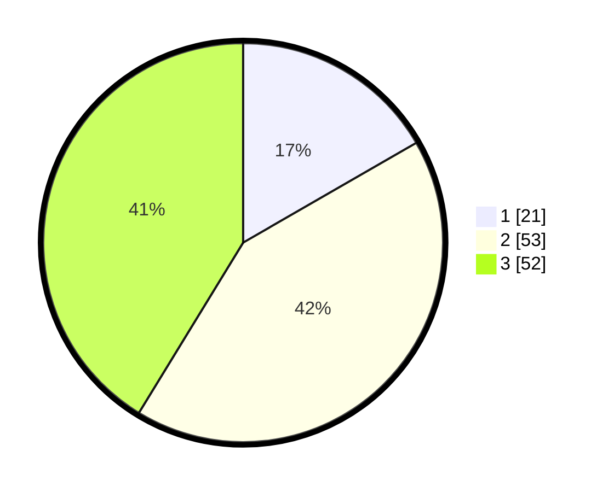

# Hasil

## Grafik

## Tabel

| No. | Nama Paslon    | Suara | Suara (raw) | Persentase |
|:--- |:-------------- | -----:| -----------:| ----------:|
| 1   | ANIES MUHAIMIN | 21    | [21][p-1]   | 16,67      |
| 2   | PRABOWO GIBRAN | 53    | [53][p-2]   | 42,06      |
| 3   | GANJAR MAHFUD  | 52    | [52][p-3]   | 41,27      |

[p-1]: https://github.com/gigit-pemilu/pemilu-2024-33-jawa-tengah/blob/main/pilpres/hitung-suara/sub/33-jawa-tengah/sub/13-karanganyar/sub/16-kerjo/sub/2007-kwadungan/sub/002-tps/sub/paslon-1.txt
[p-2]: https://github.com/gigit-pemilu/pemilu-2024-33-jawa-tengah/blob/main/pilpres/hitung-suara/sub/33-jawa-tengah/sub/13-karanganyar/sub/16-kerjo/sub/2007-kwadungan/sub/002-tps/sub/paslon-2.txt
[p-3]: https://github.com/gigit-pemilu/pemilu-2024-33-jawa-tengah/blob/main/pilpres/hitung-suara/sub/33-jawa-tengah/sub/13-karanganyar/sub/16-kerjo/sub/2007-kwadungan/sub/002-tps/sub/paslon-3.txt

## Foto C Plano

https://sirekap-obj-formc.kpu.go.id/ccab/pemilu/ppwp/33/13/16/20/07/3313162007002-20240214-222344--b4338762-9e52-4d8b-bc37-da08b5a1f1ea.jpg

https://sirekap-obj-formc.kpu.go.id/ccab/pemilu/ppwp/33/13/16/20/07/3313162007002-20240214-222435--a2d63631-8846-4ad1-b7f6-a1fd238288ae.jpg

https://sirekap-obj-formc.kpu.go.id/ccab/pemilu/ppwp/33/13/16/20/07/3313162007002-20240214-214624--e48ce78a-1f90-4fb1-bb58-e2cc476b4471.jpg

## Metadata

| Key        | Value               |
| ---------- | ------------------- |
| Time Stamp | 2024-02-16 08:30:27 |

