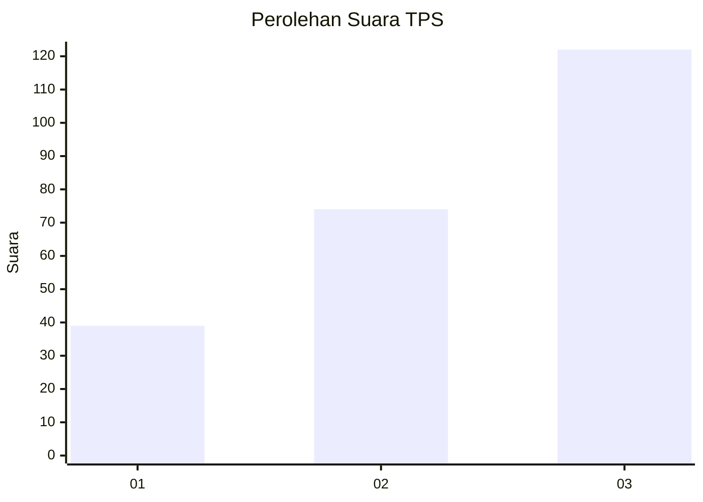
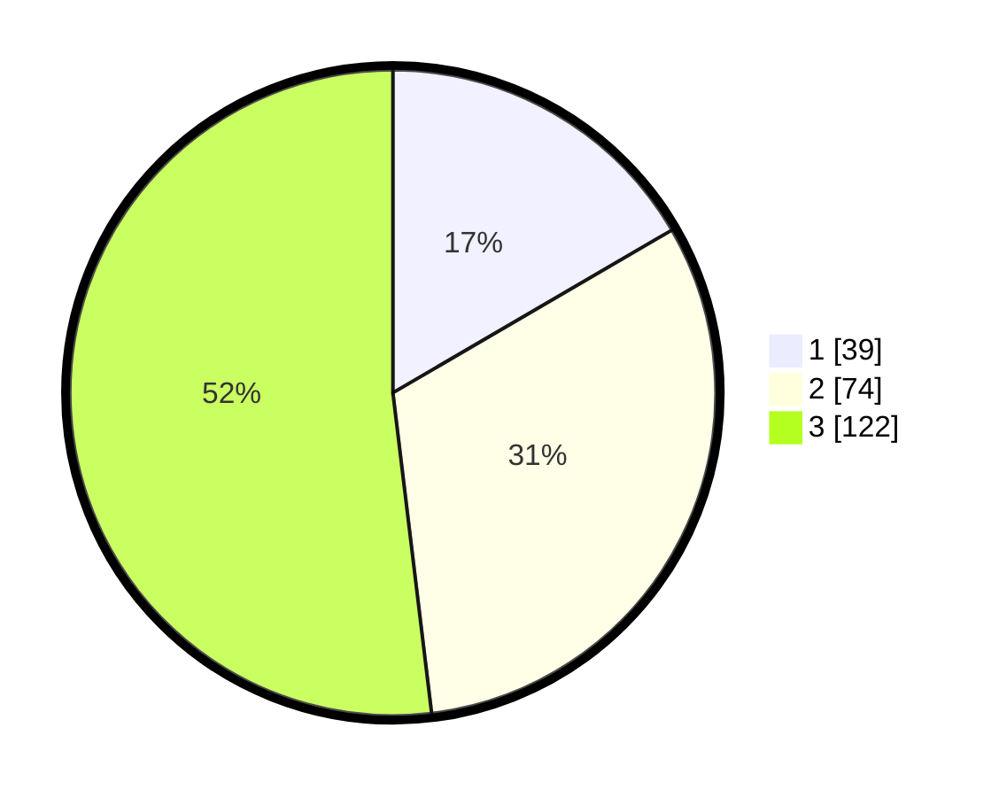

# Hasil

## Grafik

## Tabel

| No. | Nama Paslon    | Suara | Suara (raw) | Persentase |
|:--- |:-------------- | -----:| -----------:| ----------:|
| 1   | ANIES MUHAIMIN | 39    | [39][p-1]   | 16,60      |
| 2   | PRABOWO GIBRAN | 74    | [74][p-2]   | 31,49      |
| 3   | GANJAR MAHFUD  | 122   | [122][p-3]  | 51,91      |

[p-1]: https://github.com/gigit-pemilu/pemilu-2024-33-jawa-tengah/blob/main/pilpres/hitung-suara/sub/33-jawa-tengah/sub/13-karanganyar/sub/17-jenawi/sub/2002-anggrasmanis/sub/008-tps/sub/paslon-1.txt
[p-2]: https://github.com/gigit-pemilu/pemilu-2024-33-jawa-tengah/blob/main/pilpres/hitung-suara/sub/33-jawa-tengah/sub/13-karanganyar/sub/17-jenawi/sub/2002-anggrasmanis/sub/008-tps/sub/paslon-2.txt
[p-3]: https://github.com/gigit-pemilu/pemilu-2024-33-jawa-tengah/blob/main/pilpres/hitung-suara/sub/33-jawa-tengah/sub/13-karanganyar/sub/17-jenawi/sub/2002-anggrasmanis/sub/008-tps/sub/paslon-3.txt

## Foto C Plano

https://sirekap-obj-formc.kpu.go.id/7f2a/pemilu/ppwp/33/13/17/20/02/3313172002008-20240214-212437--533461aa-07cb-42ea-af30-8568d6345e8b.jpg

https://sirekap-obj-formc.kpu.go.id/7f2a/pemilu/ppwp/33/13/17/20/02/3313172002008-20240214-212616--bbddf07e-696e-44ae-a841-224bc7d3fdb4.jpg

https://sirekap-obj-formc.kpu.go.id/7f2a/pemilu/ppwp/33/13/17/20/02/3313172002008-20240214-212750--9bab9522-1f89-447b-bfe6-5c0bc7c614fd.jpg

## Metadata

| Key        | Value               |
| ---------- | ------------------- |
| Time Stamp | 2024-02-15 15:00:29 |

