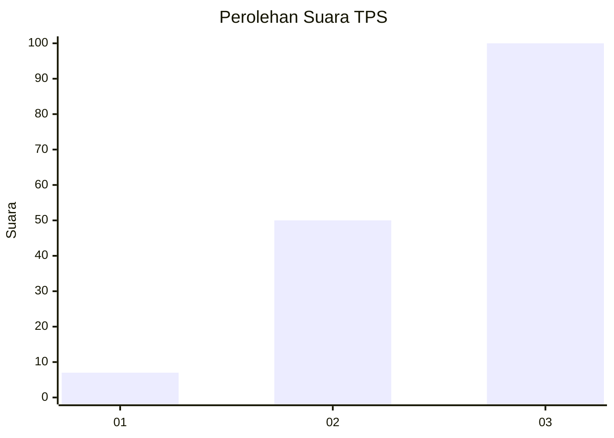
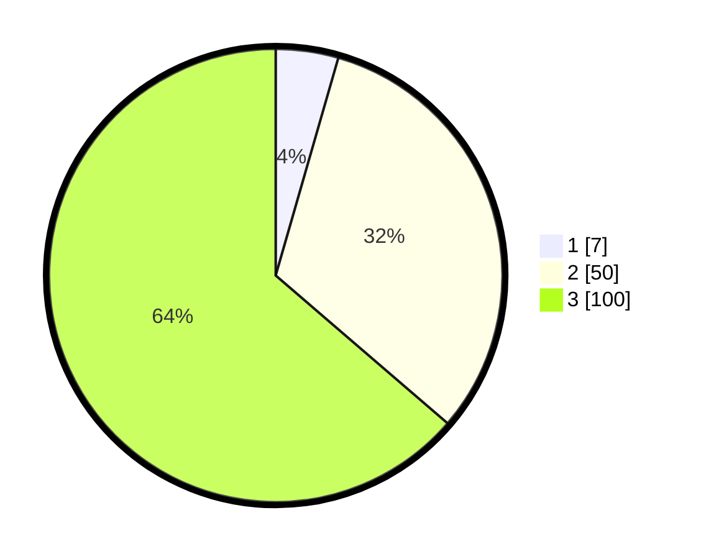

# Hasil

## Grafik

## Tabel

| No. | Nama Paslon    | Suara | Suara (raw) | Persentase |
|:--- |:-------------- | -----:| -----------:| ----------:|
| 1   | ANIES MUHAIMIN | 7     | [7][p-1]    | 4,46       |
| 2   | PRABOWO GIBRAN | 50    | [50][p-2]   | 31,85      |
| 3   | GANJAR MAHFUD  | 100   | [100][p-3]  | 63,69      |

[p-1]: https://github.com/gigit-pemilu/pemilu-2024/blob/main/pilpres/hitung-suara/sub/33-jawa-tengah/sub/13-karanganyar/sub/17-jenawi/sub/2003-jenawi/sub/007-tps/sub/paslon-1.txt
[p-2]: https://github.com/gigit-pemilu/pemilu-2024/blob/main/pilpres/hitung-suara/sub/33-jawa-tengah/sub/13-karanganyar/sub/17-jenawi/sub/2003-jenawi/sub/007-tps/sub/paslon-2.txt
[p-3]: https://github.com/gigit-pemilu/pemilu-2024/blob/main/pilpres/hitung-suara/sub/33-jawa-tengah/sub/13-karanganyar/sub/17-jenawi/sub/2003-jenawi/sub/007-tps/sub/paslon-3.txt

## Foto C Plano

https://sirekap-obj-formc.kpu.go.id/421f/pemilu/ppwp/33/13/17/20/03/3313172003007-20240214-231701--f762bc79-8696-498e-89e4-db1fbd61ced5.jpg

https://sirekap-obj-formc.kpu.go.id/421f/pemilu/ppwp/33/13/17/20/03/3313172003007-20240214-231841--dfac5140-2ef2-434c-bdb2-be527f4c32a7.jpg

https://sirekap-obj-formc.kpu.go.id/421f/pemilu/ppwp/33/13/17/20/03/3313172003007-20240214-231941--fbe4e83c-a804-457f-8d49-d7a9b1574edc.jpg

## Metadata

| Key        | Value               |
| ---------- | ------------------- |
| Time Stamp | 2024-02-15 15:30:25 |

