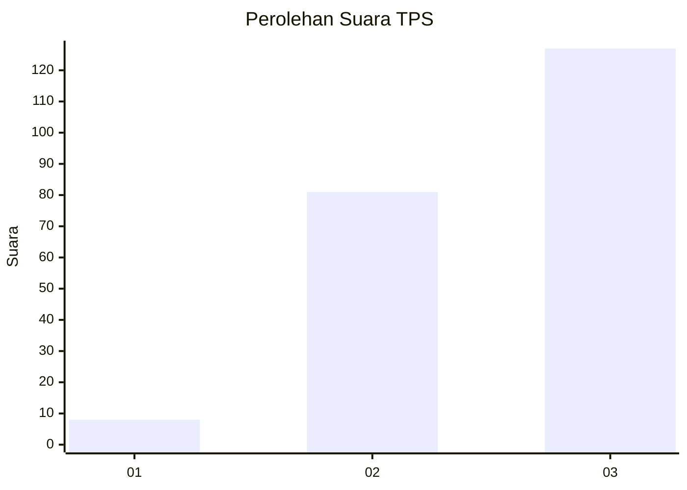
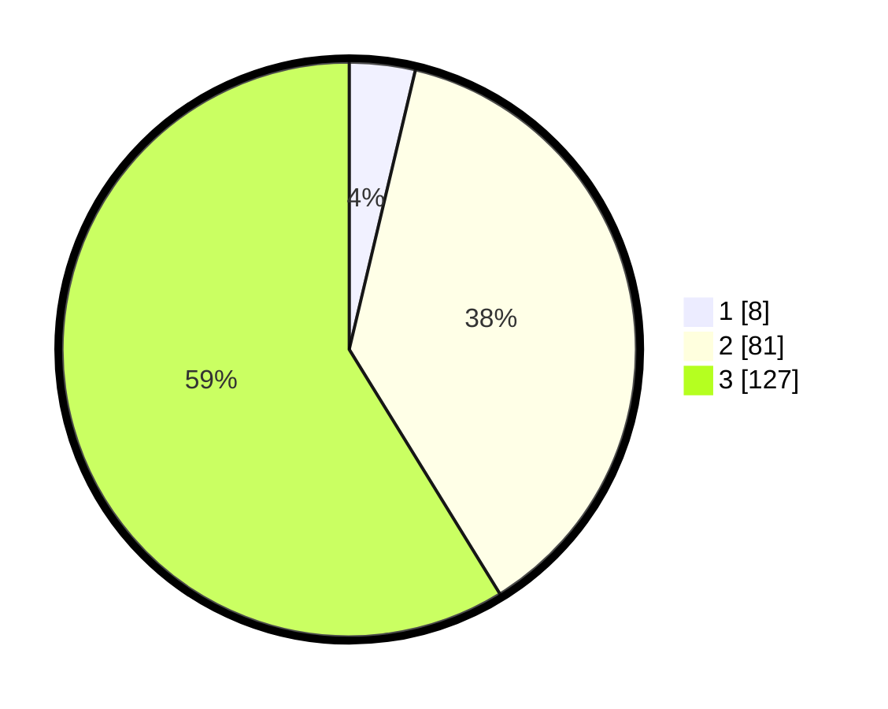

# Hasil

## Grafik

## Tabel

| No. | Nama Paslon    | Suara | Suara (raw) | Persentase |
|:--- |:-------------- | -----:| -----------:| ----------:|
| 1   | ANIES MUHAIMIN | 8     | [8][p-1]    | 3,70       |
| 2   | PRABOWO GIBRAN | 81    | [81][p-2]   | 37,50      |
| 3   | GANJAR MAHFUD  | 127   | [127][p-3]  | 58,80      |

[p-1]: https://github.com/gigit-pemilu/pemilu-2024-33-jawa-tengah/blob/main/pilpres/hitung-suara/sub/33-jawa-tengah/sub/13-karanganyar/sub/17-jenawi/sub/2007-seloromo/sub/006-tps/sub/paslon-1.txt
[p-2]: https://github.com/gigit-pemilu/pemilu-2024-33-jawa-tengah/blob/main/pilpres/hitung-suara/sub/33-jawa-tengah/sub/13-karanganyar/sub/17-jenawi/sub/2007-seloromo/sub/006-tps/sub/paslon-2.txt
[p-3]: https://github.com/gigit-pemilu/pemilu-2024-33-jawa-tengah/blob/main/pilpres/hitung-suara/sub/33-jawa-tengah/sub/13-karanganyar/sub/17-jenawi/sub/2007-seloromo/sub/006-tps/sub/paslon-3.txt

## Foto C Plano

https://sirekap-obj-formc.kpu.go.id/a079/pemilu/ppwp/33/13/17/20/07/3313172007006-20240216-232826--4007a957-cc2a-455c-acbb-1f2da11d25fe.jpg

https://sirekap-obj-formc.kpu.go.id/a079/pemilu/ppwp/33/13/17/20/07/3313172007006-20240216-232935--588f2151-2c06-43d1-bfb4-c225b307aede.jpg

https://sirekap-obj-formc.kpu.go.id/a079/pemilu/ppwp/33/13/17/20/07/3313172007006-20240216-233119--5d32b1df-a3cd-4ca9-babe-3d9b0361f1ac.jpg

## Metadata

| Key        | Value               |
| ---------- | ------------------- |
| Time Stamp | 2024-02-19 06:16:00 |

