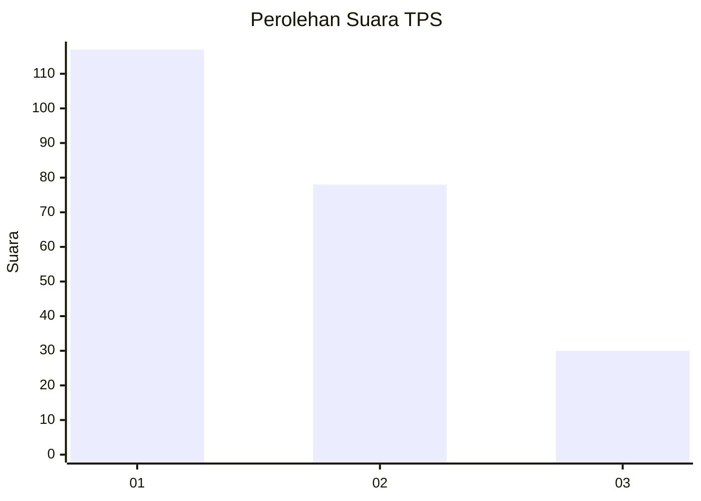
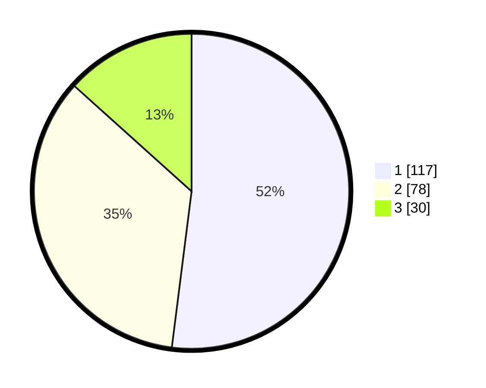

# Hasil

## Grafik

## Tabel

| No. | Nama Paslon    | Suara | Suara (raw) | Persentase |
|:--- |:-------------- | -----:| -----------:| ----------:|
| 1   | ANIES MUHAIMIN | 117   | [117][p-1]  | 52,00      |
| 2   | PRABOWO GIBRAN | 78    | [78][p-2]   | 34,67      |
| 3   | GANJAR MAHFUD  | 30    | [30][p-3]   | 13,33      |

[p-1]: https://github.com/gigit-pemilu/pemilu-2024/blob/main/pilpres/hitung-suara/sub/33-jawa-tengah/sub/13-karanganyar/sub/17-jenawi/sub/2009-lempong/sub/009-tps/sub/paslon-1.txt
[p-2]: https://github.com/gigit-pemilu/pemilu-2024/blob/main/pilpres/hitung-suara/sub/33-jawa-tengah/sub/13-karanganyar/sub/17-jenawi/sub/2009-lempong/sub/009-tps/sub/paslon-2.txt
[p-3]: https://github.com/gigit-pemilu/pemilu-2024/blob/main/pilpres/hitung-suara/sub/33-jawa-tengah/sub/13-karanganyar/sub/17-jenawi/sub/2009-lempong/sub/009-tps/sub/paslon-3.txt

## Foto C Plano

https://sirekap-obj-formc.kpu.go.id/3362/pemilu/ppwp/33/13/17/20/09/3313172009009-20240214-221343--6652b215-6cfe-491c-b389-4937e13468a8.jpg

https://sirekap-obj-formc.kpu.go.id/3362/pemilu/ppwp/33/13/17/20/09/3313172009009-20240214-221248--e09178d8-87e9-475b-9ec3-9f85d30f679f.jpg

https://sirekap-obj-formc.kpu.go.id/3362/pemilu/ppwp/33/13/17/20/09/3313172009009-20240214-184655--a5c338d8-d362-4535-9e66-0f7c6110aee8.jpg

## Metadata

| Key        | Value               |
| ---------- | ------------------- |
| Time Stamp | 2024-02-17 16:00:02 |

