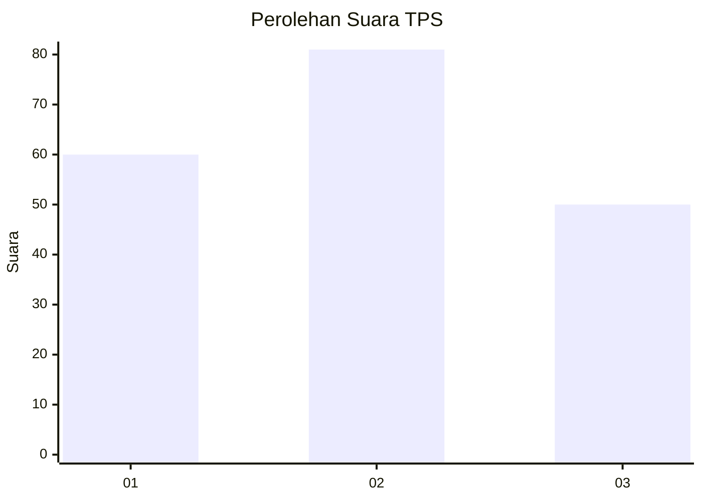
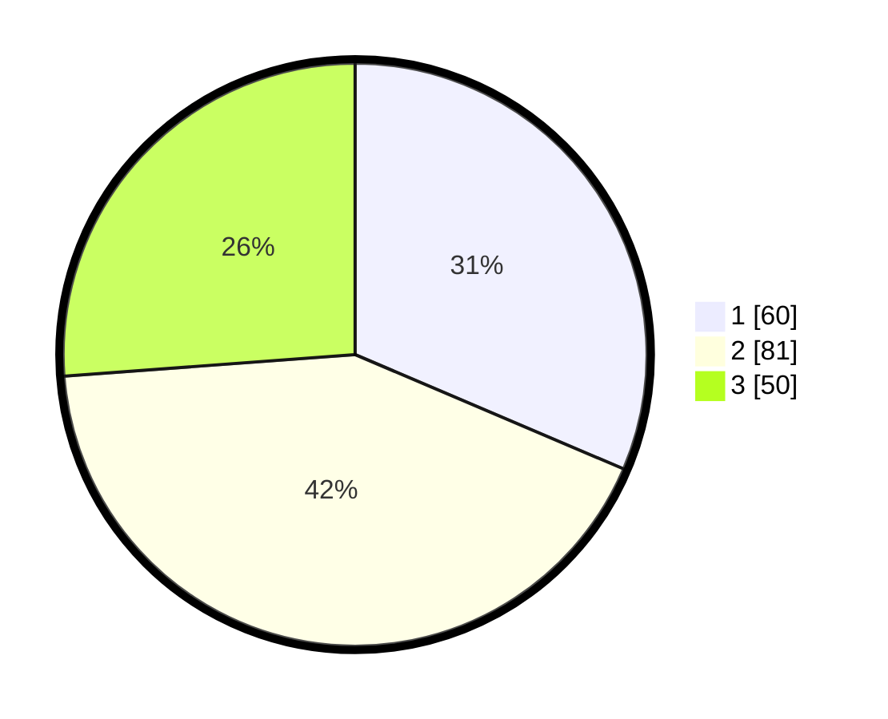

# Hasil

## Grafik

## Tabel

| No. | Nama Paslon    | Suara | Suara (raw) | Persentase |
|:--- |:-------------- | -----:| -----------:| ----------:|
| 1   | ANIES MUHAIMIN | 60    | [60][p-1]   | 31,41      |
| 2   | PRABOWO GIBRAN | 81    | [81][p-2]   | 42,41      |
| 3   | GANJAR MAHFUD  | 50    | [50][p-3]   | 26,18      |

[p-1]: https://github.com/gigit-pemilu/pemilu-2024-33-jawa-tengah/blob/main/pilpres/hitung-suara/sub/33-jawa-tengah/sub/14-sragen/sub/01-kalijambe/sub/2004-jetiskarangpung/sub/001-tps/sub/paslon-1.txt
[p-2]: https://github.com/gigit-pemilu/pemilu-2024-33-jawa-tengah/blob/main/pilpres/hitung-suara/sub/33-jawa-tengah/sub/14-sragen/sub/01-kalijambe/sub/2004-jetiskarangpung/sub/001-tps/sub/paslon-2.txt
[p-3]: https://github.com/gigit-pemilu/pemilu-2024-33-jawa-tengah/blob/main/pilpres/hitung-suara/sub/33-jawa-tengah/sub/14-sragen/sub/01-kalijambe/sub/2004-jetiskarangpung/sub/001-tps/sub/paslon-3.txt

## Foto C Plano

https://sirekap-obj-formc.kpu.go.id/ead2/pemilu/ppwp/33/14/01/20/04/3314012004001-20240214-141535--529804ef-a033-4522-a20f-a2f5174e8e64.jpg

https://sirekap-obj-formc.kpu.go.id/ead2/pemilu/ppwp/33/14/01/20/04/3314012004001-20240214-141627--a49f435f-ee6b-45d4-a0ba-4e577aab1676.jpg

https://sirekap-obj-formc.kpu.go.id/ead2/pemilu/ppwp/33/14/01/20/04/3314012004001-20240214-233845--67781d50-9423-4eaa-8ca0-bf52ca584e67.jpg

## Metadata

| Key        | Value               |
| ---------- | ------------------- |
| Time Stamp | 2024-02-15 00:41:44 |

