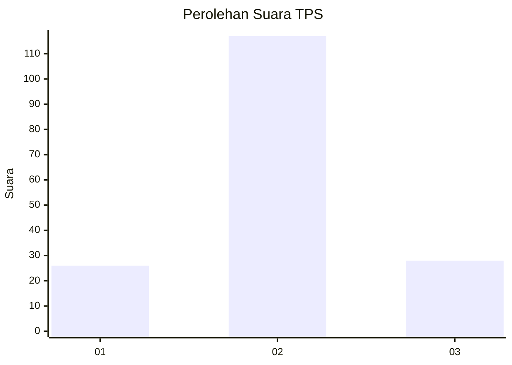
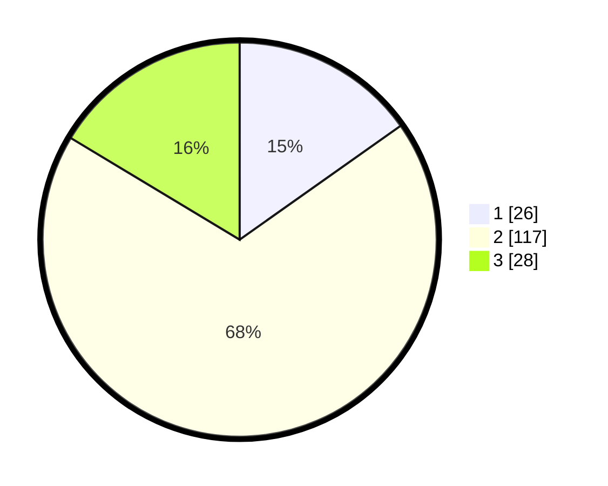

# Hasil

## Grafik

## Tabel

| No. | Nama Paslon    | Suara | Suara (raw) | Persentase |
|:--- |:-------------- | -----:| -----------:| ----------:|
| 1   | ANIES MUHAIMIN | 26    | [26][p-1]   | 15,20      |
| 2   | PRABOWO GIBRAN | 117   | [117][p-2]  | 68,42      |
| 3   | GANJAR MAHFUD  | 28    | [28][p-3]   | 16,37      |

[p-1]: https://github.com/gigit-pemilu/pemilu-2024-33-jawa-tengah/blob/main/pilpres/hitung-suara/sub/33-jawa-tengah/sub/14-sragen/sub/02-plupuh/sub/2001-karangwaru/sub/005-tps/sub/paslon-1.txt
[p-2]: https://github.com/gigit-pemilu/pemilu-2024-33-jawa-tengah/blob/main/pilpres/hitung-suara/sub/33-jawa-tengah/sub/14-sragen/sub/02-plupuh/sub/2001-karangwaru/sub/005-tps/sub/paslon-2.txt
[p-3]: https://github.com/gigit-pemilu/pemilu-2024-33-jawa-tengah/blob/main/pilpres/hitung-suara/sub/33-jawa-tengah/sub/14-sragen/sub/02-plupuh/sub/2001-karangwaru/sub/005-tps/sub/paslon-3.txt

## Foto C Plano

https://sirekap-obj-formc.kpu.go.id/b821/pemilu/ppwp/33/14/02/20/01/3314022001005-20240315-140250--a7838f0c-ed24-4d90-bfa4-c99e17225ce5.jpg

https://sirekap-obj-formc.kpu.go.id/b821/pemilu/ppwp/33/14/02/20/01/3314022001005-20240214-203939--a0bc9f16-d3ad-4ab5-b1e4-e8276f3f3f81.jpg

https://sirekap-obj-formc.kpu.go.id/b821/pemilu/ppwp/33/14/02/20/01/3314022001005-20240214-204107--873aae65-cdd9-461a-9727-5f147bd95ab7.jpg

## Metadata

| Key        | Value               |
| ---------- | ------------------- |
| Time Stamp | 2024-03-15 14:30:00 |

