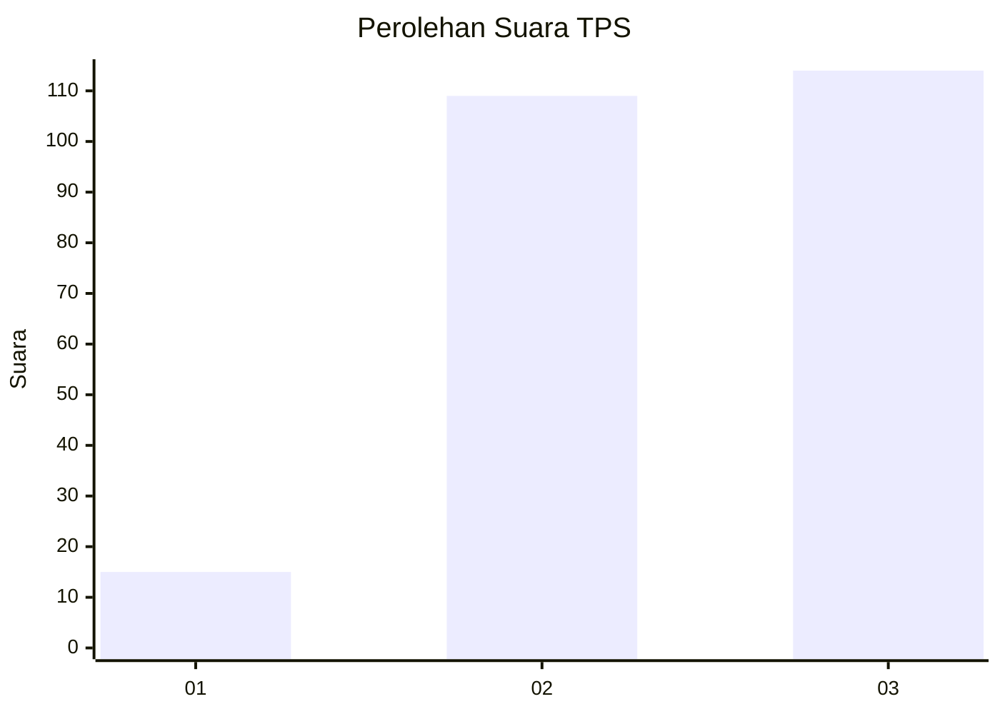
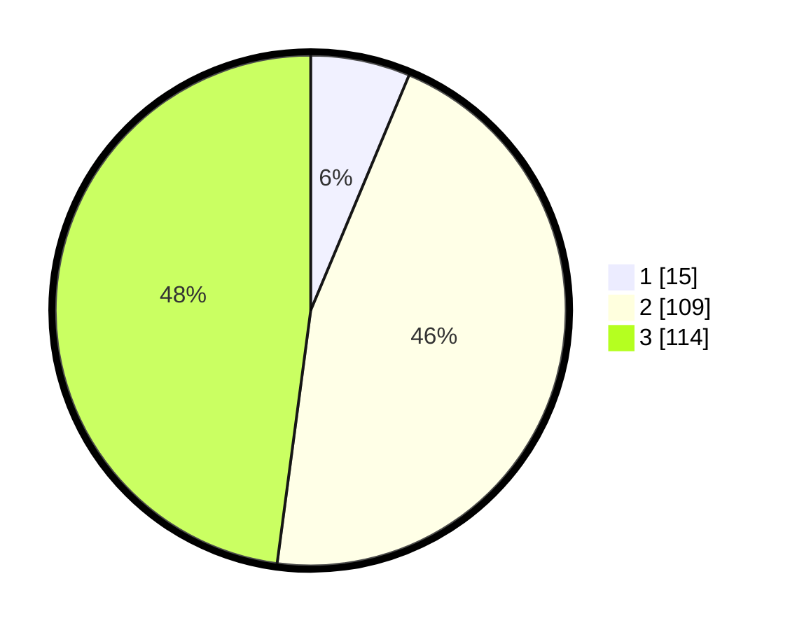

# Hasil

## Grafik

## Tabel

| No. | Nama Paslon    | Suara | Suara (raw) | Persentase |
|:--- |:-------------- | -----:| -----------:| ----------:|
| 1   | ANIES MUHAIMIN | 15    | [15][p-1]   | 6,30       |
| 2   | PRABOWO GIBRAN | 109   | [109][p-2]  | 45,80      |
| 3   | GANJAR MAHFUD  | 114   | [114][p-3]  | 47,90      |

[p-1]: https://github.com/gigit-pemilu/pemilu-2024/blob/main/pilpres/hitung-suara/sub/33-jawa-tengah/sub/14-sragen/sub/02-plupuh/sub/2011-gedongan/sub/004-tps/sub/paslon-1.txt
[p-2]: https://github.com/gigit-pemilu/pemilu-2024/blob/main/pilpres/hitung-suara/sub/33-jawa-tengah/sub/14-sragen/sub/02-plupuh/sub/2011-gedongan/sub/004-tps/sub/paslon-2.txt
[p-3]: https://github.com/gigit-pemilu/pemilu-2024/blob/main/pilpres/hitung-suara/sub/33-jawa-tengah/sub/14-sragen/sub/02-plupuh/sub/2011-gedongan/sub/004-tps/sub/paslon-3.txt

## Foto C Plano

https://sirekap-obj-formc.kpu.go.id/9ac2/pemilu/ppwp/33/14/02/20/11/3314022011004-20240218-114451--6a807ae8-7db1-4ef7-86c0-a1e2f950b4f0.jpg

https://sirekap-obj-formc.kpu.go.id/9ac2/pemilu/ppwp/33/14/02/20/11/3314022011004-20240218-113807--9f128b9b-3175-417b-a6af-70c9d3dd9ba7.jpg

https://sirekap-obj-formc.kpu.go.id/9ac2/pemilu/ppwp/33/14/02/20/11/3314022011004-20240218-113944--3159f5df-abb0-421b-9de9-dc069b64d506.jpg

## Metadata

| Key        | Value               |
| ---------- | ------------------- |
| Time Stamp | 2024-02-19 06:16:00 |

