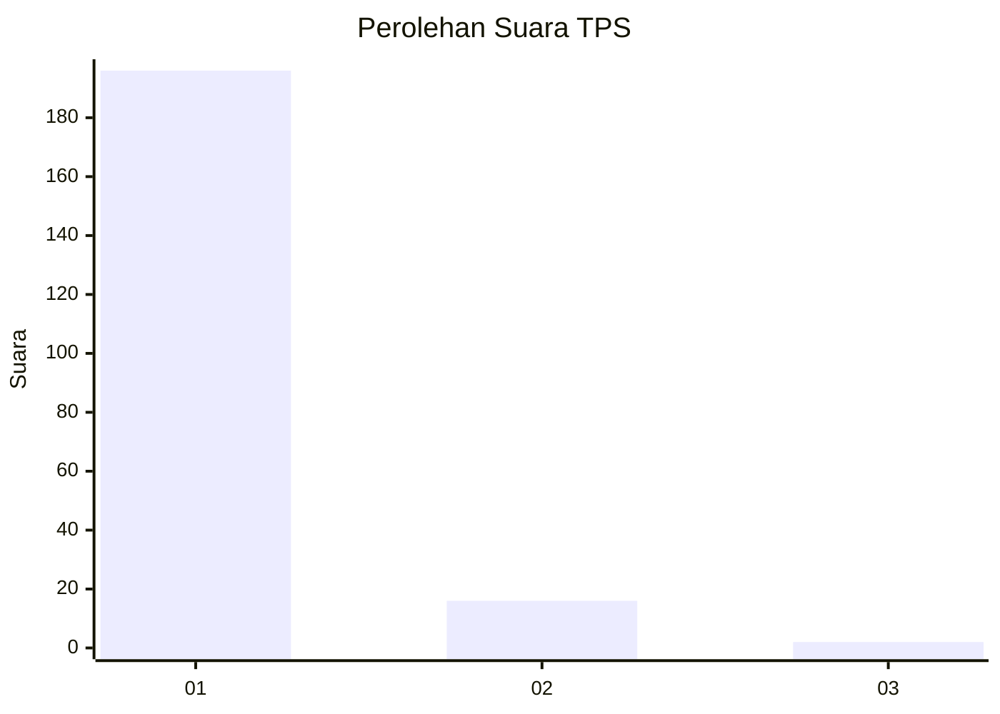
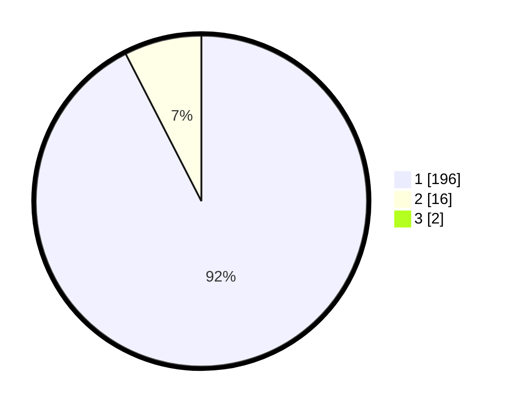

# Hasil

## Grafik

## Tabel

| No. | Nama Paslon    | Suara | Suara (raw) | Persentase |
|:--- |:-------------- | -----:| -----------:| ----------:|
| 1   | ANIES MUHAIMIN | 196   | [196][p-1]  | 91,59      |
| 2   | PRABOWO GIBRAN | 16    | [16][p-2]   | 7,48       |
| 3   | GANJAR MAHFUD  | 2     | [2][p-3]    | 0,93       |

[p-1]: https://github.com/gigit-pemilu/pemilu-2024-33-jawa-tengah/blob/main/pilpres/hitung-suara/sub/33-jawa-tengah/sub/14-sragen/sub/03-masaran/sub/2004-sepat/sub/013-tps/sub/paslon-1.txt
[p-2]: https://github.com/gigit-pemilu/pemilu-2024-33-jawa-tengah/blob/main/pilpres/hitung-suara/sub/33-jawa-tengah/sub/14-sragen/sub/03-masaran/sub/2004-sepat/sub/013-tps/sub/paslon-2.txt
[p-3]: https://github.com/gigit-pemilu/pemilu-2024-33-jawa-tengah/blob/main/pilpres/hitung-suara/sub/33-jawa-tengah/sub/14-sragen/sub/03-masaran/sub/2004-sepat/sub/013-tps/sub/paslon-3.txt

## Foto C Plano

https://sirekap-obj-formc.kpu.go.id/1cc9/pemilu/ppwp/33/14/03/20/04/3314032004013-20240214-155227--69b0c8dc-120a-41d2-bfd9-2c0a522b36e5.jpg

https://sirekap-obj-formc.kpu.go.id/1cc9/pemilu/ppwp/33/14/03/20/04/3314032004013-20240214-155243--c5f46d82-2737-481b-9e2a-e7222edb7a19.jpg

https://sirekap-obj-formc.kpu.go.id/1cc9/pemilu/ppwp/33/14/03/20/04/3314032004013-20240214-211848--8772c82b-b83e-4456-bad2-ec043dff5df4.jpg

## Metadata

| Key        | Value               |
| ---------- | ------------------- |
| Time Stamp | 2024-02-16 10:00:28 |

