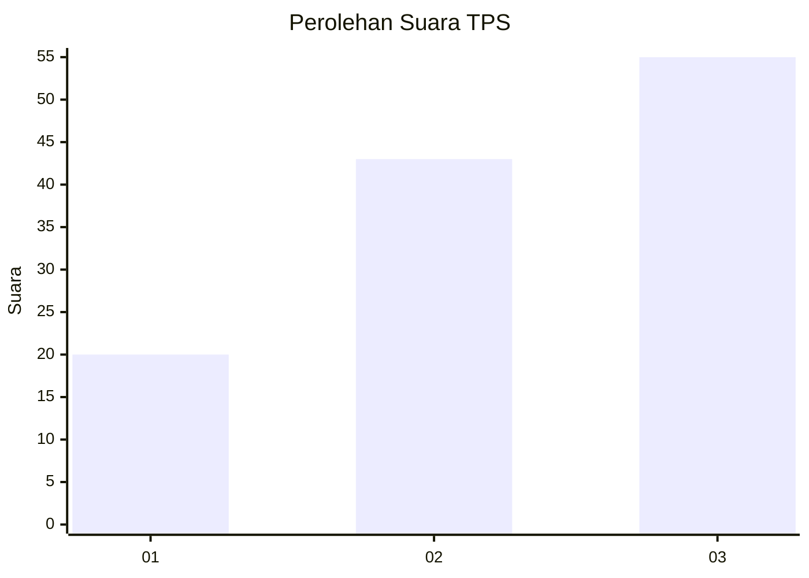
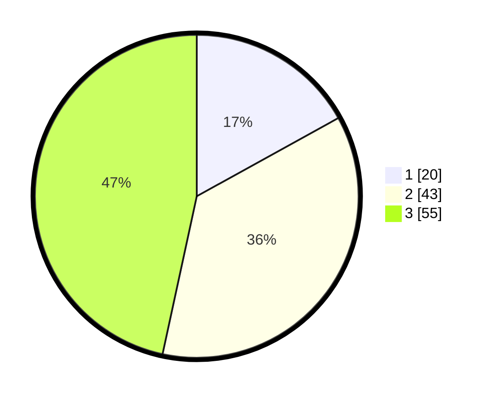

# Hasil

## Grafik

## Tabel

| No. | Nama Paslon    | Suara | Suara (raw) | Persentase |
|:--- |:-------------- | -----:| -----------:| ----------:|
| 1   | ANIES MUHAIMIN | 20    | [20][p-1]   | 16,95      |
| 2   | PRABOWO GIBRAN | 43    | [43][p-2]   | 36,44      |
| 3   | GANJAR MAHFUD  | 55    | [55][p-3]   | 46,61      |

[p-1]: https://github.com/gigit-pemilu/pemilu-2024/blob/main/pilpres/hitung-suara/sub/33-jawa-tengah/sub/14-sragen/sub/03-masaran/sub/2008-masaran/sub/028-tps/sub/paslon-1.txt
[p-2]: https://github.com/gigit-pemilu/pemilu-2024/blob/main/pilpres/hitung-suara/sub/33-jawa-tengah/sub/14-sragen/sub/03-masaran/sub/2008-masaran/sub/028-tps/sub/paslon-2.txt
[p-3]: https://github.com/gigit-pemilu/pemilu-2024/blob/main/pilpres/hitung-suara/sub/33-jawa-tengah/sub/14-sragen/sub/03-masaran/sub/2008-masaran/sub/028-tps/sub/paslon-3.txt

## Foto C Plano

https://sirekap-obj-formc.kpu.go.id/734e/pemilu/ppwp/33/14/03/20/08/3314032008028-20240219-201415--7badc7ac-f5e2-4e9e-b1a3-fc2ffc41847a.jpg

https://sirekap-obj-formc.kpu.go.id/734e/pemilu/ppwp/33/14/03/20/08/3314032008028-20240219-214559--b63f3872-1d88-414e-ba37-ca15b6ff94e7.jpg

https://sirekap-obj-formc.kpu.go.id/734e/pemilu/ppwp/33/14/03/20/08/3314032008028-20240220-125033--2819d8eb-141c-409b-87b0-afc06cf62f0e.jpg

## Metadata

| Key        | Value               |
| ---------- | ------------------- |
| Time Stamp | 2024-02-20 13:00:00 |

