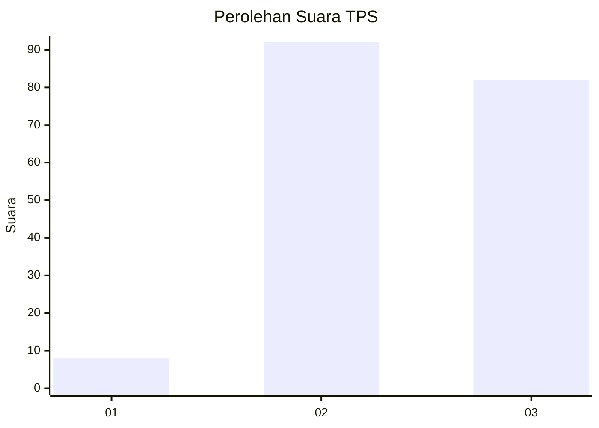
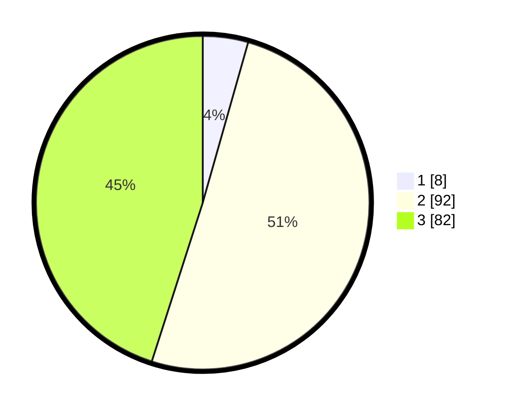

# Hasil

## Grafik

## Tabel

| No. | Nama Paslon    | Suara | Suara (raw) | Persentase |
|:--- |:-------------- | -----:| -----------:| ----------:|
| 1   | ANIES MUHAIMIN | 8     | [8][p-1]    | 4,40       |
| 2   | PRABOWO GIBRAN | 92    | [92][p-2]   | 50,55      |
| 3   | GANJAR MAHFUD  | 82    | [82][p-3]   | 45,05      |

[p-1]: https://github.com/gigit-pemilu/pemilu-2024/blob/main/pilpres/hitung-suara/sub/33-jawa-tengah/sub/14-sragen/sub/04-kedawung/sub/2004-mojodoyong/sub/002-tps/sub/paslon-1.txt
[p-2]: https://github.com/gigit-pemilu/pemilu-2024/blob/main/pilpres/hitung-suara/sub/33-jawa-tengah/sub/14-sragen/sub/04-kedawung/sub/2004-mojodoyong/sub/002-tps/sub/paslon-2.txt
[p-3]: https://github.com/gigit-pemilu/pemilu-2024/blob/main/pilpres/hitung-suara/sub/33-jawa-tengah/sub/14-sragen/sub/04-kedawung/sub/2004-mojodoyong/sub/002-tps/sub/paslon-3.txt

## Foto C Plano

https://sirekap-obj-formc.kpu.go.id/f25c/pemilu/ppwp/33/14/04/20/04/3314042004002-20240214-141626--04a2f33e-99b6-4e1f-afba-9374e8c5fd4d.jpg

https://sirekap-obj-formc.kpu.go.id/f25c/pemilu/ppwp/33/14/04/20/04/3314042004002-20240214-141401--623776dc-6ee7-4071-84db-407fe6f287e3.jpg

https://sirekap-obj-formc.kpu.go.id/f25c/pemilu/ppwp/33/14/04/20/04/3314042004002-20240214-141452--904af3cb-a1ff-4c80-8f0d-2394d6f208ee.jpg

## Metadata

| Key        | Value               |
| ---------- | ------------------- |
| Time Stamp | 2024-02-15 00:41:44 |

