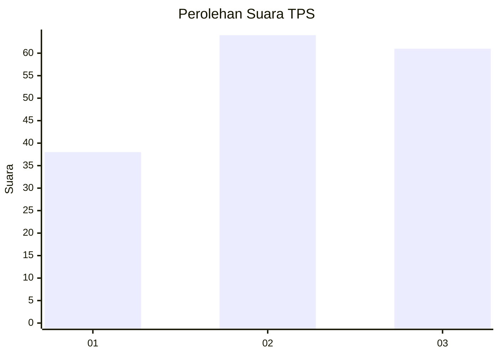
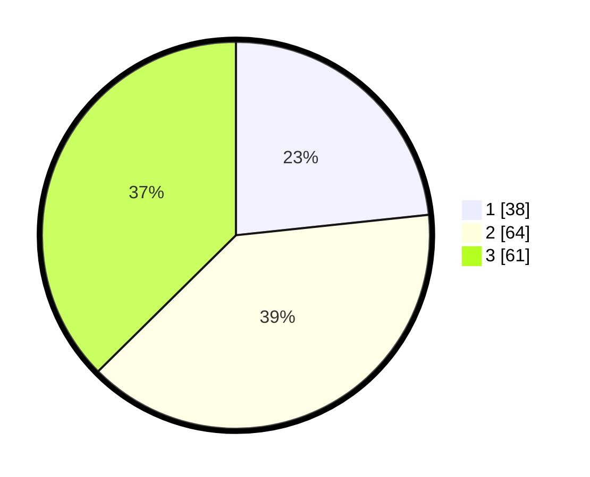

# Hasil

## Grafik

## Tabel

| No. | Nama Paslon    | Suara | Suara (raw) | Persentase |
|:--- |:-------------- | -----:| -----------:| ----------:|
| 1   | ANIES MUHAIMIN | 38    | [38][p-1]   | 23,31      |
| 2   | PRABOWO GIBRAN | 64    | [64][p-2]   | 39,26      |
| 3   | GANJAR MAHFUD  | 61    | [61][p-3]   | 37,42      |

[p-1]: https://github.com/gigit-pemilu/pemilu-2024/blob/main/pilpres/hitung-suara/sub/33-jawa-tengah/sub/14-sragen/sub/04-kedawung/sub/2007-wonorejo/sub/010-tps/sub/paslon-1.txt
[p-2]: https://github.com/gigit-pemilu/pemilu-2024/blob/main/pilpres/hitung-suara/sub/33-jawa-tengah/sub/14-sragen/sub/04-kedawung/sub/2007-wonorejo/sub/010-tps/sub/paslon-2.txt
[p-3]: https://github.com/gigit-pemilu/pemilu-2024/blob/main/pilpres/hitung-suara/sub/33-jawa-tengah/sub/14-sragen/sub/04-kedawung/sub/2007-wonorejo/sub/010-tps/sub/paslon-3.txt

## Foto C Plano

https://sirekap-obj-formc.kpu.go.id/864e/pemilu/ppwp/33/14/04/20/07/3314042007010-20240214-201935--baea7380-3663-499e-be22-e54dc1fac86e.jpg

https://sirekap-obj-formc.kpu.go.id/864e/pemilu/ppwp/33/14/04/20/07/3314042007010-20240214-202018--0ce51f4c-1248-4d51-9b9e-b53b5a496d41.jpg

https://sirekap-obj-formc.kpu.go.id/864e/pemilu/ppwp/33/14/04/20/07/3314042007010-20240214-202155--e4f25f63-c0d3-4e3b-b7b9-53707d659b35.jpg

## Metadata

| Key        | Value               |
| ---------- | ------------------- |
| Time Stamp | 2024-02-16 13:30:32 |

## DATA PEMILIH TETAP

Jumlah pemilih dalam DPT: **289**.
 * L: **302**.
 * P: **187**.

## DATA PENGGUNA HAK PILIH

Jumlah pengguna hak pilih dalam DPT: **563**.
 * L: **864**.
 * P: **892**.

Jumlah pengguna hak pilih dalam DPTb: **0**.
 * L: **800**.
 * P: **80**.

Jumlah pengguna hak pilih dalam DPK: **0**.
 * L: **800**.
 * P: **0**.

Jumlah pengguna hak pilih: **863**.
 * L: **864**.
 * P: **94**.

## JUMLAH SUARA SAH DAN TIDAK SAH

JUMLAH SELURUH SUARA SAH: **163**.

JUMLAH SUARA TIDAK SAH: **0**.

JUMLAH SELURUH SUARA SAH DAN SUARA TIDAK SAH: **163**.

