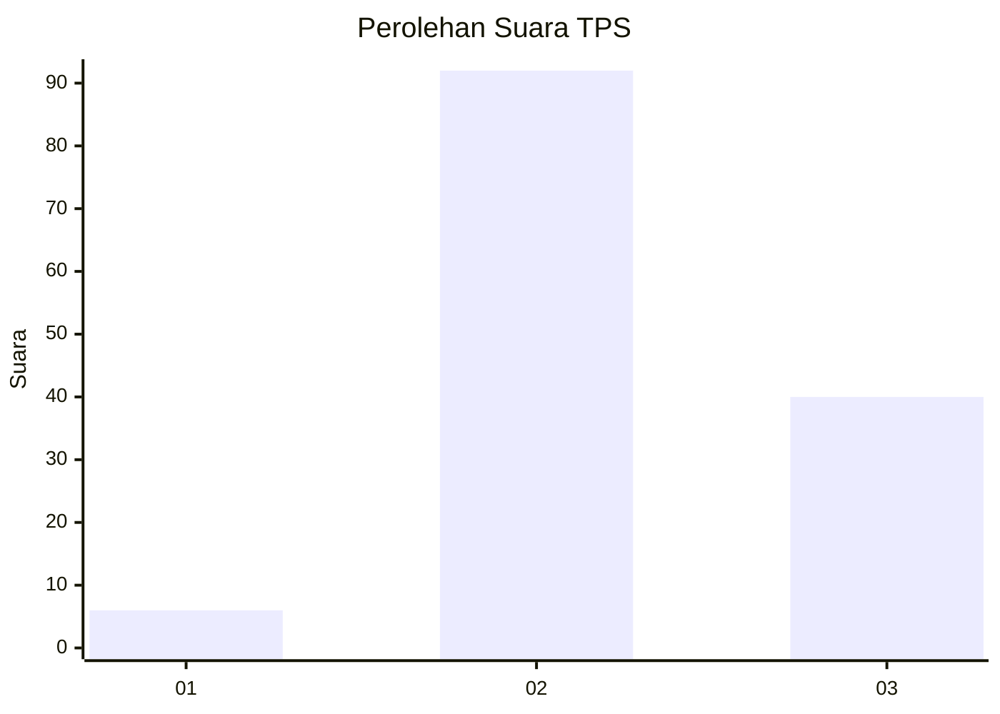
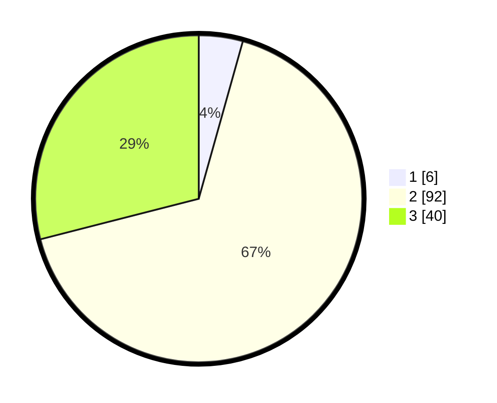

# Hasil

## Grafik

## Tabel

| No. | Nama Paslon    | Suara | Suara (raw) | Persentase |
|:--- |:-------------- | -----:| -----------:| ----------:|
| 1   | ANIES MUHAIMIN | 6     | [6][p-1]    | 4,35       |
| 2   | PRABOWO GIBRAN | 92    | [92][p-2]   | 66,67      |
| 3   | GANJAR MAHFUD  | 40    | [40][p-3]   | 28,99      |

[p-1]: https://github.com/gigit-pemilu/pemilu-2024-33-jawa-tengah/blob/main/pilpres/hitung-suara/sub/33-jawa-tengah/sub/14-sragen/sub/05-sambirejo/sub/2008-dawung/sub/009-tps/sub/paslon-1.txt
[p-2]: https://github.com/gigit-pemilu/pemilu-2024-33-jawa-tengah/blob/main/pilpres/hitung-suara/sub/33-jawa-tengah/sub/14-sragen/sub/05-sambirejo/sub/2008-dawung/sub/009-tps/sub/paslon-2.txt
[p-3]: https://github.com/gigit-pemilu/pemilu-2024-33-jawa-tengah/blob/main/pilpres/hitung-suara/sub/33-jawa-tengah/sub/14-sragen/sub/05-sambirejo/sub/2008-dawung/sub/009-tps/sub/paslon-3.txt

## Foto C Plano

https://sirekap-obj-formc.kpu.go.id/25a5/pemilu/ppwp/33/14/05/20/08/3314052008009-20240214-205804--6ddbca49-b8f6-4659-a8de-cd0b9c2a4ed7.jpg

https://sirekap-obj-formc.kpu.go.id/25a5/pemilu/ppwp/33/14/05/20/08/3314052008009-20240214-205933--2e0012b4-4f9a-4dbd-a6fb-2a00f1e5ff6f.jpg

https://sirekap-obj-formc.kpu.go.id/25a5/pemilu/ppwp/33/14/05/20/08/3314052008009-20240214-214958--1ef16daa-cf0a-4a94-a670-337e9afcaf0c.jpg

## Metadata

| Key        | Value               |
| ---------- | ------------------- |
| Time Stamp | 2024-02-15 00:41:44 |

