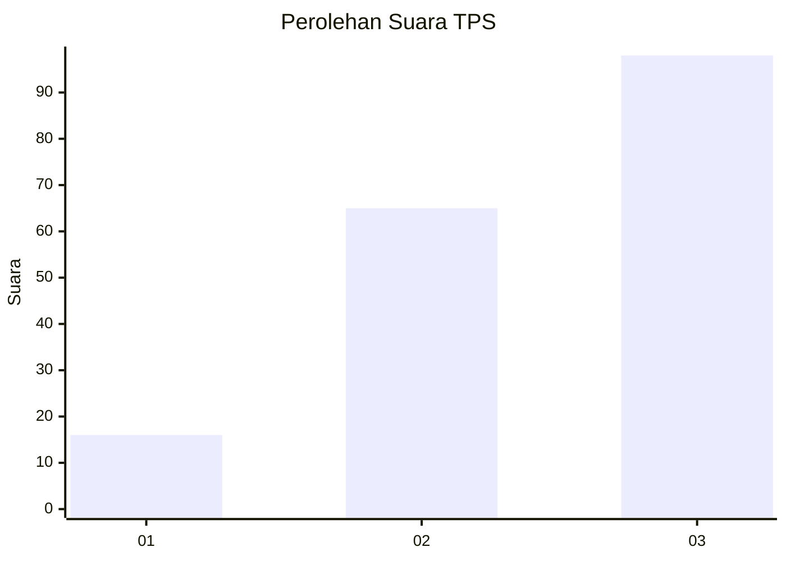
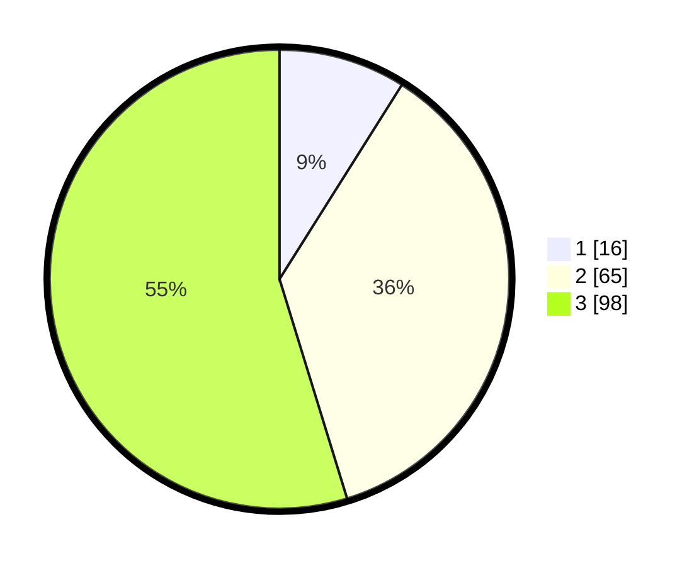

# Hasil

## Grafik

## Tabel

| No. | Nama Paslon    | Suara | Suara (raw) | Persentase |
|:--- |:-------------- | -----:| -----------:| ----------:|
| 1   | ANIES MUHAIMIN | 16    | [16][p-1]   | 8,94       |
| 2   | PRABOWO GIBRAN | 65    | [65][p-2]   | 36,31      |
| 3   | GANJAR MAHFUD  | 98    | [98][p-3]   | 54,75      |

[p-1]: https://github.com/gigit-pemilu/pemilu-2024/blob/main/pilpres/hitung-suara/sub/33-jawa-tengah/sub/14-sragen/sub/05-sambirejo/sub/2009-sambi/sub/011-tps/sub/paslon-1.txt
[p-2]: https://github.com/gigit-pemilu/pemilu-2024/blob/main/pilpres/hitung-suara/sub/33-jawa-tengah/sub/14-sragen/sub/05-sambirejo/sub/2009-sambi/sub/011-tps/sub/paslon-2.txt
[p-3]: https://github.com/gigit-pemilu/pemilu-2024/blob/main/pilpres/hitung-suara/sub/33-jawa-tengah/sub/14-sragen/sub/05-sambirejo/sub/2009-sambi/sub/011-tps/sub/paslon-3.txt

## Foto C Plano

https://sirekap-obj-formc.kpu.go.id/8c5a/pemilu/ppwp/33/14/05/20/09/3314052009011-20240214-141118--3192019c-96c6-436e-bc8f-00abb0e27bb8.jpg

https://sirekap-obj-formc.kpu.go.id/8c5a/pemilu/ppwp/33/14/05/20/09/3314052009011-20240214-141200--c66675d7-897a-4ec7-8aac-e8750ae84542.jpg

https://sirekap-obj-formc.kpu.go.id/8c5a/pemilu/ppwp/33/14/05/20/09/3314052009011-20240214-141539--239cbec8-67a0-43f6-8e31-8b1286cdb247.jpg

## Metadata

| Key        | Value               |
| ---------- | ------------------- |
| Time Stamp | 2024-02-14 21:46:01 |

