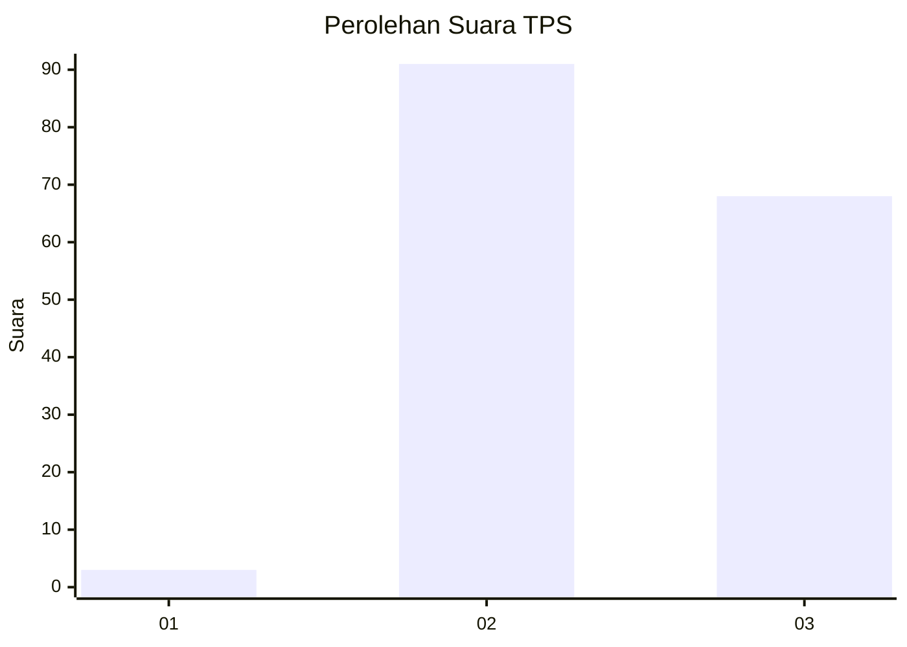
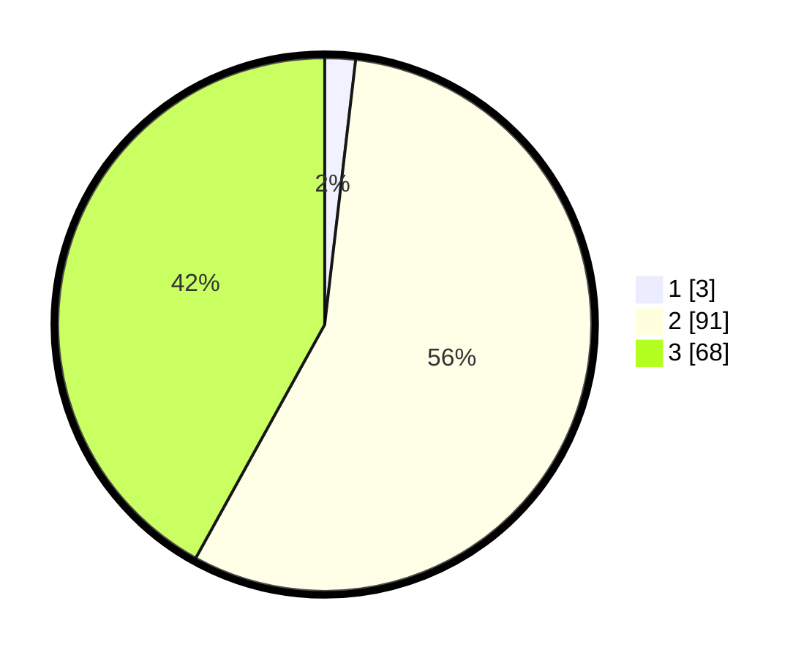

# Hasil

## Grafik

## Tabel

| No. | Nama Paslon    | Suara | Suara (raw) | Persentase |
|:--- |:-------------- | -----:| -----------:| ----------:|
| 1   | ANIES MUHAIMIN | 3     | [3][p-1]    | 1,85       |
| 2   | PRABOWO GIBRAN | 91    | [91][p-2]   | 56,17      |
| 3   | GANJAR MAHFUD  | 68    | [68][p-3]   | 41,98      |

[p-1]: https://github.com/gigit-pemilu/pemilu-2024-33-jawa-tengah/blob/main/pilpres/hitung-suara/sub/33-jawa-tengah/sub/14-sragen/sub/06-gondang/sub/2003-tunggul/sub/005-tps/sub/paslon-1.txt
[p-2]: https://github.com/gigit-pemilu/pemilu-2024-33-jawa-tengah/blob/main/pilpres/hitung-suara/sub/33-jawa-tengah/sub/14-sragen/sub/06-gondang/sub/2003-tunggul/sub/005-tps/sub/paslon-2.txt
[p-3]: https://github.com/gigit-pemilu/pemilu-2024-33-jawa-tengah/blob/main/pilpres/hitung-suara/sub/33-jawa-tengah/sub/14-sragen/sub/06-gondang/sub/2003-tunggul/sub/005-tps/sub/paslon-3.txt

## Foto C Plano

https://sirekap-obj-formc.kpu.go.id/cfb3/pemilu/ppwp/33/14/06/20/03/3314062003005-20240215-123807--e903babc-62fb-401f-9cd0-fb1d8d0d0a5e.jpg

https://sirekap-obj-formc.kpu.go.id/cfb3/pemilu/ppwp/33/14/06/20/03/3314062003005-20240215-123913--69ffae30-c0a2-4b8f-848f-6febd3bf4926.jpg

https://sirekap-obj-formc.kpu.go.id/cfb3/pemilu/ppwp/33/14/06/20/03/3314062003005-20240215-150850--1304a67c-5d98-4c30-a6e4-9d44f1f533d1.jpg

## Metadata

| Key        | Value               |
| ---------- | ------------------- |
| Time Stamp | 2024-02-15 16:00:26 |

