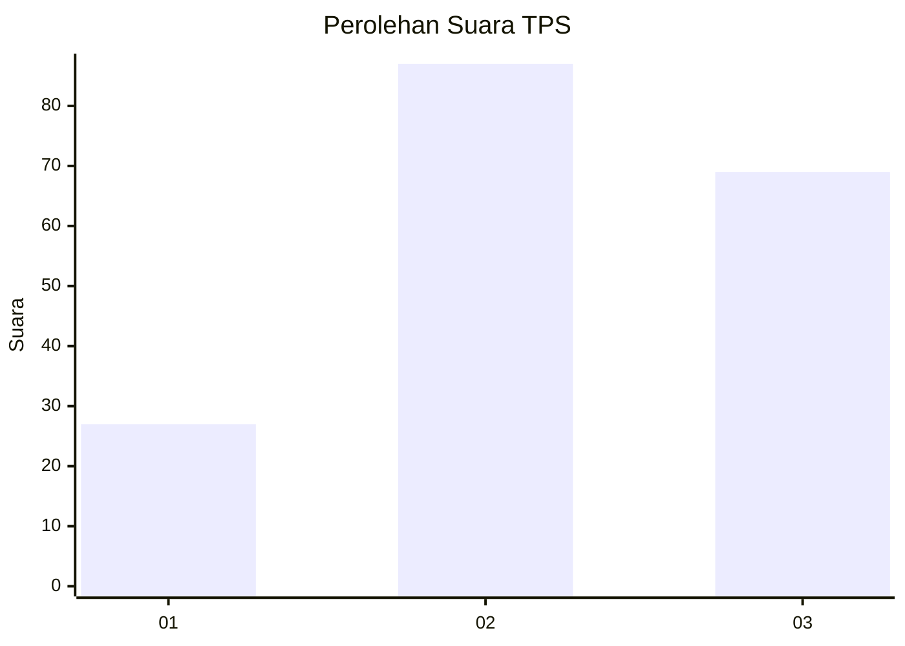
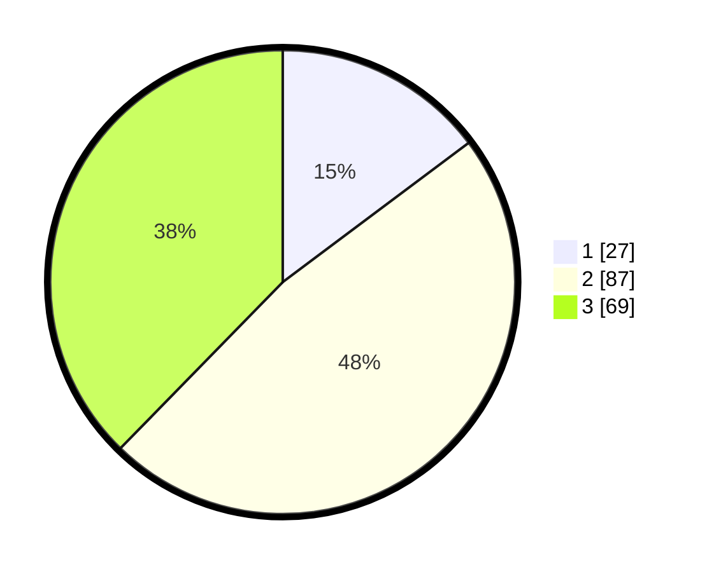

# Hasil

## Grafik

## Tabel

| No. | Nama Paslon    | Suara | Suara (raw) | Persentase |
|:--- |:-------------- | -----:| -----------:| ----------:|
| 1   | ANIES MUHAIMIN | 27    | [27][p-1]   | 14,75      |
| 2   | PRABOWO GIBRAN | 87    | [87][p-2]   | 47,54      |
| 3   | GANJAR MAHFUD  | 69    | [69][p-3]   | 37,70      |

[p-1]: https://github.com/gigit-pemilu/pemilu-2024-33-jawa-tengah/blob/main/pilpres/hitung-suara/sub/33-jawa-tengah/sub/14-sragen/sub/07-sambungmacan/sub/2001-plumbon/sub/004-tps/sub/paslon-1.txt
[p-2]: https://github.com/gigit-pemilu/pemilu-2024-33-jawa-tengah/blob/main/pilpres/hitung-suara/sub/33-jawa-tengah/sub/14-sragen/sub/07-sambungmacan/sub/2001-plumbon/sub/004-tps/sub/paslon-2.txt
[p-3]: https://github.com/gigit-pemilu/pemilu-2024-33-jawa-tengah/blob/main/pilpres/hitung-suara/sub/33-jawa-tengah/sub/14-sragen/sub/07-sambungmacan/sub/2001-plumbon/sub/004-tps/sub/paslon-3.txt

## Foto C Plano

https://sirekap-obj-formc.kpu.go.id/c5c6/pemilu/ppwp/33/14/07/20/01/3314072001004-20240218-163949--422d635d-fbad-448f-84a6-e5a56e192b66.jpg

https://sirekap-obj-formc.kpu.go.id/c5c6/pemilu/ppwp/33/14/07/20/01/3314072001004-20240216-185647--ad5f1017-76b2-4a00-a4b9-291d005f284a.jpg

https://sirekap-obj-formc.kpu.go.id/c5c6/pemilu/ppwp/33/14/07/20/01/3314072001004-20240214-211133--8812bdab-9100-441d-9a83-d2fe0f133b6b.jpg

## Metadata

| Key        | Value               |
| ---------- | ------------------- |
| Time Stamp | 2024-02-19 06:16:00 |

